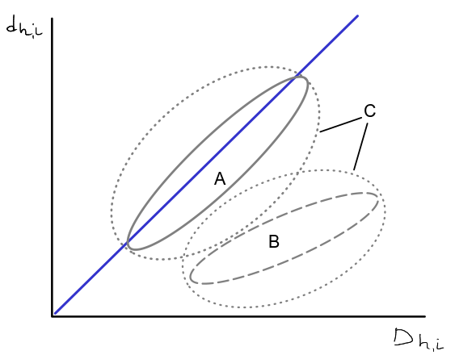

- Неметрическое многомерное шкалирование
- Как работает неметрическое многомерное шкалирование
- Оценка качества подгонки ординации
- Трактовка результатов ординации

### Вы сможете

- Построить диаграмму nMDS.
- Охарактеризовать качество ординации с помощью величины стресса.
- Сравнить результаты нескольких ординаций.

```{r setup, include = FALSE, cache = FALSE, purl = FALSE}
# output options
options(width = 70, scipen = 6, digits = 3)
library(knitr)
# chunk default options
opts_chunk$set(message = FALSE, tidy = FALSE, fig.width = 5, fig.height = 4, warning = FALSE)
library("kableExtra")
```

---

class: middle, center, inverse

# Проблема изображения многомерных данных

---

## Облако точек в многомерном пространстве

Когда признаков много, можно представить все объекты как облако точек в многомерном пространстве.


Migration by Don McCullough
on [Flickr](https://flic.kr/p/fEFhCj)

---

## Для изображения N объектов в идеале нужно N-1 измерений

- 2 объекта = 1D прямая
- 3 объекта = 2D плоскость
- 4 объекта = 3D объем
- ...
- N объектов = (N-1)-мерное пространство

---

## Многомерное пространство сложно изобразить. <br/> Есть два пути:

- Выбрать наиболее информативную проекцию (не все видно).
- Сохранить отношения между объектами (придется исказить расстояния).


.small[
black shadows for a white horses / les negres ombres dels cavalls blancs by  Ferran Jordà
on [Flickr](https://flic.kr/p/9XJxiL)
]

---

## Неметрическое многомерное шкалирование

__Nonmetric Multidimensional Scaling__, __nMDS__ (Shepard 1962, 1966, Kruskal 1964a, b)

Метод визуализации отношений между объектами в пространстве с небольшим числом измерений (обычно 2).

Исходные данные --- матрица расстояний между объектами в многомерном пространстве.

nMDS ординация старается сохранить отношения между объектами.

---

## Карта пригородов Санкт-Петербурга

```{r include=FALSE, purl=FALSE}
# library(readxl)
# library(tidyr)
# library(dplyr)
# # library(geonames)
# # dist_spb <- read_excel("data/dist_spb.xlsx", sheet = "dist")
# # D <- dist_spb[, -1] %>%
# #   as.matrix() %>%
# #   `rownames<-`(dist_spb$name) %>%
# #   as.dist()
# # 
# # options(geonamesHost="api.geonames.org", geonamesUsername="username")
# # GNsearchMy <- function(x){
# #   res <- GNsearch(name = x, cities = "cities500")
# #   return(res[1, c("name", "lng", "lat", "population")])
# # }
# # GNresult <- sapply(dist_spb$name, GNsearchMy, simplify = T)
# # 
# # # Координаты городов
# # coord_spb <- GNresult %>%
# #   t() %>%
# #   as.data.frame() %>%
# # mutate(name = rownames(.), lng = as.numeric(lng), lat = as.numeric(lat), population = as.numeric(population))
# # # Вручную Петербург, Зеленогорск и Павловск
# 
# 
# # Матрица расстояний
# dist_spb <- read_excel("data/dist_spb.xlsx", sheet = "dist")
# D <- as.matrix(dist_spb[, -1]) %>%
#   `rownames<-`(dist_spb$name) %>%
#   as.dist()
# 
# # Координаты городов
# coord <- read_excel("data/dist_spb.xlsx", sheet = "coord")
# 
# # Скачиваем карту в пределах bounding box
# my <- matrix(c(range(coord$lng), range(coord$lat)) + c(-0.4, 0.8, -0.1, 0.1), 2, 2, dimnames = list(c("x", "y"), c("min", "max")), byrow = T)
# map_dat <- get_map(location = my, maptype = "watercolor")
# save(map_dat, file = "data/dist_spb_dat.RData")
```

```{r gg-spb, message = FALSE, echo = FALSE, fig.height=6, fig.width=7}
# Загрузка пакетов ###############################

# Чтение файлов
library(readxl)

# Обработка данных
library(tidyr)
library(dplyr)
library(broom)

# Графики
library(ggmap)
theme_set(theme_bw(base_size = 12))

# Многомерная статистика
library(vegan)

# Карта пригородов Санкт-Петербурга ##############

# Матрица расстояний
dist_spb <- read_excel("data/dist_spb.xlsx", sheet = "dist")
D <- as.matrix(dist_spb[, -1]) %>%
  `rownames<-`(dist_spb$name) %>%
  as.dist()

# Координаты городов
coord <- read_excel("data/dist_spb.xlsx", sheet = "coord")

# Фон карты
load(file = "data/dist_spb_dat.RData")

# Карта окрестностей спб
gg_spb <- ggmap(map_dat) + 
  geom_point(data = coord, aes(x = lng, y = lat, 
                               size = population/1000), 
             alpha = 0.8, colour = "grey20") + 
  geom_text(data = coord, aes(x = lng, y = lat, 
                              label = name), 
            size = 4,
            vjust = -0.3, hjust = -0.05) + 
  theme(legend.position = "none") +
  labs(x = "Долгота", y = "Широта", 
       size = "Население,\nтыс. чел.")
gg_spb
```

---

## Расстояния по автодорогам

```{r dist-table, echo=FALSE, purl=FALSE}
as.data.frame(dist_spb) %>%
  kable("html") %>%
  kable_styling() %>%
  scroll_box(width = "100%", height = "500px")

# DT::datatable(
#   as.data.frame(dist_spb),
#   options = list(pageLength = 8)
  # options = list(
  #             pageLength = 15,
  #             lengthMenu = c(5, 10, 15, 20),
  #             scrollY = 600,
  #             scrollX = TRUE,
  #             fixedColumns = list(leftColumns = 2)
  #           )
# )
```

Расстояния по автодорогам не совсем "евклидовы": например, из Кронштадта до Санкт-Петербурга нельзя добраться по прямой.

---

## Обычная проекция исходного пространства на плоскость неудачна

.pull-left[

Карта<br/><br/>

```{r, gg-spb, echo=FALSE, purl=FALSE, fig.height=6, fig.width=7}
```
]

.pull-right[

Проекция при помощи анализа главных координат (PCoA)

```{r pcoa-spb, echo=FALSE, purl=-c(1, 3), fig.height=4, fig.width=5}
op <- par(mar = c(3, 3, 0.1, 0.1), mgp = c(2, 1, 0), cex = 1.2)
ordiplot(wcmdscale(d = D, k = 2), type = "t")
par(op)
```
]

--

- Карта неудачна: Стрельна, Красное Село и Гатчина сливаются вместе, хотя они не рядом.

---

## Можно восстановить карту, сохраняя ранги расстояний между объектами

.pull-left[

Карта

```{r, gg-spb, echo=FALSE, purl=FALSE, fig.height=3.5, fig.width=5}
```
]

.pull-right[

Ординация nMDS

```{r ord-spb, echo=FALSE, purl=-c(1, 3), fig.height=3.5, fig.width=5, results='hide'}
op <- par(mar = c(3, 3, 0.1, 0.1), mgp = c(2, 1, 0), cex = 1.2)
spb_ord <- metaMDS(D)
ordiplot(spb_ord, type = "t")
par(op)
```
]

--

- Что странного в этой карте?

---

## Важные свойства nMDS-ординации

--

1. __Сохраняется ранг расстояний между объектами__ (похожие располагаются близко, непохожие --- далеко.  
Если объект А похож на B, больше чем на C, то и на ординации он, скорее всего, окажется ближе к B, чем к C).

--

2. __Имеет смысл только взаиморасположение объектов друг относительно друга__.  
Суть ординации не изменится, если решение 
  - вращать, 
  - перемещать, 
  - зеркально отражать

--

3. __Численные значения координат точек в ординации лишены смысла__.  
Их вообще можно не приводить на итоговой ординации.

---

class: middle, center, inverse

# Как работает nMDS

---

## Наблюдаемые различия и ожидаемые расстояния

Взаиморасположение точек на плоскости подобно взаиморасположению точек в многомерном пространстве признаков, но значения не полностью совпадают.

```{r, echo=FALSE}
# Реальные расстояния
obs_dist <- D %>% tidy() %>% rename("observed" = "distance")
# Расстояния на ординации
ord_dist <- vegdist(spb_ord$points, method = "euclidean") %>% tidy() %>% rename("nmds" = "distance")
# Все вместе (отсортированное)
distances <- merge(obs_dist, ord_dist) %>% arrange(observed)

distances %>%
  kable("html") %>%
  kable_styling() %>%
  scroll_box(width = "100%", height = "450px")
```

---

## Диаграмма Шепарда

__Диаграмма Шепарда__ --- график зависимости расстояний между точками на ординации и соответствующих им значений коэффициентов различия в исходном пространстве.

.pull-left[

```{r, fig-shep, echo=FALSE, fig.height=4, fig.width=5}
ggplot(distances, aes(x = observed, y = nmds)) + geom_point() + xlab("Observed dissimialrity") + ylab("Ordination distance")
```

]

.pull-right[

- По оси X --- значения коэффициентов различий $D_{h,i}$, ранжированные в порядке возрастания
- По оси Y --- значения расстояний на плоскости ординации --- $d_{h,i}$
]

В идеале, ранги расстояний между точками  $d_{h,i}$ на хорошей ординации nMDS должны совпадать с рангами коэффициентов различия $D_{h,i}$ в исходном многомерном пространстве.


---

## Интерпретация диаграммы Шепарда

Форма и расположение облака точек на диаграмме Шепарда позволяет судить о качестве ординации.

.pull-left[


]

.pull-right[

- A --- ординация объясняет большую часть исходной изменчивости
- В --- ординация объясняет небольшую часть изменчивости, но относительное расположение точек сохранено
- С --- относительное расположение точек плохо соответствует исходному

]

---

## Диаграмма Шепарда

В идеале, большим расстояниям в исходном пространстве должны соответствовать большие расстояния на ординации, а меньшим --- меньшие (т.е. должны сохраняться ранги расстояний).

.pull-left[

```{r echo=FALSE, purl=-c(1, 3), fig.height=4, fig.width=5}
op <- par(mar = c(3, 3, 0.1, 0.1), mgp = c(2, 1, 0))
stressplot(spb_ord)
par(op)
```

]

.pull-right[

Красная линия --- предсказанные монотонной регрессией значения расстояний на ординации --- монотонно возрастает.

]

---

## Монотонная регрессия

__Монотонная регрессия__ минимизирует сумму квадратов отклонений значений координат на ординации от значений в исходном многомерном пространстве, сохраняя монотонные отношения между ними.

Алгоритм подбора монотонной регрессии называется   Pool-Adjacent-Violator-Algorithm (PAVA)

```{r isoreg-ani, echo=FALSE, fig.width=7, fig.height=6, fig.show='animate', interval=2, animation.hook='gifski', aniopts='control,loop'}
op <- par(mar = c(3, 3, 0.1, 0.1), mgp = c(2, 1, 0))
plot_isoreg <- function(x, y, n){
  if (length(x) != length(y)) {
    stop("length of x and y must be equal") 
  }
  if (n < 0) {
    stop("n must be greater than zero")
  }
  if (n > length(x)) {
    stop("n must be smaller than length of x and y") 
  }
  dhat <- isoreg(x[1:n], y[1:n])
  # координаты концов сегментов
  yr <- sort(c(dhat$yf, dhat$yf[dhat$iKnots[-length(dhat$iKnots)] + 1]))
  xr <- sort(c(dhat$x, dhat$x[dhat$iKnots[-length(dhat$iKnots)]]))
  xx <- dhat$x
  # основа
  plot(x, y, pch = 1, cex = 1, col = "blue", xlab = "Observed dissimilarity", ylab = "Ordination distance")
  # 
  lines(xr, yr, col = "red", lwd = 2)
  points(xx[dhat$iKnots], dhat$yf[dhat$iKnots], col = "red", pch = 4, cex = 2, lwd = 2)
}

for (i in 0:11) {
  plot_isoreg(x = 1:11, y = c(1, 2, 3, 6, 4, 5.5, 8, 7, 6, 5, 7), i)
}
par(op)
```


---

## Стресс --- мера качества ординации

__Стресс (Stress)__ показывает, насколько соответствуют друг другу взаиморасположение точек на плоскости ординации и в исходном многомерном пространстве признаков.

Стресс 1 (Stress(1), Kruskal, 1964a) --- это корень из суммы квадратов остатков монотонной регрессии, отнесенной к сумме квадратов всех коэффициентов различия в исходной матрице.

.pull-left[

```{r echo=FALSE, purl=-c(1, 3), fig.height=4, fig.width=5}
op <- par(mar = c(3, 3, 0.1, 0.1), mgp = c(2, 1, 0))
stressplot(spb_ord)
par(op)
```

]

.pull-right[

$$Stress(1) = \sqrt{\frac{\sum_{h < i}{(d_{h,i} - \hat d_{h,i})^2}}{\sum_{h < i}{d_{{h,i}}^2}}}$$

- $d$ --- наблюдаемое значение коэффициента различия между двумя точками
- $\hat d$ --- значение, предсказанное монотонной регрессией

Хорошо, когда $Stress(1) < 0.2$

]

---

## Алгоритм nMDS

1. Выбираем _a priori_ число измерений _k_ для финального решения (число осей).

--

2. Вычисляем матрицу коэффициентов различия между объектами.

--

3. Вначале размещаем объекты в пространстве _k_ осей случайно (или PCoA).

--

4. Вычисляем матрицу расстояний между точками в пространстве ординации.

--

5. Вычисляем стресс.

--

6. Сдвигаем точки, чтобы минимизировать стресс (метод _steepest descent_).

--

7. Повторяем шаги 3-6 многократно, чтобы избежать локальных минимумов стресса.

--

8. Обычно финальную ординацию поворачивают при помощи PCA, чтобы вдоль оси X было максимальное варьирование.


.small[
Марка СССР Ёжик в тумане (1988, ЦФА №5919). [Википедия](https://ru.wikipedia.org/wiki/%D0%A4%D0%B0%D0%B9%D0%BB:1988_CPA_5919.jpg)
]


---

## Преимущества и ограничения nMDS

--

.content-box-green[

### Преимущества

- Неметрический (ранговый) метод, подходит для большинства типов данных.
- Можно использовать любые меры различия подходящие для данных, например
  - коэф.Брея-Куртиса для численностей
  - коэф. Жаккара для данных присутствия-отсутствия  
  и т.п.
]

--

.content-box-red[

### Ограничения

- nMDS --- метод визуализации данных, а не метод анализа (см. напр. perMANOVA)
- Нужно осознанно выбирать способ трансформации данных и коэффициент различия исходя из того, какие именно свойства отношений между объектами должны быть визуализированы
- Выбранное число измерений решения влияет на результат
]

---

class: middle, center, inverse

# Пример: Симбионты мидий

---

## Пример: Симбионты мидий

.pull-left[
[Krapivin et al. 2018](https://doi.org/10.3354/dao03259) 

Данные можно скачать [с сайта Pangaea](https://doi.pangaea.de/10.1594/PANGAEA.870537?format=textfile) ([Krapivin 2017](https://doi.org/10.1594/PANGAEA.870537))
]

.pull-right[

]

<a title="Andreas Trepte, CC BY-SA 2.5 &lt;https://creativecommons.org/licenses/by-sa/2.5&gt;, via Wikimedia Commons" href="https://commons.wikimedia.org/wiki/File:Blue_mussel_Mytilus_edulis.jpg"></a>
.small[
Andreas Trepte, [CC BY-SA 2.5](https://creativecommons.org/licenses/by-sa/2.5), via Wikimedia Commons
]

---

## Открываем данные

```{r}
dat <- read.delim("data/Krapivin_2017_Medulis-symb.tab", skip = 36, 
                  stringsAsFactors = TRUE)
str(dat)
```

---

## Приводим в порядок названия переменных

```{r R.options=list(width = 80)}
colnames(dat) # Было

colnames(dat) <- gsub("[.]", replacement = "", colnames(dat))
dat <- rename(dat, L = "MedulisLshellmm", Age = "Medulisagea")

colnames(dat) # Стало
```

---

## Приводим в порядок данные

```{r}
# Делаем сайт фактором
dat$Site <- factor(dat$Site, levels = c(2, 3, 1), labels = c("G","L","S"))

# Сливаем редкие виды в одну категорию
f_remove <- c("Nematoda", "Microsetella", "Copepoda", "Chironomidae", 
              "Halacaridae", "Jaeraspp", "Ostrac")
dat$Other <- rowSums(dat[, f_remove])

# Суммарная численность симбионтов
f_sp <- c("Urastomaspp", "Renicolaspp", "Himasthlaspp", "Metacercaria", 
          "Gymnophallusspp", "Alg", "Other")
dat$Total  <- rowSums(dat[, f_sp])

# Данные для анализа
# Только мидии с симбионтами и возрастом от 3 до 8 лет 
dat <- dat[dat$Total != 0 & dat$Age %in% 3:8, ]
spec <- dat[, f_sp]                         # виды-симбионты
env <- dat[, c("Zone", "Site", "L", "Age")] # свойства мидий-хозяев
```

---

class: middle, center, inverse

# Ординация сообществ симбионтов в мидиях

---

## Задание 1

Постройте ординацию мидий по обилию разных видов-симбионтов с использованием коэффициента различия Брея-Куртиса.
Следите, чтобы алгоритму удалось найти финальное решение. Если необходимо, настройте вызов `metaMDS()`

Вычислите стресс для получившейся ординации.

Нарисуйте простейший график ординации.

```
ord_mus <- 
```

---

## Решение

.scroll-box-20[

```{r eval=TRUE, purl=FALSE}
ord_mus <- metaMDS(spec, dist = "bray")
```

]

Все ли в порядке с этими результатами?

---

## Решение

```{r eval=FALSE, purl=FALSE}
ord_mus <- metaMDS(spec, dist = "bray")
```

--

.content-box-purple[

__Внимание!__
По-умолчанию metaMDS() пытается подобрать оптимальную трансформацию, подходящую для анализа сообществ. В данном случае --- извлекает корень и делает двойную висконсинскую стандартизацию.

]

```
* ## Square root transformation
* ## Wisconsin double standardization
  ## Run 0 stress 0.132 
  ## Run 1 stress 0.151 
  ## Run 2 stress 0.13 
  ## ... New best solution
  ## ... Procrustes: rmse 0.0161  max resid 0.0895 
  ## Run 3 stress 0.14 
  ...
```

--

.content-box-red[

Эта модель не сходится!

]

```
  ...
  ## Run 19 stress 0.133 
  ## Run 20 stress 0.138 
* ## *** No convergence -- monoMDS stopping criteria:
  ##     12: stress ratio > sratmax
  ##      8: scale factor of the gradient < sfgrmin
```

---

## Решение

После отключения автоматического подбора трансформации данных удается найти решение.

.scroll-box-20[

```{r purl=FALSE}
ord_mus <- metaMDS(spec, dist = "bray", autotransform = FALSE)
```

]

---

## Решение

```{r, fig-mus-bw, purl=FALSE, fig.height=4, fig.width=6, echo=-1}
op <- par(mar = c(3, 3, 0.1, 0.1), mgp = c(2, 1, 0))
ord_mus$stress
ordiplot(ord_mus)
```

--

Но график нужно украсить --- добавить информацию о свойствах мидий.

---

## Украшенный график


Кодируем свойства мидий: горизонт литорали цветом, а сайт --- формой.

```{r fig-mus-col, fig.height=4, fig.width=6, echo=-1}
par(mar = c(3, 3, 0.1, 0.1), mgp = c(2, 1, 0))
# Палитры
pal_col <- c("red", "green", "steelblue")
pal_sh <- c(1, 2, 0)

# Украшенный график
ordiplot(ord_mus, type = "n")
points(ord_mus, col = pal_col[env$Zone], pch = pal_sh[env$Site])
```

--

А где же легенда?

---

## Украшенный график с легендой

```{r fig-mus-col-leg, fig.height=3, fig.width=6, echo=-1}
par(mar = c(3, 3, 0.1, 0.1), mgp = c(2, 1, 0))
# Палитры
pal_col <- c("red", "green", "steelblue")
pal_sh <- c(1, 2, 0)
# Украшенный график
ordiplot(ord_mus, type = "n")
points(ord_mus, col = pal_col[env$Zone], pch = pal_sh[env$Site])

# Легенда (пример относительного и абсолютного расположения)
legend("topleft", bty = "n",
       title = "Intertidal levels: ",
       legend = levels(env$Zone), col = pal_col, pch = 15)
legend(x = 3, y = 1.5, xjust = 1, yjust = 1,
       title = "Sites: ",
       legend = levels(env$Site), col = "black", pch = pal_sh)
```

--

А как понять, где какие виды паразитов?

---

## Украшенный график с центроидами видов

```{r fig-mus-col-leg-centr, fig.height=4, fig.width=6, fig.show='hold'}
op <- par(mar = c(3, 3, 0.1, 0.1), mgp = c(2, 1, 0))
ordiplot(ord_mus, type = "n")
points(ord_mus, col = pal_col[env$Zone], pch = pal_sh[env$Site])
legend("topleft", bty = "n",
       title = "Intertidal levels: ",
       legend = levels(env$Zone), col = pal_col, pch = 15)
legend("topright", bty = "n",
       title = "Sites: ",
       legend = levels(env$Site), col = "black", pch = pal_sh)
text(ord_mus, display = "spec", cex = 0.9, col = "grey20")
par(op)
```

---

class: middle, center, inverse

# Визуализация ординации в ggplot2

---

## Задание 2

Используя данные, приведенные ниже, постройте график ординации при помощи `ggplot2`.

Покажите 
  - точками --- мидий, 
  - текстом --- центроиды для видов-симбионтов,
  - цветом --- зону литорали, 
  - формой --- сайт,
  - размером маркеров --- размер мидий.

```{r}
# Координаты точек (мидий)
ord_mus_pt <- data.frame(env, scores(ord_mus, display = "sites"))
head(ord_mus_pt, 2)

# Координаты центроидов переменных (видов-симбионтов)
ord_mus_sp <- data.frame(scores(ord_mus, display = "species"))
ord_mus_sp$Species <- rownames(ord_mus_sp)
head(ord_mus_sp, 2)
```

---

## Решение: График с точками

```{r fig-gg-ord-mus, fig.width=8, fig.height=5}
gg_ord_mus <- ggplot() +
  geom_point(data = ord_mus_pt, 
             aes(x = NMDS1, y = NMDS2, colour = Zone, 
                 shape = Site, size = L), alpha = 0.5)
gg_ord_mus
```

---

## Решение: График с центроидами видов

```{r fig-gg-ord-mus-sp, fig.width=8, fig.height=5}
gg_ord_mus_sp <- gg_ord_mus +
  geom_text(data = ord_mus_sp, 
            aes(x = NMDS1, y = NMDS2, 
                label = Species))
gg_ord_mus_sp
```

---

class: middle, center, inverse

# Интерпретация ординации: envfit

---

## Анализ связи с внешними переменными c помощью функции `envfit()`


Функция `envfit()` строит регрессионную модель зависимости переменной среды от координат точек на плоскости ординации:

$$y_i = \beta_1 \text{NMDS1}_i + \beta_2 \text{NMDS2}_i + \varepsilon_i$$

Пермутационный тест значимости позволяет работать, когда не выполнены условия применимости регрессии.


---

## Можно подобрать сразу несколько моделей --- <br/>от каждого из факторов своя модель

.scroll-box-20[

```{r}
ef <- envfit(ord_mus, env[, c("Zone", "Site", "L", "Age")])
ef
```

]

---

## Интерпретация результатов `envfit()` для непрерывных переменных

```{r}
ef$vectors
```

<br/>

- `MDS1` и `MDS2` --- направление вектора непрерывной переменной (длина вектора переменной пропорциональна корню из коэффициента детерминации для модели, т.е. $R$).  
- `r2` --- $R^2$ коэффициент детерминации.     
- `Pr(>r)` --- пермутационная оценка статистической значимости.      

---

## Интерпретация результатов `envfit()` для дискретных переменных 

.pull-left[

```{r R.options=list(width=60)}
ef$factors
```

]

.pull-right[
- `MDS1` и `MDS2` --- координаты центроидов для дискретных факторов  (т.е. положение центра облака точек, относящихся к категории фактора).
- `r2` --- $R^2$ коэффициент детерминации.    
- `Pr(>r)` --- пермутационная оценка статистической значимости. 
]

---

## График с векторами и центроидами, найденными `envfit()`

```{r, fig.width=6, fig.height=5}
ordiplot(ord_mus, type = "n")
points(ord_mus, col = pal_col[env$Zone], pch = pal_sh[env$Site])
plot(ef)
```

---

## Для ggplot-графика удобно использовать вспомогательный пакет

```{r}
# install.packages("devtools")
# devtools::install_github("gavinsimpson/ggvegan")
library(ggvegan)
ord_mus_ef <- fortify(ef)
ord_mus_ef
```

---

## ggplot2 версия графика `envfit()`

```{r fig.width=7, fig.height=5}
gg_ord_mus +
  geom_segment(data = ord_mus_ef[ord_mus_ef$Type == "Vector", ],
               aes(x = 0, xend = NMDS1, y = 0, yend = NMDS2),
               arrow = arrow(length = unit(0.25, "cm"))) +
  geom_text(data = ord_mus_ef[ord_mus_ef$Type == "Vector", ],
            aes(x = NMDS1, y = NMDS2, label = Label, hjust = 1.1, vjust = 1)) +
  geom_text(data = ord_mus_ef[ord_mus_ef$Type == "Centroid", ],
            aes(x = NMDS1, y = NMDS2, label = Label, hjust = 1.1, vjust = 1))
```

---

## Ограничения `envfit()`

.content-box-red[

__Осторожно!__ `envfit()` основан на предположении о линейном характере связи между внешней переменной и координатами на ординации. Это не всегда так.

]
---

class: middle, center, inverse

# Интерпретация ординации: ordisurf

---

## Анализ связи с внешними переменными c помощью `ordisurf()`


`ordisurf()` применяется, когда зависимость нелинейна.

В основе работы функции --- общая аддитивная модель (General Additive Model, GAM).


$$Y_i = f(MDS1_i, MDS2_i)$$

GAM позволяют подобрать нелинейные зависимости, даже если заранее неизвестна их форма.

`ordisurf()` использует пакет `mgcv` для подбора GAM на основе метода тонких пластин (thin plate spline)

---

## График с поверхностью, найденной `ordisurf()`

Изолинии на графике ординации показывают предсказанное значение зависимой переменной для разных участков ординации.

```{r fig.show='hold', fig.width=7, fig.height=5}
par(mfrow = c(1, 2))
os_L <- ordisurf(ord_mus, env$L, method = "REML")
os_Age <- ordisurf(ord_mus, env$Age, method = "REML")
par(mfrow = c(1, 1))
```

---

## Интерпретация результатов `ordisurf()`

Длина мидий линейно меняется на ординации (эффективное число степеней свободы для сплайна $edf=1.96$). Зависимость умеренной силы (объясненная девианса 18.7%).

```{r}
summary(os_L)
```


---

## Интерпретация результатов `ordisurf()`

Возраст мидий меняется нелинейно вдоль ординационных осей (эффективное число степеней свободы для сплайна $edf=4.99$). Эта зависимость довольно слабая (объясненная девианса 8.97%).

```{r}
summary(os_Age)
```

---

## Для ggplot-графика понадобится добыть данные о контурах

```{r}
fortify_ordisurf <- function(model) {
  # Fortifies an object of class ordisurf to produce 
  # a dataframe of contour coordinates 
  # for subsequent plotting in ggplot.
  xy <- expand.grid(x = model$grid$x, y = model$grid$y)
  xyz <- cbind(xy, c(model$grid$z))
  names(xyz) <- c("x", "y", "z")
  return(na.omit(xyz))
}

ord_mus_os <- fortify_ordisurf(os_Age)
head(ord_mus_os, 4)
```

---

## ggplot2 версия графика с поверхностью, найденной `ordisurf()`

```{r}
ggplot(data = ord_mus_os, aes(x = x, y = y, z = z)) +
  stat_contour(aes(colour = ..level..)) +
  labs(x = "NMDS1", y = "NMDS2", colour = "Age")
```

---

## Ограничения `ordisurf()`

.content-box-red[
__Осторожно!__ Для использования `ordisurf()` важно, чтобы в ординации участвовало много объектов и они располагались на плоскости ординации более-менее равномерно. Пустоты и отскоки снижают качество предсказаний.
]

---

## Финальный график

```{r echo=FALSE, fig.width=8, fig.height=6}
f_vect <- ord_mus_ef$Type == "Vector" & ord_mus_ef$Label == "L"

ggplot(data = ord_mus_pt, aes(x = NMDS1, y = NMDS2)) +
  stat_contour(data = ord_mus_os, 
               aes(x = x, y = y, z = z, colour = ..level..),
               binwidth = 0.25) +
  geom_point(data = ord_mus_pt, 
             aes(fill = Zone, shape = Site),
             alpha = 0.5, size = 3) +
  scale_shape_manual(values = c(21, 24, 22)) +
  geom_text(data = ord_mus_sp, 
            aes(label = Species), size = 5) +
  geom_segment(data = ord_mus_ef[f_vect, ], 
               colour = "blue", size = 1,
               aes(x = 0, xend = NMDS1, y = 0, yend = NMDS2),
               arrow = arrow(length = unit(0.25, "cm"))) +
  geom_text(data = ord_mus_ef[f_vect, ], 
            colour = "blue", size = 6,
            aes(label = Label, hjust = 1.1, vjust = 0.7)) +
  guides(fill = guide_legend(override.aes = list(shape = 22, alpha = 1))) +
  labs(colour = "Age") +
  coord_fixed() 
```

---

## Take-home messages

+ nMDS --- один из методов ординации в пространстве сниженной размерности. При ординации этим методом сохраняются ранги расстояний между объектами.
+ Мера качества ординации называется "стресс".
+ Значения координат не имеют особенного смысла. Имеет значение только взаиморасположение точек.
+ Результат nMDS зависит от выбора меры различия.
+ Существует несколько способов визуализировать на ординации значения внешних переменных. При выборе между `envfit()` и `ordisurf()` обращайте внимание на форму связи.

---

## Литература

+ Borcard, D., Gillet, F., Legendre, P., 2011. Numerical ecology with R. Springer.
+ Legendre, P., Legendre, L., 2012. Numerical ecology. Elsevier.
+ Oksanen, J., 2015. Multivariate analysis of ecological communities in R: vegan tutorial. http://www.cc.oulu.fi/~jarioksa/opetus/metodi/vegantutor.pdf
+ Zuur, A. F., Ieno, E. N., Smith, G. M. Analysing Ecological Data. Springer 2007

---

class: middle, center, inverse

# Самостоятельная работа

---

## Задание 3

**Данные**

1. Растительные сообщества во франции La Mafragh (данные из работы de Belair et al. 1987, данные `mafragh`, пакет `ade4`).
2. Деревья на острове Barro Colorado (данные из работы Condit et al. (2002), данные `BCI`, пакет `vegan`).

Во всех примерах необходимо:    

1. Разобраться с данными.   
2. Построить ординацию объектов (описаний, проб и т.п.).      
3. Визуализировать связь между полученной ординацией и параметрами среды.    
4. Сделать выводы о наиболее важных факторах.    

