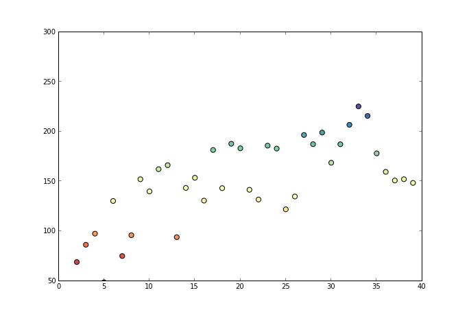
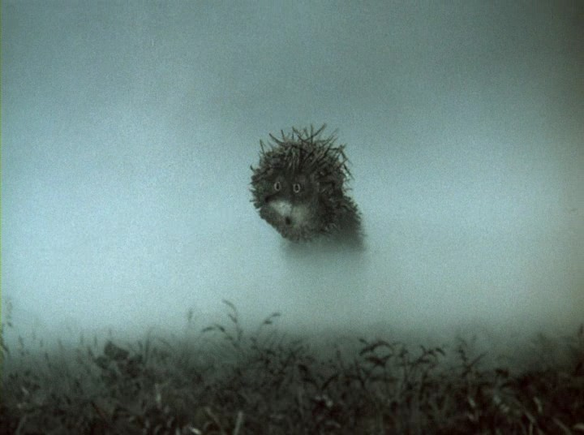

##

- Общие принципы ординации объектов
- Неметрическое многомерное шкалирование
- Как работает неметрическое многомерное шкалирование
- Оценка качества подгонки ординации
- Сравнение ординаций
- Трактовка результатов ординации

### Вы сможете

- Построить диаграмму простейшей непрямой ординации.
- Построить диаграмму nMDS.
- Охарактеризовать качество ординации с помощью величины стресса.
- Сравнить результаты нескольких ординаций

```{r setup, include = FALSE, cache = FALSE, purl = FALSE}
# output options
options(width = 70, scipen = 6, digits = 3)
library(knitr)
# chunk default options
opts_chunk$set(fig.align='center', tidy = FALSE, fig.width = 7, fig.height = 3, warning = FALSE)
```

# Общие принципы ординации объектов

## Классификация методов ординации

__Ординация__ (лат. _ordinatio_ --- расположение в порядке) --- это упорядочивание объектов вдоль некоторых осей, определяющих варьирование свойств этих объектов.

Элемент | (син)экология | морфология | молекулярная биология |
--------| ------------- | ---------- | --------------------- |
Объекты | площадки / пробы | особи / клетки и т.п. | особи / клетки и т.п. |
Собственные свойства объектов | численность / биомасса особей разных видов | измерения, свойства | интенсивность экспрессии гена/пептида |
Внешние факторы | свойства среды | свойства среды / особей / клеток | свойства среды / особей / клеток |

Методы ординации делят на две большие группы (ter Braak, Prentice, 1988):

- Прямая ординация (_direct ordination_ = _direct gradient analysis_) --- когда мы проверяем, влияют ли непосредственно на свойства объектов измеренные внешние факторы.

- Непрямая ординация (_indirect ordination_ = _indirect gradient analysis_) --- когда мы пытаемся найти какие-то закономерности изменения свойств самих объектов, и затем пытаемся связать их с внешними факторами.

## Прямая ординация

__Прямая ординация__ --- упорядочивание объектов с разными свойствами вдоль осей, которые отражают значения переменных. (Например, упорядочение площадок с разным обилием видов в зависимости от параметров среды).

В самом простом случае --- это ординация в осях самих внешних переменных. Но, поскольку обычно переменных больше чем 2--3, обычно пользуются осями, искуственно созданными как функции от нескольких переменных.

Синоним --- ограниченная ординация (_constrained ordination_). 

Методы прямой ординации позволяют тестировать гипотезы о влиянии различных внешних переменных на свойства объектов:

- анализ избыточности (_Redundancy Analysis_, RDA)
- канонический корреспондентный анализ (_Canonical Correspondence Analysis_, CCA).

## Непрямая ординация

__Непрямая ординация__ --- упорядочивание происходит вдоль направления изменения свойств объектов.

Используются только признаки объектов, и только затем для интерпретации результатов используется информация о значениях других переменных.

Синоним --- неограниченная ординация (_unconstrained ordination_). 

Методы непрямой ординации:

- неметрическое многомерное шкалирование (_non-Metric Multidimensional Scaling_, nMDS)
- анализ главных компонент (_Principal Component Analysis_, PCA)
- корреспондентный анализ (_Correspondence Analysis_, CA).


## Пример: Сообщества бентоса акватории Долгой губы (о. Б. Соловецкий, Белое море)

В этом примере используется сокращенный набор данных о бентосе Долгой губы (Нинбург, 1990; Хайтов и др., 2013) --- только численность наиболее обильных видов на 68 станциях.

<div class="smaller">
- `dolg_abundance.txt` --- данные об обилии 25 видов
- `dolg_hydrology.txt` --- данные о 4 гидрологических характеристиках: глубина, Температура придонной воды, Соленость, Степень гидратации грунта
</div>

```{r, echo=FALSE, fig.height=4, fig.width=4.5, purl=FALSE, message=FALSE, warning=FALSE}
library(ggmap, verbose = FALSE, quietly = TRUE)
# if (!file.exists("data/map-solovky-stamen.Rda")) {
#   map1 <- get_stamenmap(bbox = c(left = 35.47, bottom = 64.89, right = 36.3, top = 65.25), zoom = 10, maptype = "toner-lite", crop = TRUE)
#   save(map1, file = "data/map-solovky-stamen.Rda")
# } else {
#   load("data/map-solovky-stamen.Rda")
# }
# ggmap(map1) + ggtitle("Solovetsky island")

if (!file.exists("data/map-solovky-google.Rda")) {
 map2 <- get_googlemap(center = c(lon = 35.86, lat = 65.070), zoom = 10, crop = TRUE, maptype = "satellite")
 save(map2, file = "data/map-solovky-google.Rda")
} else {
 load("data/map-solovky-google.Rda")
}
ggmap(map2) + ggtitle("Solovetsky island")
```

## Читаем данные

```{r}
abund <- read.table("data/dolg_abundance.txt", skip = 1, header = TRUE, sep = ";")
hydrol <- read.table("data/dolg_hydrology.txt", skip = 1, header = TRUE, sep = ";")
```

## Задание: Прямая ординация станций в осях Температуры и Солености

Постройте диаграмму, отражающую ординацию станций в осях Температуры и Солености.

Модифицируйте график так, чтобы была еще видна связь с суммарным обилием видов в пробах.


## Прямая ординация станций в осях Температуры и Солености

### Решение

```{r, fig.width=6, purl=FALSE}
library(ggplot2)
tot_abund <- apply(abund[,-1], 1, FUN = sum)
theme_set(theme_bw(base_size = 16))
ggplot(hydrol, aes(x = Temp, y = Sal, size = tot_abund)) + geom_point() + labs(size = "Total abundance") 
```

## Висконсинская полярная ординация 

Это простейший прием непрямой ординации

Шаг 1. Подготовим данные для анализа.

```{r}
log_abund <- log(abund[,-1] + 1)
row.names(log_abund) <- abund$Station
```


## Висконсинская полярная ординация 

Шаг 2. Вычисление матрицы сходства/различия между объектами.   
Из дидактических соображений возьмем матрицу Евклидовых расстояний. 

```{r, message=F}
library(vegan)
E_dist <- vegdist(log_abund, method = "euclidean")
# E_dist
```


## Висконсинская полярная ординация 

Шаг 3. Найдем наиболее различающиеся объекты (максимальное Евклидово расстояние между ними). 

```{r, echo=FALSE}
unfolding <- function(x, method = "euclidean") {
  n <- nrow(x)
  N <- (n^2 - n)/2
  unfold <- data.frame(i = 1:N, Object_j = NA, Object_k = NA, Distance = NA)
  pos <- 0
  for(i in 1:(n-1)) for(j in (i+1):n) {
    pos <- pos + 1
    unfold$Object_j[pos] <- i
    unfold$Object_k[pos] <- j
  }
  unfold$Distance <- as.vector(vegdist(x, method = method))
  unfold
}

polarord <- function(x, method = "euclidean") {
  dist <- unfolding(x)
  polar_distance <- max(dist$Distance)
  Object_polus1 <- dist$Object_j[dist$Distance == max(dist$Distance)]
  Object_polus2 <- dist$Object_k[dist$Distance == max(dist$Distance)]
  Polar_coord <- data.frame(Object = 1:nrow(x), Coord = NA)
  for(i in 1:nrow(x)) {
    
    AC <- dist$Distance[dist$Object_j == Object_polus1 & dist$Object_k == Object_polus2]
    if (i != Object_polus1 & i != Object_polus2) BC <- dist$Distance[(dist$Object_j == i & dist$Object_k == Object_polus1)|(dist$Object_j == Object_polus1 & dist$Object_k == i)]
    if (i != Object_polus1 & i != Object_polus2) AB <- dist$Distance[(dist$Object_j == i & dist$Object_k == Object_polus2)|(dist$Object_j == Object_polus2 & dist$Object_k == i)]
    if (i != Object_polus1 & i != Object_polus2) Polar_coord$Coord[i] <- (BC^2 + AC^2 - AB^2)/(2 * AC)
    
  }
  Polar_coord$Coord[Object_polus1] <- 0
  Polar_coord$Coord[Object_polus2] <- polar_distance
  Polar_coord
}


New_coord <- polarord(log(abund[, -1]+1))

```

```{r}
dist <- unfolding(log_abund) # Пользовательская функция

dist[dist$Distance == max(dist$Distance),]
```

Эти два объекта и задают ось, вдоль которой будет производиться ординация.

## Висконсинская полярная ординация 

Шаг 4. Координаты каждого из объектов на этой оси могут быть найдены, согласно правилам треугольника 

Возьмем любую другую точку, например "S2"

```{r, echo=FALSE}
a <- dist$Distance[dist$Object_j == 1 & dist$Object_k == 2]

b <- New_coord$Coord[New_coord$Object == 2]

c <- sqrt(a^2 - b^2) 

d <- dist$Distance[dist$Distance == max(dist$Distance)]

point <- data.frame(X = c(0, d, b),Y = c(0, 0, c))

ggplot(point, aes(x = X, y = Y)) + ylim(-1, 14) +geom_text(aes(0, -1), label = "S1") + geom_text(aes(d, -1), label = "S45") + geom_segment(x = 0, xend = d, y = 0, yend = 0, size = 2, color = "red") + geom_text(x = (b-3), y = 1, label ="Polar axis 1") + geom_segment(x = 0, xend = b, y = 0, yend=c, size = 1, color = "black") + geom_segment(x = d, xend = b, y = 0, yend = c, size = 1, color = "black") + geom_point(size = 4, color = "blue") + geom_text(x = b, y = (c + 1), label = "S2") + geom_segment(x = b, xend = b, y = 0, yend=c, size = 1, color = "black", linetype = 2) + geom_point(aes(x = b, y = 0), size = 4, color="yellow") + geom_text(x = 5, y = 8, label = "D 1-2") + geom_text(x = 17.5, y = 8, label = "D 45-2") + geom_text(x = b, y = -1, label = "D 1-45") + ggtitle("Point's coordinate on the polar axis")
```

## Висконсинская полярная ординация 

Шаг 5. Вычисляем координаты на полярной оси для каждого объекта. 

```{r, echo=FALSE}
polarord <- function(x, method = "euclidean") {
  dist <- unfolding(x)
  polar_distance <- max(dist$Distance)
  Object_polus1 <- dist$Object_j[dist$Distance == max(dist$Distance)]
  Object_polus2 <- dist$Object_k[dist$Distance == max(dist$Distance)]
  Polar_coord <- data.frame(Object = 1:nrow(x), Coord = NA)
  for(i in 1:nrow(x)) {
    AC <- dist$Distance[dist$Object_j == Object_polus1 & dist$Object_k == Object_polus2]
    if (i != Object_polus1 & i != Object_polus2) BC <- dist$Distance[(dist$Object_j == i & dist$Object_k == Object_polus1)|(dist$Object_j == Object_polus1 & dist$Object_k == i)]
    if (i != Object_polus1 & i != Object_polus2) AB <- dist$Distance[(dist$Object_j == i & dist$Object_k == Object_polus2)|(dist$Object_j == Object_polus2 & dist$Object_k == i)]
    if (i != Object_polus1 & i != Object_polus2) Polar_coord$Coord[i] <- (BC^2 + AC^2 - AB^2)/(2 * AC)
  }
  Polar_coord$Coord[Object_polus1] <- 0
  Polar_coord$Coord[Object_polus2] <- polar_distance
  Polar_coord
}

New_coord <- polarord(log_abund)

ggplot(New_coord, aes(x=Coord, y =0)) + geom_segment(x = 0, xend = d, y = 0, yend=0, size = 2, color = "red") + geom_point(aes(fill = hydrol$Depth), position = position_jitter(width = 0, height=0.1), size = 4, shape = 21) + ylim(-1, 1) + scale_fill_gradient(low = "cyan", high = "darkblue") + xlab("New coordinate") + ylab("")  + labs(fill = "Depth") 
```


## Висконсинская полярная ординация 

Шаг 6. При необходимости, находим следующую пару наиболее несходных объектов и вычисляем координаты для каждой точки на новой оси.  

_At!_ Одновременное изображение информации об обеих полярных осях на одной диаграмме невозможно!  
Мы не знаем как взаимосвязаны эти оси. Они могут быть неортогональны. 

# Неметрическое многомерное шкалирование

### Non-metric multidimensional scaling (nMDS)

## Результаты функции `metaMDS()`

```{r}
library (vegan)
ord <- metaMDS(log_abund, distance = "bray", k = 2) # результаты сохраняются в объекте ord
ord
```

## Графическое представление результатов средствами пакета `vegan`

```{r}
ordiplot(ord, display = "sites" )
# text(ord) #Можно добавить обозначения сайтов (объектов)
```

## Задание: Графическое представление результатов средствами `ggplot2`

- Исследуйте объект `ord` и извлеките из него данные с новыми координатами
- Постройте график ординации при помощи пакета `ggplot2`
- Раскрасьте точки на ординации согласно глубине (данные в `hydrol`)

## Решение

Рассчитанные при помощи nMDS координаты объектов хранятся в элементе `points`

```{r}
ord$points
```

## Решение

Координаты легко использовать для графика после преобразования в датафрейм.

```{r}
ord_MDS <- data.frame(ord$points)

ggplot(ord_MDS, aes(x = MDS1, y = MDS2)) + geom_point(aes(fill = hydrol$Depth), size = 4, shape = 21) + scale_fill_gradient(low = "cyan", high = "darkblue")  + labs(fill = "Depth")
```


## Важные свойства MDS 

1. Ординация __сохраняет ранг расстояний между объектами__ (похожие располагаются близко, непохожие --- далеко; если объект А похож на B, больше чем на C, то и на ординации он окажется ближе к B, чем к C).
2. Значения координат точек в ординации лишены смысла (их вообще можно не приводить на итоговой ординации), имеет смысл лишь взаиморасположение объектов.
3. Облако точек в осях MDS можно вращать, перемещать, зеркально отражать. Суть ординации от этого не изменится.


# Как работает неметрическое многомерное шкалирование?

## Задание: 

- Создайте датафрейм, содержащий исходные данные (без логарифмирования) только по сайтам S17, S33, S37, S38, S44, S59.
- Постройте ординацию этих объектов с использованием в качестве меры различия коэффициент Брея-Куртиса.
- Измерьте линейкой расстояния между точками на ординации
- Сравните матрицу коэффициентов Брея-Куртиса и матрицу расстояний между точками на ординации.

## Решение

```{r, purl=FALSE}
obj <- c("S17", "S33", "S37", "S38", "S44", "S59")
red_abund <- log_abund[abund$Station %in% obj, ]
row.names(red_abund) <- obj
ord1 <- metaMDS(red_abund, distance = "bray")
```

## Решение

```{r, fig.height=5, purl=FALSE}
ordiplot(ord1, display = "sites", type = "text")
```

## Решение {.columns-2}

```{r, fig.height=4, fig.width=4, purl=FALSE}
ggplot(data.frame(ord1$points), aes(x = MDS1, y = MDS2)) + geom_point() + geom_text(aes(label = row.names(ord1$points)), vjust = -0.5)
vegdist(red_abund[])
```


## Взаиморасположение точек на плоскости подобно взаиморасположению точек в многомерном пространстве признаков

>- В этом легко убедиться, построив график. Но мы видим, что расстояния не полностью совпадают

```{r, echo=FALSE, fig.height=4, purl=FALSE}
dist_compare <- data.frame(Bray = as.vector(vegdist(red_abund[, -1])), MDS = as.vector(vegdist(ord1$points, method = "euclidean")))

ggplot(dist_compare, aes(x = Bray, y = MDS)) + geom_point(size = 4) + xlab("Bray-Curtis dissimilarity") + ylab("Distance between points \non ordination")
```

## Диаграмма Шепарда

__Диаграмма Шепарда__ показывает соответствие расстояний на ординации и расстояний в исходном многомерном пространстве.

```{r}
stressplot(ord1)
```

- По оси X - откладываются ранжированные (расположенные в порядке возрастания) значения D (коэффициент Брея-Куртиса)
- По оси Y- соответствующие им, значения расстояний на плоскости – Z
- Ломаная линия на диаграмме - это монотонная регрессия.

## Монотонная регрессия

__Монотонная регрессия__ минимизирует сумму квадратов отклонений значений координат на ординации от значений в исходном многомерном пространстве.

При одном условии: так, чтобы при этом сохранялись монотонные отношения между ними (если возрастает расстояние в исходном пространстве, то и на ординации оно должно возрастать). Именно это свойство монотонной регрессии позволяет сохранить ранги расстояний при построении ординации.



<div class="footnote">Иллюстрация из блога Fabian Pedregosa [о монотонной регрессии](http://fa.bianp.net/blog/tag/scikit-learn.html)</div>

## Stress

__Stress__ --- мера соответствия ординации на плоскости взаиморасположению точек в многомерном пространстве признаков

$$ Stress = \sqrt{\frac{\sum{(Z_i - Zh_i)^2}}{\sum{Z_{i}^2}}}$$

Для вычисления величины стресса необходимо построить диаграмму Шепарда и подобрать монотонную регресию


## Посмотрим, что означает Stress. 

Чтобы лучше представить себе, откуда берется стресс, оценим его величину для случайно выбранного расположения объектов по сравнению с нашей лучшей ординацией.

Создадим случайную ординацию для этого примера: передвинем все шесть точек на случайное расстояние.

```{r, echo=FALSE, warning=FALSE, purl=FALSE, fig.height=4}
rnd_ord <- data.frame(ord1$points)
set.seed(97)
rnd_ord$RND1 <- rnd_ord$MDS1 - rnorm(nrow(ord1$points), sd = 0.1)
rnd_ord$RND2 <- rnd_ord$MDS2 - rnorm(nrow(ord1$points), sd = 0.1)

pl1 <- ggplot(rnd_ord, aes(x = MDS1, y = MDS2)) + geom_text(label = row.names(rnd_ord))  + ggtitle("MDS ordination")

pl2 <- ggplot(rnd_ord, aes(x = RND1, y = RND2)) + geom_text(label = row.names(rnd_ord))  + ggtitle("Random ordination")

library(gridExtra)
grid.arrange(pl1, pl2, ncol = 2)
```


## Построение монотонной регрессии

Выпишем в развернутом виде матрицу коэффициентов Брея-Куртиса между точками на ординации, а так же между случайно расположенными точками. Отсортируем их в порядке возрастания расстояния на ординации.

```{r, echo=FALSE, purl=FALSE}
# расстояния между точками
monotonic <- unfolding(red_abund[, -1], method = "bray")
# расстояния между случайно расположенными точками
monotonic$RND_Distance <- as.vector(dist(rnd_ord[, 3:4]))
# сортируем по возрастанию расстояния между точками
monotonic <- monotonic[order(monotonic$Distance), ]
monotonic
```

## Построение монотонной регрессии

Вычисляем последовательно средние значения так, чтобы каждое новое было не меньше предыдущего.

В R это делается при помощи функции `isoreg()`

```{r, echo=FALSE, purl=FALSE, fig.height=5}
monotonic$Fitted_monotonic <- isoreg(x = monotonic$Distance, y = monotonic$RND_Distance)$yf

pl3 <- ggplot(monotonic, aes(x = Distance)) + geom_line(aes(y = Fitted_monotonic), color = "blue") + geom_point(aes(y = RND_Distance), size = 4) + xlab("Dissimilarity") + ylab("Distance on ordination(Z)")

pl4 <- ggplot(monotonic, aes(x = Distance)) + geom_line(aes(y = Fitted_monotonic), color = "blue") + geom_point(aes(y = RND_Distance), size = 4) + geom_segment(aes(xend = Distance, y = RND_Distance, yend =  Fitted_monotonic)) + xlab("Dissimilarity") + ylab("Distance on ordination(Z)") + geom_text(x = 0.5, y = 1.8, label = "Zh - deviation from \nfitted monotone regession")

grid.arrange(pl3, pl4, ncol = 2)
```

## Вычисление величины стресса

$$ Stress = \sqrt{\frac{\sum{(Z_i - Zh_i)^2}}{\sum{Z_{i}^2}}}$$

```{r, echo=FALSE}
stress <- with(
  monotonic, 
  sqrt(sum((RND_Distance - Fitted_monotonic)^2) / sum((RND_Distance)^2))
)
```

Для данной, случайной, ординации точек Stress = `r stress`


## Алгоритм MDS

1. Вычисляем матрицу коэффициенттов различия между объектами.
2. Распределеяем объекты в случайном порядке на плоскости [NB! от первичного распределения точек может зависеть и результат, поэтому на практике используются процедуры оптимального начального размещения точек (PCA)].
3. Вычисляем значение стресса.
4. Двигаем точки по плоскости так, чтобы найти минимальное значение стресса.
5. Повторяем процедуру 2-4 несколько раз для того чтобы избежать локальных минимумов стресса.
6. Обычно финальную ординацию поворачивают вдоль оси X так, чтобы ось отражала максимальное варьирование.




## Задание: 

Постройте диаграмму Шепарда вместе с монотонной регрессией на полном материале по Долгой губе. Найдите величину стресса.

Hint: Используйте функцию `stressplot()`

## Решение  

```{r}
stressplot(ord)
```

Stress = `r ord$stress`  

Надежна ли такая ординация?

## Оценка качества подгонки

+ Stress < 0.05 Ординация отличная. Можно в деталях проанализировать взаиморасположение точек
+ 0.05 < Stress < 0.1 Хорошая конфигурация.
+ 0.1 < Stress < 0.2 Приемлемая конфигурация. Надо быть осторожными в интерпретации. 
+ Stress > 0.2 Возможно, надо проводить ординацию в большем количестве осей. Двумерное изображение неадекватно отражает взаиморасположение точек.


## MDS в трехмерном пространстве

```{r, echo=FALSE, fig.height=4}
library(scatterplot3d)
ord3 <- metaMDS(log_abund, k = 3, trace = FALSE)
scatterplot3d(x = ord3$points[,1], y = ord3$points[,2], z = ord3$points[,3], xlab = "MDS 1", ylab = "MDS 2", zlab = "MDS 3")
```

Stress = `r ord3$stress`

At! Ни в коем случае не используете координаты 3D MDS для двумерной ординации.

# Сравнение ординаций

## Задание:

- Постройте ординацию всех станций с использованием Евклидова расстояния

## Решение

```{r}
ord4 <- metaMDS(log_abund, distance = "euclidean")
ggplot(data.frame(ord4$points), aes(x = MDS1, y = MDS2)) + geom_point() 
```

## Насколько похожи ординации, полученные при использовании коэффициента Брея-Куртиса и Евклидова расстояния?

```{r, echo=FALSE, fig.width=10, fig.height=5}
op <- par(mfrow = c(1, 2))
ordiplot(ord, display = "site", type = "text", main = "Bray-Curtis")
ordiplot(ord4, display = "site", type = "text", main = "Euclidean")
par(op)
```

## Прокурстово преобразование

```{r, fig.width=10, fig.height=5}
procrust <- procrustes(ord, ord4)
plot(procrust)
text(procrust, adj = 1, cex = 0.6)
```

<<<<<<< HEAD
#Выявление связи ординации с "внешним" набором данных

## Постановка проблемы

Мы имеем набор объектов, охарактеризованных двумя сопряженным наборами переменных

- Обилия видов ($M$ видов $\times$ $N$ описаний) и параметры среды ($K$ параметров $\times$ $N$ описаний) 
- Морфометрические показатели ($M$ признаков $\times$ $N$ объектов) и генетические признаки (Экспрессия $K$ генов $\times$ $N$ объектов)
- Признаки  хозяина ($M$ признаков $\times$ $N$ объектов) и признки паразита ($K$ признаков $\times$ $N$ объектов) 


## Ординация растительности на пастбищах северных оленей {.smaller .columns-2}

Väre, H., Ohtonen, R. and Oksanen, J. (1995) Effects of reindeer grazing on understorey vegetation in dry Pinus sylvestris forests. Journal of Vegetation Science 6, 523–530.


<small>из Väre, Ohtonen & Oksanen (1995)</small>

```{r, message=FALSE}
library(vegan)
data(varespec)
data(varechem)
```

Два набора данных:

- `varespec` - Описание растительности (обилия отдельных видов)
- `varechem` - Параметры среды на участках (Концентрации веществ)

<br /><br /><br /><br /><br /><br /><br /><br /><br /><br />


# Выявление связи ординации объектов и значений конкретных факторов 


## Задание
1. Постройте ординацию описаний растительности в осях MDS.  
2. Вычислите величину стресса  
3. Раскрасьте точки в соответствии с концентрацией Al    

Hint. В качестве меры различия используйте коэффициент Брея-Куртиса


## Решение {.columns-2 .smaller}
```{r, echo=FALSE, fig.height=5, fig.width=5, message=FALSE, results=F}
veg_ord <- metaMDS(varespec)
veg_MDS <- as.data.frame(veg_ord$points)

```

```{r, fig.height=5, fig.width=5, message=FALSE}
library(ggplot2)
ggplot(veg_MDS, aes(x = MDS1, y = MDS2, fill = varechem$Al))  + 
  geom_point(shape=21, size =4)+ 
  theme_bw() + 
  theme(legend.position = "bottom") + 
  labs(fill = "Aluminium concentration") + 
  scale_fill_gradient(high = "red", low = "yellow")

```


## Анализ связи с переменными c помощью функции envfit() {.columns-2}

```{r}
env_fit <- envfit(veg_ord, varechem)
env_fit
```

В основе работы функции лежит регрессионный анализ

>- Колонки `MDS1` и `MDS2` содержат косинусы углов (пропорциональны коэффициентам частной корреляции)    
>- `r2` - $R^2$ из регресионного анализа     
>- `Pr(>r)` - Пермутационная оценка статистической значимости      


## Визуализация результатов

```{r, fig.height=4.5, fig.width=4.5}
plot(veg_ord, display = "site")
plot(env_fit)
```


## Анализ связи с переменными c помощью функции ordisurf() {.columns-2 .smaller}

```{r, e-fit, echo=FALSE, results='hide', fig.height=5 , fig.width=5}
env_fit2 <- envfit(veg_ord ~ Al + Mn, data = varechem)
plot(veg_ord, display = "site")
plot(env_fit2, col = "red")
ordisurf(veg_ord, varechem$Al, add = TRUE, col="blue")
ordisurf(veg_ord, varechem$Mn, add = TRUE, col="green")
```

```{r, e-fit, echo=TRUE, eval=FALSE}
=======
#Результатов ординации и связь с "внешним" набором данных

## Постановка проблемы

Мы имеем набор объектов, охарактеризованных двумя сопряженным наборами переменных

- Обилия видов ($M$ видов $\times$ $N$ описаний) и параметры среды ($K$ параметров $\times$ $N$ описаний) 
- Морфометрические показатели ($M$ признаков $\times$ $N$ объектов) и генетические признаки (Экспрессия $K$ генов $\times$ $N$ объектов)
- Признаки  хозяина ($M$ признаков $\times$ $N$ объектов) и признки паразита ($K$ признаков $\times$ $N$ объектов) 


## Ординация растительности на пастбищах северных оленей {.columns-2}

Väre, H., Ohtonen, R. and Oksanen, J. (1995) Effects of reindeer grazing on understorey vegetation in dry Pinus sylvestris forests. Journal of Vegetation Science 6, 523–530.


<small>из Väre, Ohtonen & Oksanen (1995)</small>

```{r, message=FALSE}
library(vegan)
data(varespec)
data(varechem)
```

Два набора данных:

- `varespec` - Описание растительности (обилия отдельных видов)
- `varechem` - Параметры среды на участках (Концентрации веществ)

<br /><br /><br /><br /><br /><br /><br /><br /><br /><br />


# Часть 1. Выявление связи ординации объектов и значений конкретных факторов 


## Задание
1. Постройте ординацию описаний растительности в осях MDS.  
2. Вычислите величину стресса  
3. Раскрасьте точки в соответствии с концентрацией Al    

Hint. В качестве меры различия используйте коэффициент Брея-Куртиса


## Решение {.columns-2 .smaller}
```{r, echo=FALSE, fig.height=5, fig.width=5, message=FALSE}
library(ggplot2)
veg_ord <- metaMDS(varespec)
veg_MDS <- as.data.frame(veg_ord$points)
ggplot(veg_MDS, aes(x = MDS1, y = MDS2, fill = varechem$Al))  + geom_point(shape=21, size =4)+ scale_fill_gradient(low = "cyan", high = "darkblue") + theme_bw() + theme(legend.position = "bottom") + labs(fill = "Aluminium concentration") + scale_fill_gradient(high = "red", low = "yellow")

```


## Анализ связи с переменными c помощью функции envfit() {.columns-2}

```{r}
env_fit <- envfit(veg_ord, varechem)
env_fit
>>>>>>> 174fad68f38955f7991ddf83a4d9bc0503dae1aa
```
В основе работы функции лежит анализ обобщенных аддитивных моделей (General Additive Model)

> Применяется, когда зависимость нелинейна
> Изолинии характеризуют уровень значения фактора для данной области ординации объектов

# Самостоятельная работа

##Данные 
Во всех примерах необходимо 
1. Разобраться с данными.
2. Построить ординацию объектов (описаний, проб и т.п.).
3. Визуализировать связь между полученной ординацией и параметрами среды.
4. Сделать выводы о наиболее важных факторах.

**Источники данных**  
1. Обилие полихет-трубкостроителей на литорали Белого моря (оригинальные данные В.М.Хайтова)  
2. растительные сообщества во франции La Mafragh (данные из работы de Belair et al. 1987, представленные в пакете `ade4`)   
3. Деревья на острове Barro Colorado (данные из работы Condit et al. (2002), представленные в пакете `vegan`)


В основе работы функции лежит регрессионный анализ

>- Колонки `MDS1` и `MDS2` содержат косинусы углов (пропорциональны коэффициентам частной корреляции)    
>- `r2` - $R^2$ из регресионного анализа     
>- `Pr(>r)` - Пермутационная оценка статистической значимости      


## Визуализация результатов

```{r, fig.height=4.5, fig.width=4.5}
plot(veg_ord, display = "site")
plot(env_fit)
```


## Анализ связи с переменными c помощью функции ordisurf() {.columns-2 .smaller}

```{r, e-fit, echo=FALSE, results='hide', fig.height=5 , fig.width=5}
env_fit2 <- envfit(veg_ord ~ Al + Mn, data = varechem)
plot(veg_ord, display = "site")
plot(env_fit2, col = "red")
ordisurf(veg_ord, varechem$Al, add = TRUE, col="blue")
ordisurf(veg_ord, varechem$Mn, add = TRUE, col="green")
```

```{r, e-fit, echo=TRUE, eval=FALSE}
```
В основе работы функции лежит анализ обобщенных аддитивных моделей (General Additive Model)

> Применяется, когда зависимость нелинейна
> Изолинии характеризуют уровень значения фактора для данной области ординации объектов

## Задание:

Отразите связь ординации растительности со значениями концентрации гумуса.


## Take-home messages

+ Существует много методов непрямой ординации.
+ nMDS - один из методов ординации в пространстве сниженной размерности. При ординации этим методом сохраняются ранги расстояний между объектами.
+ Оценка качества подгонки ординации производится с помощью величины стресса.
+ Значения координат не имеют особенного смысла. Имеет значение только взаиморасположение точек.
+ Результат nMDS зависит от выбора меры различия

## Литература

+ Borcard, D., Gillet, F., Legendre, P., 2011. Numerical ecology with R. Springer.
+ Legendre, P., Legendre, L., 2012. Numerical ecology. Elsevier.
+ Oksanen, J., 2011. Multivariate analysis of ecological communities in R: vegan tutorial. R package version 2–0.
+ Zuur, A. F., Ieno, E. N., Smith, G. M. Analysing Ecological Data. Springer 2007  
+ Миркин Б.М., Розенберг Г.С., Наумова Л.Г. Словарь понятий и терминов современной фитоцентологии. М. Наука, 1989.

