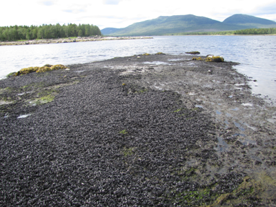
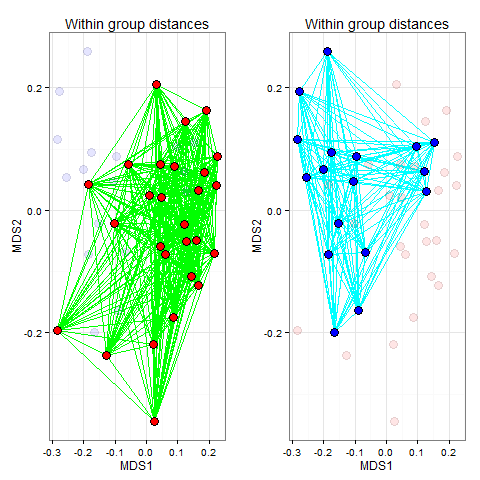

## Вы сможете

 
- Протестировать гипотезу о различиях между дискретными группами многомерных данных с помощью теста ANOSIM  
- Выявить переменные, вносящие наибольший вклад в формирование различий между группами, применив процедуру SIMPER  

```{r setup, include = FALSE, cache = FALSE, purl = FALSE}
# output options
options(width = 70, scipen = 6, digits = 3)
library(knitr)
# chunk default options
opts_chunk$set(fig.align='center', tidy = FALSE, fig.width = 7, fig.height = 3, warning = FALSE)

library(ggplot2)
theme_set(theme_bw())
```

## Вспомним основы {.columns-2 }


       

Этапы работы с гипотезами (Underwood, 1997)

Формулировка биологической гипотезы  

Численное выражение биологической гипотезы ($H$)  

Формулировка альтернативной гипотезы ($H_0$ - нулевой гипотезы)  

Тестирование нулевой гипотезы  


Если $H_0$ ложна, то признаем, что верна $H$ и, следовательно, биологическую гипотезу можно рассматривать как истинное утверждение  

Если $H_0$ истинна, то…  


# ANOSIM: Analysis Of Similarity

## Пример: Динамика сообществ мидиевых банок {.columns-2 .smaller}

Существуют ли различия в сообществах мидиевых банок, сформированных старыми и молодыми мидиями (Khaitov, 2013)?



<br>
<br>
<br>
```{r, echo=TRUE}
com <- read.csv("data/mussel_beds.csv", sep=';', header = T)
ascam <- read.csv("data/ASCAM.csv", sep=';', header = T)
```

<br>
<br>

`com` --- усредненные данные по обилию `r ncol(com[,-c(1:3)])` видов для 3 мидиевых банок (Vor2, Vor4, Vor5).         
`ascam` --- (averaged size class abundance matrix) средние плотности поселения мидий разных размеров (`r ncol(ascam[, -c(1:2)])`] размерных классов) 


## Задание

- Постройте ординацию всех описаний датасета `com` (прологарифмированные данные) в осях nMDS на основе матрицы Брея-Куртиса
- Раскрасьте разными цветами точки, относящиеся к двум разным группам: "Large-dominated" и "Small-dominated"


## Решение

```{r}
library(vegan)
library(ggplot2)

log_com <- log(com[,-c(1:3)] + 1)

ord_log_com <- metaMDS(log_com, distance = "bray", k=2, autotransform = F, trace = 0)
MDS <- data.frame(ord_log_com$points)

```

## Решение

Обратите внимание, здесь есть две группы расстояний между точками

```{r, fig.width=6, fig.height=3.5}
ggplot(MDS, aes(x = MDS1, y = MDS2, fill = com$Mussel_size)) + 
  geom_point(shape = 21, size = 4) + 
  scale_fill_manual(values = c("red", "blue")) + 
  labs(fill = "Mussel size structure type") + ggtitle(paste("Stress = ", round(ord_log_com$stress, 3), sep = " "))
```

## Расстояния между объектами {.columns-2}

### 1. Внутригрупповые расстояния 



<br />

### 2. Межгрупповые расстояния


## Ранги расстояний

Для работы удобно (но не обязательно!) перейти от исходных расстояний между объектами, к их рангам.

Обозначим внутригрупповые расстояния (ранги), как $r_w$, а межгрупповые, как $r_b$.

Вычислим  

* средние значения внутригрупповых рангов расстояний $R_w$
* средние значения межгрупповых рангов расстояний $R_b$


## R - статистика

На основе полученных значений можно построить статистику (Clarke, 1988, 1993)

$$R_{global} = \frac{R_b-R_w}{n(n-1)/4}$$

Эта статистика распределена в интервале -1 < $R_{global}$ < 1

$R_{global}$ - оценивает степень разделенности групп в пространстве признаков.

$R_{global} > 0$  -- как минимум есть тенденция к разделению групп

$R_{global} \rightarrow 1$  -- группы разделяются хорошо

$R_{global} \leq 0$  -- нет разделения на группы


<!-- Статистическая значимость этой величины оценивается пермутационным методом -->

# ANOSIM вручную

## Ранги расстояний в пространстве признаков

**Задание:**

1. Вычислите матрицу коэффициентов Брея-Куртиса на основе матрицы `log_com`
2. Разверните полученную матрицу в вектор. 
3. На основе полученного вектора создайте вектор, содержащий ранги расстояний.


## Решение

```{r}
dist_com <- vegdist(log_com, method = "bray")

rank_dist_com <- rank(dist_com)

```

## Внутри- и межгрупповые расстояния

**Задание:**

4. Создайте треугольную матрицу `dummy_dist`, той же размерности, что и матрица `dist_com`, в которой `0` будет с стоять в тех ячейках, которые соответствуют межгрупповым расстояниями, а   `1` -- внутригрупповым.    

## Решение

```{r}
dummy_dist <- dist(as.numeric(com$Mussel_size))

dummy_dist <- ifelse(dummy_dist == 0, 0, 1)

```


## R-статистка

**Задание:**

5. Вычислите средние значения рангов внутри- и межгрупповых расстояний
6. Вычислите R-статистику


## Решение


```{r}
dists <- data.frame(rank_dist = rank_dist_com, dummy = as.vector(dummy_dist))

library(dplyr)

mean_dists <- dists %>% group_by(dummy) %>% summarize(rank_mean = mean(rank_dist))

n <- nrow(log_com)

R_glob <- (mean_dists$rank_mean[2] - mean_dists$rank_mean[1])/(n * (n - 1)/4) 
```


> Вопрос: Каков дальнейший ход процедуры `ANOSIM`?


## Пермутации


**Задание:**

7. Напишите пользовательскую функцию (пусть она будет называться `R_perm`), которая пермутировала бы принадлежность каждого объекта к той или иной группе и вычисляла бы значение R-статистики для новой комбинации.
8. Используя функцию `for()` вычислите 10000 значений  R-статистики и запишите их в вектор.


Hint. Весь код для пользовательской функции почти такой же, как написали ранее.


## Решение


```{r}
# функция. Весь код почти такой же, как написали ранее.
R_perm <- function(comm, group){
  require(vegan)
  dist_com <- vegdist(comm)
  rank_dist_com <- rank(dist_com)
  dummy_dist <- dist(sample(as.numeric(group))) #Перемешиваем группы
  dummy_dist <- ifelse(dummy_dist == 0, 0, 1)
  dists <- data.frame(rank = rank_dist_com, dummy = as.vector(dummy_dist))
  require(dplyr)
  mean_dists <- dists %>% group_by(dummy) %>% summarize(rank_type = mean(rank))
  n <- nrow(log_com)
  R_p <- (mean_dists$rank_type[2] - mean_dists$rank_type[1])/(n * (n - 1)/4) 
  R_p
} 


R_perms <-  rep(NA, 10000)

for(i in 1:9999) R_perms[i] <- R_perm(comm = log_com, group = com$Mussel_size)

```


Вопрос: Что надо добавить в вектор `R_perms`?


## Распределение пермутационных оценок R-статистики

**Задание:**

9. Постройте частотную гистограмму, характеризующую распределение пермутационных оценок.
10. Нанесите на нее полученное значение $R_{global}$.
10. Вычислите уровень значимости.

## Решение

```{r}
R_perms[10000] <- R_glob

Pl_manual <- ggplot(data.frame(R_perms), aes(x = R_perms)) + 
  geom_histogram(binwidth = 0.01) + 
  geom_vline(xintercept = R_glob, linetype = 2) + xlim(-0.4, 0.4) 

Pl_manual
```

## Решение

Вычисляем уровень значимости

```{r}
p_level <- mean(R_perms >= R_glob)
p_level
```


# Процедура ANOSIM в пакете `vegan`

## Специализированная функция `anosim()`

```{r}
com_anosim <- anosim(log_com, 
           grouping = com$Mussel_size, 
           permutations = 9999, 
           distance = "bray")
```


## Задание

Изучите структуру объекта `com_anosim` и постройте частотное распределение значений $R_{global}$, полученных при каждом акте пермутации

## Решение

```{r r-global, eval=TRUE}

anosim_perm <- data.frame(perm = com_anosim$perm)

anosim_perm[(com_anosim$permutations + 1), 1] <- com_anosim$statistic

Pl_prof <- ggplot(anosim_perm, aes(x = perm)) + 
  geom_histogram(binwidth = 0.01, color = "black", fill = "blue") + 
  geom_vline(xintercept = com_anosim$statistic, linetype = 2)  + xlim(-0.4, 0.4)
Pl_prof

```

## Сравним результаты ручной и автоматической обработки

```{r, echo=FALSE, fig.height=4}
library(gridExtra)
grid.arrange(Pl_manual, Pl_prof, ncol = 1)
```


## Результаты процедуры ANOSIM

```{r}
summary(com_anosim)
```

## Ограничения (Assumptions) для применения ANOSIM

### 1) Внутригрупповые расстояния (ранги) для разных групп должны иметь приблизительно равные медианы и пределы варьирования.

Для проверки этого допущения надо сравнить распределения внутригрупповых и межгрупповых расстояний (рангов)

Распределение расстояний имеет следующий вид

```{r fig.width=5, fig.height=3.5, warning=FALSE}
plot(com_anosim)
```

## ANOSIM позволяет сравнивать одновременно и несколько групп

НО! Есть одно очень важное ограничение: 

### 2) Попарные сравненения групп можно осуществлять только если было показано, что $R_{global}$ статистически значимо.

Если это условие выполнено, то можно проводить попарные сравнения

### Пример

Пусть у нас есть три группы объектов: A, B, C.  
Можно вычислить $R_{A vs B}$, $R_{A vs C}$, $R_{B vs C}$.


Но при больших объемах выборки даже незначительные различия будут достоверны. Важно обращать внимание не только на оценку статистической значимости, но и на значения R! 

**Важно!** При множественных сравнениях придется вводить поправку Бонферрони.

NB! Для сравнения нескольких групп многомерных объектов, есть более мощное средство - **PERMANOVA** 


## Задание

+ Постройте ординацию в осях nMDS, раскрасив точки в разные цвета в зависимости от номера мидиевой банки
+ Проверьте гипотезу о различиях в структуре сообществ на разных банках
+ Проверьте условия применимости ANOSIM
+ Проведите попарное сравнение всех банок


## Решение

### График ординации {.smaller}

```{r fig.height = 4, fig.width=5}
ggplot(MDS, aes(x = MDS1, y = MDS2, fill = com$Bank)) + 
  geom_point(shape = 21, size = 4) + 
  scale_fill_manual(values = c("red", "blue", "green")) + 
  labs(fill = "Mussel beds") + ggtitle(paste("Stress = ", round(ord_log_com$stress, 3), sep = " "))
```

## Решение

### Проверка гипотезы о различиях в структуре сообществ на разных банках

```{r}
bed_anosim <- anosim(log_com, grouping = com$Bank,permutations = 999, distance = "bray")
bed_anosim
```

## Решение

### Условия применимости

```{r}
plot(bed_anosim)
```

## Решение

### Попарные сравнения Vor2 vs Vor4

```{r}
# Vor2 vs Vor4
anosim(log_com [com$Bank %in% c("Vor2", "Vor4"),], 
    grouping = com$Bank[com$Bank %in% c("Vor2", "Vor4")])
```

## Попарные сравнения Vor2 vs Vor5

```{r}
# Vor2 vs Vor5
anosim(log_com[com$Bank %in% c("Vor2", "Vor5"),], grouping = com$Bank[com$Bank %in% c("Vor2", "Vor5")])
```

## Попарные сравнения Vor4 vs Vor5

```{r}
# Vor4 vs Vor5
anosim(log_com [com$Bank %in% c("Vor4", "Vor5"),], grouping = com$Bank[com$Bank %in% c("Vor4", "Vor5")])
```

## Проблема малых выборок

Мощность ANOSIM невелика.

При малых выборках пермутационная оценка уровня значимости может не выявить достоверных различий, даже при очень высоком значении R.


<!-- ## Модельные матрицы и ANOSIM -->

<!-- При проверке гипотезы о значимости различий между группами можно использовать тест Мантела. В этой ситуации модельная матрица будет содержать отрицательную константу, если расстояние внутригрупповое, и положительную константу если расстояние межгрупповое. -->

<!-- Для внутригрупповых расстояний: $const = \frac{-1}{N_{betw} \cdot (n(1-n)/4)}$ -->


<!-- Для межгрупповых расстояний: $const = \frac{1}{N_{with} \cdot (n(1-n)/4)}$ -->


<!-- *Задание*  -->

<!-- 1. Напишите код, который создал бы модельную матрицу для этого анализа.  -->
<!-- 2. Вычислите Мантеловскую корреляцию между матрицей `dist_com` и полученной модельной матрицей -->


<!-- ## Решение -->

<!-- ```{r} -->

<!-- n <- length(com$Bank) -->

<!-- m <- vegdist(as.numeric(com$Bank), method = "euclidean")  -->
<!-- mm <- m -->
<!-- mm[m > 0] <- (1/sum(m > 0))/(n*(n-1)/4) -->
<!-- mm[m == 0] <- (-1/sum(m == 0))/(n*(n-1)/4) -->

<!-- mantel(vegdist(log_com), mm, method = "spearman") -->
<!-- ``` -->

<!-- Значения теста Мантела будут очень близки к $R_{global}$ -->


# SIMPER: Similarity Percentages

## Какие признаки зависимой матрицы вносят наибольший вклад в формирование различий между группами?

```{r, R.options=list(width = 80)}
log_com_simper <- simper(log_com, group = com$Mussel_size, permutations = 999)
summary (log_com_simper)
```

## Оценка вклада в формирование различий

$$Contr_i = \frac{|{y_{i,j}-y_{i,k}}|}{\sum{(y_{i,j}-y_{i,k})}}$$


$y_{i,j}-y_{i,k}$ - разность значений $i$-той переменной (вида) в объектах (пробах) $j$ и $k$

Величины $Contr_i$ далее усредняются для всех межгрупповых пар $average$

$sd$ - среднеквадратичное отклонение

Отношение $average/sd$ характеризует дискриминирующую силу переменной

## Задание

Выявите виды, отвечающие за различия в сообществах разных банок

## Решение

```{r R.options=list(width = 80)}
summary(simper(log_com, group = com$Bank, permutations = 999 ))
```

## Summary

+ ANOSIM --- простейший вариант сравнения нескольких групп объектов, охарактеризованных по многим признакам.
+ С помощью процедуры SIMPER можно оценить вклад отдельных переменных в формирование различий между группами. 


## Что почитать

* Clarke, K. R., Gorley R. N. (2006) PRIMER v6: User Manual/Tutorial. PRIMER-E, Plymouth.
* Legendre P., Legendre L. (2012) Numerical ecology. Second english edition. Elsevier, Amsterdam.
