##

- Еще раз про множественные сравнения
- Пример: Поведение песчанок в тесте открытое поле
- perMANOVA
- Условия применимости perMANOVA
- Более подробная интерпретация результатов perMANOVA
- Более сложные дизайны в perMANOVA

### Вы сможете

- Вспомнить основные дизайны для тестирования гипотез в рамках дисперсионного анализа
- Применить функции R для тестирования гипотез с помощью perMANOVA

```{r setup, include = FALSE, cache = FALSE, purl = FALSE}
# output options
options(width = 70, scipen = 6, digits = 3)
library(knitr)
# chunk default options
opts_chunk$set(fig.align='center', tidy = FALSE, fig.width = 7, fig.height = 3, warning = FALSE)
```

# Еще раз про множественные сравнения 

## В чем опасность множественных сравнений?

$\alpha$ --- это __вероятность совершить ошибку первого рода при тестировании гипотезы__ (= вероятность отвергнуть истинную нулевую гипотезу, = вероятность найти различия там, где их нет).

Обычно принимается, что $H_0$ отвергают на уровне значимости $\alpha = 0.05$. 

Когда у нас два средних --- все просто, сравнение всего одно. Естественно, __вероятность совершить ошибку I рода для группы сравнений $\alpha _{familywise}$ равна уровню значимости для единственного сравнения $\alpha _{per\,comparison}$__.

$\alpha _{familywise} = \alpha _{per\,comparison}$

Но если сравнений много, то растет вероятность совершить хотя бы одну ошибку I рода (найти различия там, где их нет).

## Если сравнений много...

Например, если мы хотим попарно сравнить три значения, нам понадобится сделать 3 сравнения.

Пусть мы решили, что в каждом из сравнений будем использовать уровень значимости $0.05$.

Тогда в каждом из сравнений вероятность совершить ошибку первого рода будет $\alpha_{per\,comparison} = 0.05$.

Если сделать $N$ тестов, то вероятность совершить хотя бы одну ошибку I рода в группе тестов (family-wise error rate, FWER) значительно возрастает.

$$\alpha_{familywise} = 1 - (1 - \alpha_{per\,comparison})^N$$

## Чем больше сравнений, тем больше вероятность обнаружить различия там, где их на самом деле нет.

$$\alpha_{familywise} = 1 - (1 - \alpha_{per\,comparison})^N$$

В таблице даны значения $\alpha _{familywise}$ для разного числа сравнений, если $\alpha _{per\,comparison} = 0.05$:

```{r results='asis', echo=FALSE, purl=FALSE}
x <- 2:5
ncomb <- choose(x, 2)
FWER <- 1 - (1 - 0.05)^ncomb
df <- data.frame(x, ncomb, FWER)
colnames(df) <- c("Число средних", "Число сравнений", "&alpha;<sub>familywise</sub>")
library(knitr)
kable(df)
```


## Для решения проблемы есть два подхода

1. Взять более жесткий порог уровня значимости. (Например, ввести поправку Бонферрони, поправку Хольма-Бонферрони, воспользоваться процедурой Бенъямини-Хохберга).
2. Изменить схему тестирования гипотезы --- тестировать не три независимых гипотезы, а одну сложную (так это, например, происходит в ANOVA).

## Поправка Бонферрони

$\alpha^*_{per\,comparison} = \alpha_{familywise} /{N}$

Это жесткий способ, т.к с возрастанием числа сравнений резко снижается уровень значимости и мощность теста. В результате растет риск не найти различий, где они есть. 

Ниже $\alpha _{per\,comparison}$ после поправки Бонферрони, сохраняющие $\alpha _{familywise} = 0.05$:

```{r results='asis', echo=FALSE, purl=FALSE}
x <- 2:6
ncomb <- choose(x, 2)
APC <- 0.05 / ncomb
df1 <- data.frame(x, ncomb, APC)
colnames(df1) <- c("Число средних", "Число сравнений", "&alpha;<sub>per comparison</sub>")
library(knitr)
kable(df1)
```

## Метод Хольма-Бонферрони

Метод Хольма-Бонферрони --- это пошаговая процедура.

Чтобы зафиксировать $FWER \le \alpha_{familywise}$:

1. Сортируем в порядке возрастания $N$ значений $p$, полученные в тестах, и присваиваем каждой ранг $j$ от 1 до $N$:  
$$p_{1} \le p_{2} \le \cdots \le p_{N - 1} \le p_{N}$$
2. Вводим поправку для значений $p$   
$${p^*_{j}} = min{\{(N - j + 1) \cdot p_{j},\;1\}}$$
3. Сравниваем с $\alpha$. Отвергаем $H_0$, если $p^*_{j} < \alpha_{familywise}$

## Пример поправки Хольма-Бонферрони

В таблице ниже даны результаты нескольких сравнений ($N = 5$). С помощью поправки Хольма-Бонферрони для каждого $p_j$ мы получим свое скорректированное значение $p^*_{j}$. 

```{r echo=FALSE, message=FALSE, results='asis', purl=FALSE}
n <- 5
alph <- 0.05
dat <- data.frame(
  rank = 1:5,
  p_val = c(0.001, 0.01, 0.035, 0.04, 0.046)
  )

dat$adj <- n - dat$rank + 1
dat$p_adj <- pmin(dat$adj * dat$p_val, 1)
dat$h0 <- ifelse(dat$p_adj <= alph, "Да", "Нет")
frst_neg <- match("Нет", dat$h0)
dat$h0[frst_neg] <- "Нет, и дальше везде сохраняем $H_0$"
dat$h0[(frst_neg + 1):nrow(dat)] <- ""
colnames(dat) <- c("Ранг($j$)", "$\\mathbf{p_{j}}$", "$N - j + 1$",  "$\\mathbf{p^*_{j}} = min{\\{(N - j + 1) \\cdot p_{j},\\;1\\}}$", "Отвергаем $H_0$?")

library(knitr)
kable(dat, format = "markdown")
```

# Дисперсионный анализ (повторение)

## Классический дисперсионный анализ

<div class="columns-2">

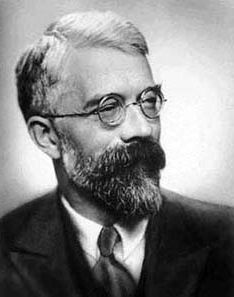

<small>Рональд Элмер Фишер</small>

Пусть имеется несколько градаций фактора _A_  
(например, $A _{1...3}$)

- Почему  появляется __межгрупповая__ изменчивость, то есть разные средние значения для групп по фактору _А_?
- Почему  появляется __внутригрупповая__ изменчивость, то есть разные значения _y_ в группах?

</div>

| A1  | A2 | A3 |   |
| --------- | --------- | --------- | -- |
| $y_{11}, y_{12}, y_{13}$ | $y_{21}, y_{22}, y_{23}$ | $y_{31}, y_{32}, y_{33}$ |    |
| $\bar{y}_{A_1}$ |$\bar{y}_{A_2}$ | $\bar{y}_{A_3}$ | $\bar{Y}_{gen}$ |

## Суммарная дисперсия может быть разложена на две составляющие

$SS_{total} = SS_{between} + SS_{within}$

```{r echo = FALSE, warning=FALSE, fig.width = 10, fig.height=4, message=FALSE, purl=FALSE}
library(ggplot2)
theme_set(theme_bw())
library(plyr)
library(gridExtra)
set.seed(3451)
df_anova <- data.frame(X = factor(unlist(lapply(c("A1", "A2", "A3"), rep, times = 5))),
  Y = unlist(lapply(c(3, 8, 5), function(x)rnorm(5, mean = x, sd = 2))))
df_anova$JitterX <- ave(as.numeric(df_anova$X), df_anova$X, FUN = function(x) x + rnorm(length(x), sd = 0.5))
df_anova <- ddply(df_anova, .(X), transform, MeanY = mean(Y))

lims <- range(df_anova$Y) + c(-1, 1)
yannot <- lims[1] + 0.5
gmean <- mean(df_anova$Y, na.rm = TRUE)

gg_anova <- ggplot(df_anova, aes(x = JitterX, y = Y)) + aes(colour = X) + xlab("X") + scale_x_continuous("X", breaks = 1:3, labels = levels(df_anova$X), limits = c(0, 4)) + theme(legend.position = "none") + ylim(lims[1], lims[2])

# Общая изменчивость (отклонения от общего среднего)
gg_anova_total <- gg_anova + 
  geom_point() +
  geom_segment(aes(xend = JitterX, yend = gmean)) +
  geom_hline(yintercept = gmean, linetype = "dashed") + 
  ggtitle("Общая изменчивость\n(отклонения от общего среднего)") +
  annotate("text", label = "Общее\nсреднее", 
           x = 0,  y = gmean, hjust = -0.1, size = 4) + 
  annotate("text", label = "SS[total] == sum((bar(y) - y[ij]))^2", parse = TRUE, x = 0,  y = yannot, hjust = 0, size = 6) 

# Межгрупповая изменчивость (связанная с фактором)
gg_anova_factor <- gg_anova + 
  geom_hline(yintercept = gmean, linetype = "dashed") + 
  geom_text(size = 25,  stat="summary", fun.y = "mean", aes(y = MeanY, label = "-"), vjust = 0.4) + 
  geom_segment(aes(x = as.numeric(X), y = MeanY, xend = as.numeric(X), yend = gmean)) +
  ggtitle("Факторная изменчивость\n(межгрупповая)")+
    annotate("text", label = "SS[between] == sum(n[j](bar(y)[j] - bar(y)))^2", parse = TRUE, x = 0,  y = yannot, hjust = 0, size = 6)

# Внутригрупповая изменчивость (случайная)
gg_anova_error <- gg_anova + 
  geom_point() +
  geom_text(size = 25,  stat="summary", fun.y = "mean", aes(y = MeanY, label = "-"), vjust = 0.4) + 
  geom_segment(aes(xend = JitterX, yend = MeanY)) +
  ggtitle("Случайная изменчивость\n(внутригрупповая)")+
    annotate("text", label = "SS[within] == sum(sum((bar(y) [j] - y[ij])))^2", parse = TRUE, x = 0,  y = yannot, hjust = 0, size = 6)

grid.arrange(gg_anova_total, gg_anova_factor, gg_anova_error, ncol = 3, widths = c(0.38, 0.31, 0.31))
```


## Для тестирования гипотезы о влиянии фактора надо сравнить межгрупповую изменчивость ($SS_{between}$) и внутригрупповую ($SS_{within}$). 

Для этого сравнения Фишер предложил статистику $F = \frac{SS_{between} / (a - 1)}{SS_{within} / (N - a)}$, где $a$ --- число групп.

### F-распределение

Если межгрупповая изменчивость равна внутригрупповой, то $F$ принадлежит $F$-распределению с двумя параметрами $df_{between} = a - 1$ и $df_{within} = N - a$, где $a$ --- число классов, $N$ --- общее количество объектов в анализе.


```{r, echo=FALSE, fig.height=2.5, purl=FALSE}
library(ggplot2)
theme_set(theme_bw())
df_f <- data.frame(x = seq(0, 5, 0.01), y = df(seq(0, 5, 0.01), 3, 36))
F_crit <- qf(p = 0.95, df1 = 3, df2 = 36)
shade <- rbind(c(F_crit, 0), subset(df_f, x > F_crit), c(df_f[nrow(df_f), "x"], 0))

ggplot(data = df_f, aes (x = x, y = y)) + geom_line(size = 2, color = "steelblue") + xlab("F for df = 3 and df = 36") + ylab ("Probability") + geom_polygon(data = shade, aes(x, y), fill = "orangered") + geom_vline(aes(xintercept = F_crit), linetype = "dashed") + annotate(geom = "text", x = F_crit, y = max(df_f$y), label = "F when p = 0.05", hjust = -0.1) + annotate(geom = "text", x = F_crit, y = max(df_f$y)/2, label = "reject H0", hjust = -0.1) + annotate(geom = "text", x = F_crit/2, y = max(df_f$y)/2, label = "fail to reject H0", hjust = 0)
```


## Однофакторный дизайн


Выявляется влияние фактора А.

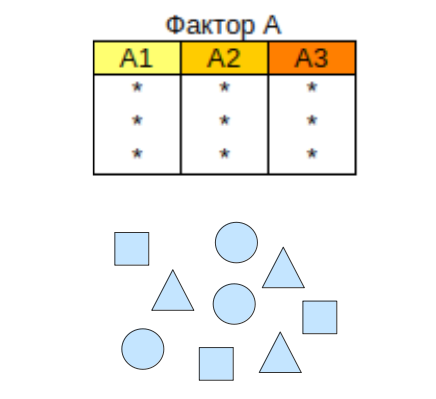


## Многофакторный ортогональный дизайн

Выявляется влияние фактора А, B и их взаимодействия A$\times$B.

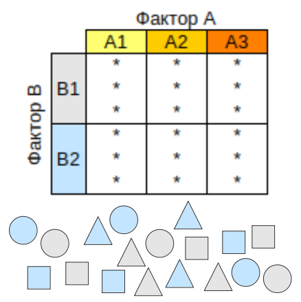
  

## Иерархический дизайн

Некоторые дискретные предикторы могут быть иерархически соподчинены.

Выявляется влияние вложенного фактора B внутри градаций фактора A.

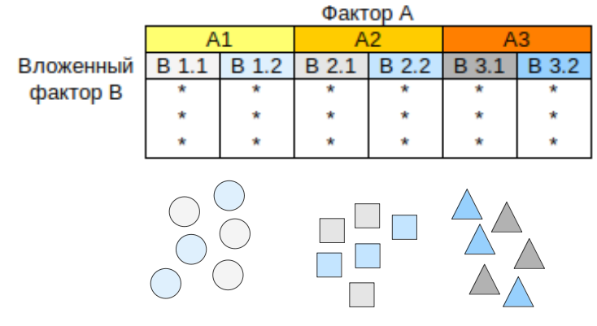

Влияние вложенного фактора B можно оценить, но чаще всего оно не представляет интереса для исследователя.


## Рандомизированный полный блочный дизайн


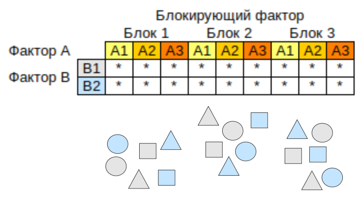

Влияние блокриующего фактора тоже можно оценить, но часто оно не представляет интереса для исследователя. Обычно блокирующий фактор рассматривается как случайный.

# Пример: Поведение песчанок в тесте открытое поле


## Пример: Поведение песчанок в тесте открытое поле

**Гипотеза:** Разные виды песчанок различаются по поведению в тесте "Открытое поле"

<center>
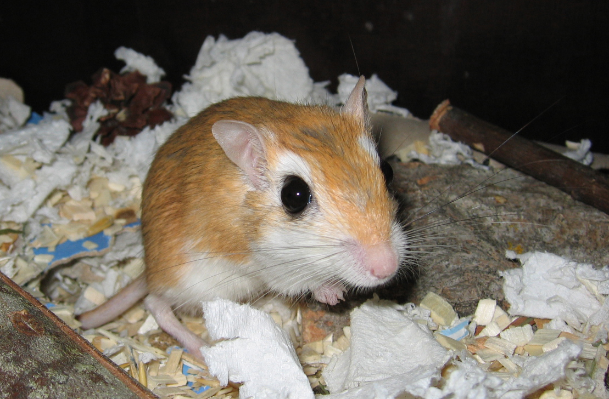
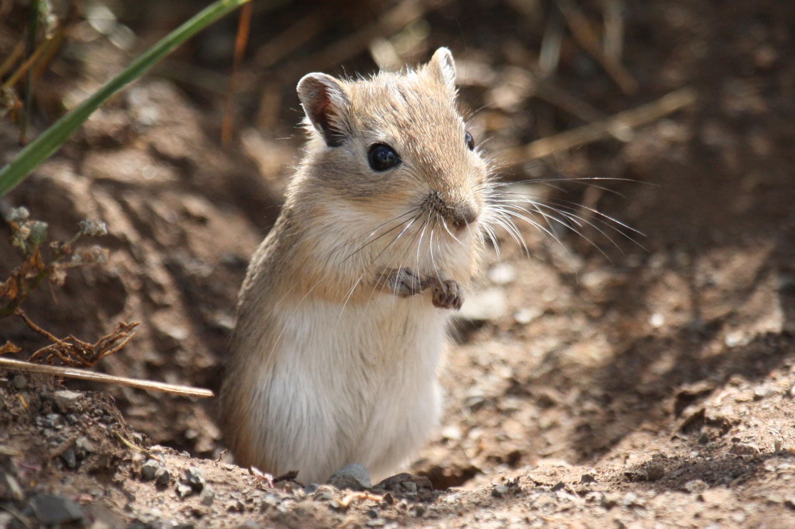
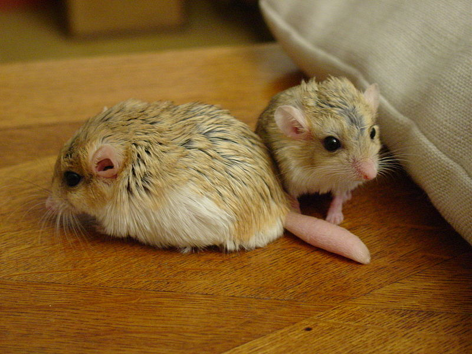
</center>

Виды:

* Карликовая песчанка (_Gerbillus gerbillus_)
* Монгольская песчанка (_Meriones unguiculatus_)
* Жирнохвостая песчанка (_Pachyuromys duprasi_)

<br/><br/><br/><br/>
<small>Фото: (1) XV8-Crisis; (2) Alastair Rae; (3) P.H.J. (Peter) Maas / www.petermaas.nl </small>

## Тест "открытое поле"

<div align="center">
<iframe width="560" height="315" src="https://www.youtube.com/embed/LifsadrTAUY?rel=0&start=73" frameborder="0" allowfullscreen></iframe>
</div>

## Пример: Поведение песчанок в тесте открытое поле

**Гипотеза:** Разные виды песчанок различаются по поведению в тесте "Открытое поле"

<center>


</center>

Оценка поведения песчанок трех видов по семи признакам:

* Время до выхода в квадрат открытого поля
* Количество актов мочеиспускания
* Количество актов дефекации
* Количество пересеченных квадратов
* Число вертикальных стоек
* Количество актов смещенной активности
* Время проведенное в центре квадрата открытого поля

<small>Фото: (1) XV8-Crisis; (2) Alastair Rae; (3) P.H.J. (Peter) Maas / www.petermaas.nl </small>

## Данные наблюдений

```{r eval=FALSE}
pesch <- read.csv("data/pesch.csv", header = TRUE, sep = ";")
head(pesch)
```

```{r echo=FALSE}
pesch <- read.csv("data/pesch.csv", header = TRUE, sep = ";")
rmarkdown::paged_table(head(pesch))
```

## Задание

- Какую меру различия можно использовать с этими данными?
- Как можно преобразовать данные?
- Постройте ординацию объектов в осях MDS и раскрасьте точки в соответствии с видами

## Решение

Поскольку измеренные признаки варьируют в разных масштабах, целесообразно логарифмировать данные.

```{r purl=FALSE}
options(digits = 4)
log_pesch <- pesch
log_pesch[, 3:ncol(pesch)] <- log(pesch[, 3:ncol(pesch)] + 1)
head(log_pesch)
```

## Решение

```{r ord-pesch, message=FALSE, purl=FALSE, results='hide'}
library(ggplot2)
library(vegan)
theme_set(theme_bw())

mds_pesch <- metaMDS(log_pesch[, 3:ncol(pesch)], distance = "euclidean")
mds_pesch <- as.data.frame(mds_pesch$points)
mds_pesch$Species <- pesch$Species

ggplot(mds_pesch, aes(x = MDS1, y = MDS2, colour = Species)) + 
  geom_point(size = 5)
```

## Различаются ли виды песчанок по поведению?

Каким способом можно ответить на этот вопрос?

```{r ord-pesch, echo=FALSE, message=FALSE, purl=FALSE, results='hide'}
```

>- Мы могли бы взять каждый из поведенческих признаков отдельно и провести одномерный однофакторный дисперсионный анализ.
- Но нас интересует поведение в целом --- нужен многомерный анализ.


# Методы выявления различий между группами для многомерных данных

## ANOVA разработан для одномерных данных

### Что делать если мы хотим оценивать объект по многим признакам сразу?

Примеры:

* Сообщество как целое (много видов)
* Поведение как целое (много элементов)
* Метаболом как целое (много метаболитов)
* Ответы респондентов на множество вопросов в анкетах

Варианты решений:

>- MANOVA (Fisher, 1925, Wilks, 1932)
- distance-based Redundancy Analysis (db-RDA) (Legendre, Anderson, 1999)
- perMANOVA (Anderson, 2001; McArdle, Anderson, 2001)

## Многомерный дисперсионный анализ (MANOVA)

Давно разработан параметрический метод MANOVA (Multivariate Analysis Of Variance). Он дает возможность проводить анализ аналогичный ANOVA. В основе MANOVA лежат представление о многомерном нормальном распределении и расстояниях между центроидами.

В MANOVA сравниваются:

- __<span class="red">отклонения точек от групповых центроидов</span>__ (аналог $SS_{within}$)
- __<span class="blue">отклонения групповых центроидов от общего центроида</span>__ (аналог $SS_{between}$).

<div class="columns-2">

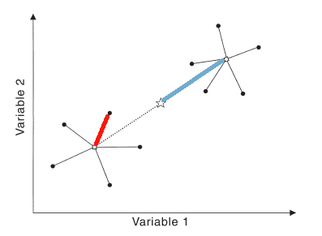

<small>Anderson, 2001</small>

<br /><br /><br /><br />
Ограничения MANOVA:

- Многомерная нормальность распределения
- Гомогенность дисперсий


## Permutational Multivariate Analysis of Variance (perMANOVA) {.columns-2}


<small>Марти Джейн Андерсон</small>

<br /><br /><br /><br />


## Теорема

Сумма квадратов <span class="red">отклонений от центроидов</span> равна сумме квадратов <span class="orange">взаимных расстояний</span>, деленной на число объектов


Для Евклидовых расстояний эта закономерность была известна давно (например, Kendall, Stuart 1963).

<div class="columns-2">

<small>Anderson, 2001</small>

<br /><br /><br /><br />

В случае Евклидова расстояния (именно его имплицитно использует MANOVA) центроиды найти очень просто --- это средние значения соответствующих координат. Поэтому обычно сначала непосредственно вычисляли центроиды, и затем --- сумму квадратов отклонений от них.

Для других мер различия центроиды найти гораздо сложнее. Например, для коэффициента Брея-Куртиса (не метрика), среднее значение не будет соответствовать центроиду.

</div>

## Марти Андерсон показала, что можно обойтись без вычисления центроидов и для других мер различия

<center></center><small>Anderson, 2001</small>

<div class="columns-2">

MANOVA (Евклидово расстояние)

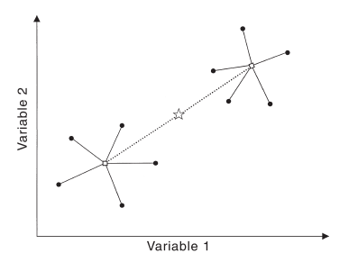

<small>Anderson, 2001</small>

perMANOVA (любой коэффициент)

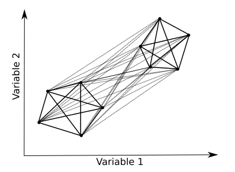

<br />

</div>

## Можно непосредственно из матрицы любых коэффициентов различия найти и общую и внутригрупповые суммы квадратов

<small>Anderson, 2001</small>

## Разложение дисперсии становится очень простым

<div class="columns-2">

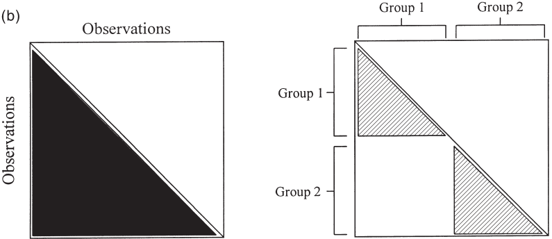
<small>Anderson, 2001</small>

<br /><br />

Пусть всего _N_ элементов, принадлежащих _a_ группам по _n_ элементов в каждой, _d_ - расстояние между _i_-тым и _j_-тым объектами, $\epsilon$ - 1 если объекты _i_ и _j_ из одной группы и 0, если из разных.

</div>

$SS_{total} = \frac{1}{N}\sum \sum {d_{ij}^2}$  
Сумма квадратов взаимных расстояний --- это сумма квадратов субдиагональных элементов, деленная на число объектов _N_. 

$SS_{within} = \frac{1}{n}\sum \sum {d_{ij}^2 \cdot \epsilon_{ij}}$  
Внутригрупповая сумма квадратов --- это сумма всех сумм квадратов расстояний между элементами для каждой группы, деленная на _n_ число объектов в группе.

Тогда межгрупповая сумма квадратов $SS_{between} = SS_{total} - SS_{within}$

## Псевдо-F статистика

$$F = \frac{SS_{between} / (a - 1)}{SS_{within}/(N - a)}$$

### Для оценки значимости псевдо-F используется пермутационная процедура:

* Случайным образом перетасовываются строки исходной матрицы 
* После каждого акта пермутации вычисляется $F_{perm}$
* Уровень значимости
* Внимание! Для иерархического дизайна процедура пермутации имеет свои особенности (обсудим позднее).

$$p = \frac {N_{F_{perm} \ge F}} {N_{permutations}}$$

# perMANOVA в примере

## Применим метод perMANOVA (функция `adonis()`)

```{r}
library(vegan)
permanova_pesch <- adonis(log_pesch[3:9] ~ Species, data = log_pesch,
                          method = "euclidean")
permanova_pesch
```

Мы видим традиционную для ANOVA таблицу результатов. Что здесь что?

## Результаты perMANOVA

```{r, echo=FALSE, purl=FALSE}
permanova_pesch
pvalue <- permanova_pesch$aov.tab$`Pr(>F)`[1]
```

>- Поведение разных видов песчанок в тесте открытое поле значимо различалось (perMANOVA, p = `r pvalue`).

# Условия применимости perMANOVA

## Условия применимости perMANOVA

1. Требуется равенство внутригрупповых дисперсий (гомоскедастичность).

2. Желательно использование сбалансированных данных (с равным объемом групп), т.к. этом случае perMANOVA устойчив к гетерогенности дисперсии (Anderson, Walsh, 2013).


## Проверка равенства внутригрупповых дисперсий

Для проверки можно использовать функцию `betadisper()`, изначально предназначенную для сравнения $\beta$-разнообразия сообществ.

Функция `betadisper()` вычисляет внутригрупповые центроиды и координаты точек в пространстве главных координат (_Principal Coordinate Analysis = PCoA = metric MDS_). 

Затем, значимость различий отклонений от центроидов в разных группах проверяется с помощью процедуры `PERMDISP2`.

```{r flow, echo=FALSE, fig.width=9, fig.height=2}
library(DiagrammeR)
grViz("images/permanova-assumpt-check.gv", width = 975)
```

<p></p>

```{r}
dist_pesch <- vegdist(log_pesch[,3:ncol(pesch)], method  = "euclidean")
PCO_pesch <- betadisper(dist_pesch, log_pesch$Species)
```

## График ординации PCoA 

Объект, возвращаемый `betadisper()`, позволяет также нарисовать наши объекты в пространстве главных координат (PCoA).

```{r fig.height=4.5}
plot(PCO_pesch, main = "PCoA ordination")
```

## Процедура  `PERMDISP2` для проверки равенства внутригрупповых дисперсий

Процедура `PERMDISP2` реализована в пакете `vegan` в функции `anova.betadisper()`. Это многомерный аналог теста Левина на гомогенность дисперсий в группах, который иногда используется для проверки условий применимости дисперсионного анализа.

```{r results='markup'}
anova(PCO_pesch)
```

>- Не выявлено значимых различий разброса внутригрупповых расстояний.

## Для визуализации можно нарисовать боксплот 

```{r fig.height=5}
boxplot(PCO_pesch)
```

# Более подробная интерпретация результатов perMANOVA

## Post hoc тесты в perMANOVA

```{r, echo=FALSE, purl=FALSE}
library(ggplot2)
#dist_pesch <- vegdist(log_pesch[,3:ncol(pesch)], method = "euclidean")
mds_pesch <- metaMDS(log_pesch[,3:ncol(pesch)], distance = "euclidean", trace = FALSE)
mds_pesch <- as.data.frame(mds_pesch$points)
mds_pesch$Species <- pesch$Species
pl_pesch <- ggplot(mds_pesch, aes(x = MDS1, y = MDS2, colour = Species))
pl_pesch + geom_point(size = 5)
```

На приведенной ординации видно, что точки, соответствующие Монгольским песчанкам расположены отдельно от остальных.

Для выявления попарных различий нужны попарные сравнения.

## Попарные сравнения как замена post hoc тесту

Внимание! В пакете `vegan` пост хок тест не реализован. Но мы можем сделать простейшую его версию самостоятельно.


<center>


</center>

<br/>
Проведем __попарные сравнения__ между группами, то есть:

* Карликовые _vs._ Монгольские
* Карликовые _vs._ Жирнохвостые
* Монгольские _vs._ Жирнохвостые

<br/><br/><br/>
<small>Фото: (1) XV8-Crisis; (2) Alastair Rae; (3) P.H.J. (Peter) Maas / www.petermaas.nl </small>

## Функция для попарных сравнений perMANOVA

```{r}
pairwise_permanova <- function(dat, group, strata = NULL, ...){
  pair <- combn(unique(as.character(group)), 2)
  ncomb <- ncol(pair)
  res <- rep(NA, ncomb)
  for (i in 1:ncomb) {
    filter <- group %in% pair[, i]
    if(is.null(strata)){
      posthoc <- adonis(dat[filter, ] ~ group[filter], ...)$aov.tab$Pr[1]
    } else {
      posthoc <- adonis(dat[filter, ] ~ group[filter], 
                        strata = strata[filter], ...)$aov.tab$Pr[1]
    }
    res[i] <- posthoc
    names(res)[i] <- paste(pair[, i], collapse = " vs. ")
  }
  return(res)
}
```

## Результаты попарных сравнений

<center>


</center>

```{r R.options=list(width = 100)}
p_vals <- pairwise_permanova(
  dat = log_pesch[, -c(1:2)], group = log_pesch$Species, 
  method = "euclidean", permutations=9999)
p_vals
```

Это все? Пишем статью?

<br/><br/>
<small>Фото: (1) XV8-Crisis; (2) Alastair Rae; (3) P.H.J. (Peter) Maas / www.petermaas.nl </small>

## Поправка на множественные сравнения

Мы делали три пары сравнений --- нужно ввести поправку для уровня значимости. Будем считать значимыми различия в тех сравнениях, где после введения поправки $p < 0.05$.

Можно посчитать скорректированные значения уровня значимости $p$ с учетом поправки Хольма-Бонферрони.

```{r R.options=list(width = 100)}
p.adjust(p_vals, method = "holm")
```

# Более сложные дизайны в perMANOVA

## Многофакторный дизайн в perMANOVA
 
Выясним, влияет ли пол и вид песчанок на поведение. 

Отфильтруем исходные данные (в случае с жирнохвостыми песчанками были изучены только самки)

```{r}
log_pesch2 <- log_pesch[log_pesch$Species != "zhirnokhvost", ]
```

## Проведем двухфакторный анализ perMANOVA {.smaller}

Различается ли поведение песчанок в зависимости от видовой принадлежности и пола?

```{r}
twofact_pesch <- adonis(log_pesch2[,3:ncol(pesch)] ~ Gender * Species,
                        data = log_pesch2, method = "euclidean")
twofact_pesch
```

## Здесь возможен иерархический дизайн {.smaller}

Различается ли поведение самцов и самок у этих видов песчанок?

```{r}
nested_pesch <- adonis(log_pesch2[, 3:ncol(pesch)] ~ Gender, 
                       data = log_pesch2, strata = log_pesch2$Species, 
                       method = "euclidean")
nested_pesch
```

Внимание! Пермутации производятся только в пределах группирующего фактора (аргумент `strata`)

## Задание

+ Создайте датафрейм из файла `simulated_data.csv` (Это данные симулированные по алгоритму, приведенному в справке по функции `adonis()`)
+ В этом датафрейме записано обилие двух видов на экспериментальных площадках двух типов: без добавления и с добавлением NO3, по 6 повторностей в каждом эксперименте.  
Эксперименты были независимо проведены на 3 полях. 
+ Оцените, зависит ли структура совместного поселения этих двух видов от концентрации NO3.

## Решение

```{r purl=FALSE}
com <- read.csv("data/simulated_data.csv", sep = ',', header = T)

# Ошибочный дизай
com_permanova <- adonis(com[,1:2] ~ com$NO3)

# Правильный дизайн
com_permanova2 <- adonis(com[,1:2] ~ com$NO3, strata = com$field)

```

## Summary

+ При одновременном тестировании нескольких гипотез растет вероятность ошибки I рода.
+ Чтобы контролировать вероятность ошибки I рода, либо используют более жесткий уровень значимости, либо тестируют сложную гипотезу вместо нескольких простых.
+ perMANOVA дает возможность тестировать сложные гипотезы в отношении явлений, описанных по многим переменным (т.е. на многомерных данных).
+ В perMANOVA можно использовать любые коэффициенты различия.
+ Для применения perMANOVA требуется равенство разбросов точек между центроидами их групп, но при равных объемах групп анализ устойчив к отклонениям от этого условия.
+ При использовании perMANOVA важно не запутаться в дизайне.

## Другие программы

* *Primer 6.0 + PERMANOVA* Коммерческий продукт.
* *PAST* Некоммерческая программа. Здесь метод называется NPMANOVA. 
* Оригинальная программа М. Андерсон *PERMANOVA* и  *PERMDISP*.

## Что почитать

* Anderson, M.J. 2001. A new method for non-parametric multivariate analysis of variance. Austral Ecology, 26: 32–46.
* Anderson, M.J. 2005. PERMANOVA: a FORTRAN computer program for permutational multivariate analysis of variance. Department of Statistics, University of Auckland, New Zealand.
* Anderson, M.J. (2004). PERMDISP: a FORTRAN computer program for permutational analysis of multivariate dispersions (for any two-factor ANOVA design) using permutation tests. Department of Statistics, University of Auckland, New Zealand. 
* Legendre P., Legendre L. (2012) Numerical ecology. Second english edition. Elsevier, Amsterdam.
