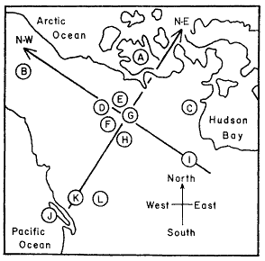

## Кластерный анализ

- Методы построения деревьев
- Методы кластеризации на основании расстояний
- Примеры для демонстрации и для заданий
- Кластерный анализ в R
- Качество кластеризации:
    - кофенетическая корреляция
    - ширина силуэта
    - поддержка ветвей
- Сопоставление деревьев: танглграммы

### Вы сможете

- Выбирать подходящий метод агрегации (алгоритм кластеризации)
- Строить дендрограммы
- Оценивать качество кластеризации (Кофенетическая корреляция, ширина силуэта, поддержка ветвей)
- Сопоставлять дендрограммы, полученные разными способами, при помощи танглграмм


```{r setup, include = FALSE, cache = FALSE, purl = FALSE}
# output options
options(width = 70, scipen = 6, digits = 3)
library(knitr)
# chunk default options
opts_chunk$set(fig.align='center', tidy = FALSE, fig.width = 7, fig.height = 3, warning = FALSE, message = FALSE)
par_spbu <- par(
    mar = c(3, 3, 2, 0.5), # Dist' from plot to side of page
    mgp = c(2, 0.4, 0), # Dist' plot to label
    las = 1, # Rotate y-axis text
    tck = -.01, # Reduce tick length
    xaxs = "i", yaxs = "i", 
    mex = 0.8,
    mgp = c(2, .5, 0),
    tcl = -0.3) # Remove plot padding
par(par_spbu)
```

# Кластерный анализ

## Какие бывают методы построения деревьев?

### Методы кластеризации на основании расстояний (о них сегодня)
  - Метод ближайшего соседа
  - Метод отдаленного соседа
  - Метод среднегруппового расстояния
  - Метод Варда
  - и т.д. и т.п.

### Методы кластеризации на основании признаков
  - Метод максимальной бережливости
  - Метод максимального правдоподобия

### И это еще далеко не все


# Примеры

## Пример: Волки

Морфометрия черепов у волков в Скалистых горах и в Арктике (Jolicoeur, 1959)



Данные взяты из работы Morrison (1990):

- A --- волки из Арктики (10 самцов, 6 самок)
- L --- волки из Скалистых гор (6 самцов, 3 самки)

```{r, message=FALSE}
library(candisc)
data("Wolves")
```

## Знакомимся с данными

```{r}
dim(Wolves)
colnames(Wolves)
head(rownames(Wolves))
any(is.na(Wolves))
table(Wolves$group)
```

## Пример: Ирисы

```{r}
data("iris")
```

## Знакомимся с данными

```{r}
dim(iris)
colnames(iris)
head(rownames(iris))
# Делаем осмысленные имена строк
Species <- substr(iris$Species, 0, 2)
rownames(iris) <- make.unique(Species)
# Делаем случайную выборку для этой демонстрации
set.seed(191231)
ids <- sample(nrow(iris), 30)
siris <- iris[ids, ]
```


## Задание:

- Постройте ординацию nMDS данных о морфометрии волков и ирисов
- Оцените качество ординации
- Обоснуйте выбор коэффициента
- Раскрасьте точки на ординации волков в зависимости от географического происхождения (`group`), а на ординации ирисов --- от вида (`Species`)

## Решение: Волки

```{r}
library(vegan)
library(ggplot2); theme_set(theme_bw())
s_w <- scale(Wolves[, 4:ncol(Wolves)]) ## стандартизируем
ord_w <- metaMDS(comm = s_w, distance = "euclidean", autotransform = FALSE)
dfr_w <- data.frame(ord_w$points, Group = Wolves$group)
gg_w <- ggplot(dfr_w, aes(x = MDS1, y = MDS2)) + geom_point(aes(colour = Group))
```

## Решение: Волки

```{r, echo=FALSE}
gg_w
```

## Решение: Ирисы

```{r}
ord_i <- metaMDS(comm = siris[, -5], distance = "euclidean", 
                 autotransform = FALSE)
dfr_i <- data.frame(ord_i$points, Species = siris$Species)
gg_i <- ggplot(dfr_i, aes(x = MDS1, y = MDS2)) + geom_point(aes(colour = factor(Species)))
```

## Решение: Ирисы

```{r, echo=FALSE}
gg_i
```


# Методы кластеризации на основании расстояний

## Этапы кластеризации

```{r echo=FALSE, fig.width=10, fig.height=6, cache=FALSE}
library(DiagrammeR)
DiagrammeR("images/clust-stages.gv", type = "grViz")
```

## От чего зависит результат кластеризации

Результат кластеризации зависит от

- коэффициента сходства-различия
- от алгоритма кластеризации


## Методы кластеризации

```{r, echo=FALSE, fig.height=6}
library(gridExtra)
theme_set(theme_bw())
cl_dat <- data.frame(cl = c(rep("A", 5), rep("B", 4)), 
           x = c(1, 2.7, 2, 1.5, 2, 5, 6, 5.5, 5.8),
           y = c(1, 1.2, 3, 2, 1.5, 1.2, 1, 3, 2))

segm_between <- function(ind1, ind2, dat){
i_betw <- expand.grid(ind1, ind2)
segm <- lapply(1:nrow(i_betw), function(i) cbind(dat[i_betw[i, 1], ], dat[i_betw[i, 2], ]))
segm <- Reduce(rbind, segm)
colnames(segm) <- c("x", "y", "xend", "yend")
return(segm)
}

segm_within <- function(ind1, ind2, dat){
  # for ward
  dat1 <- dat[ind1, ]
  dat2 <- dat[ind2, ]
with1 <- segm_between(1:nrow(dat1), nrow(dat1)+1, rbind(dat1, colMeans(dat1)))
with2 <- segm_between(1:nrow(dat2), nrow(dat2)+1, rbind(dat2, colMeans(dat2)))
segm <- rbind(with1, with2)
return(segm)
}

betw_segm <- segm_between(1:5, 6:9, cl_dat[, 2:3])
with_segm <- segm_within(1:5, 6:9, cl_dat[, 2:3])

library(dplyr)
cl_means <- cl_dat %>% group_by(cl) %>% summarise(
  x = mean(x), y = mean(y)
)
betw <- as.matrix(dist(cl_dat[, 2:3]))[6:9, 1:5]
# which.min(betw)
# which.max(betw)
th <- theme_classic() + theme(axis.line = element_blank(), axis.title = element_blank(), axis.ticks = element_blank(), axis.text = element_blank(), legend.position = "none")

gg <- ggplot(cl_dat, aes(x = x, y = y, colour = cl)) + geom_point() + stat_ellipse(level = 0.8) + geom_point(data = cl_means, size = 4, shape = 5) + th

gg_single <- gg +  annotate(geom = "segment", x = 2.7, y = 1.2, xend = 5, yend = 1.2, colour = "grey60")

gg_complete <- gg +  annotate(geom = "segment", x = 1, y = 1, xend = 6, yend = 1, colour = "grey60")

gg_average <- gg + geom_segment(data = betw_segm, aes(x = x, y = y, xend = xend, yend = yend, colour = NULL), colour = "grey60")

gg_ward <- gg + geom_segment(data = with_segm, aes(x = x, y = y, xend = xend, yend = yend, colour = NULL), colour = "grey60")

grid.arrange(gg_single + ggtitle("Метод ближайшего соседа"), gg_complete + ggtitle("Метод отдаленного соседа"), gg_average + ggtitle("Метод среднегруппового расстояния"), gg_ward + ggtitle("Метод Варда"), ncol = 2)
```


## Метод ближайшего соседа

### = nearest neighbour = single linkage

<div class="columns-2">

```{r, echo=FALSE, fig.width=4.5, fig.height=3.5}
gg_single
```

- к кластеру присоединяется ближайший к нему кластер/объект
- кластеры объединяются в один на расстоянии, которое равно расстоянию между ближайшими объектами этих кластеров

</div>

### Особенности:

- Может быть сложно интерпретировать, если нужны группы
  - объекты на дендрограмме часто не образуют четко разделенных групп
  - часто получаются цепочки кластеров (объекты присоединяются как бы по-одному)
- Хорош для выявления градиентов

## Как работает метод ближайшего соседа

```{r ani-dat, include=FALSE, cache=TRUE, purl=FALSE}
# Данные
dat <- data.frame(x = c(9, 19, 30, 32, 38, 50, 20, 50), y = c(42, 40, 10, 30, 60, 35, 42, 31))
rownames(dat) <- LETTERS[1:8]
plot(dat, type = "n"); text(dat, rownames(dat))
# Кластеризация
hc_s <- hclust(dist(dat), method = "single")
hc_c <- hclust(dist(dat), method = "complete")
hc_a <- hclust(dist(dat), method = "average")

cluster_ani <- function(dat, gg_dat, dist_fun = "vegdist", dist_method = "euclidean", hclust_method = "average", k = nrow(dat)){
  library(vegan)
  library(ggplot2)
  library(ggalt)
  library(dendextend)
  library(cowplot)
  if (dist_fun == "vegdist") {
    d <- vegdist(dat, method = dist_method)
  } else if (dist_fun == "dist") {
    d <- vegdist(dat, method = dist_method)
  } else {
    stop("dist_fun should be either `vegdist` or `dist`")
  }

  hc <- hclust(d, method = hclust_method)
  den <- as.dendrogram(hc)
    # ordination plot
    gg_ord <- ggplot(data = gg_dat, aes(x = MDS1, y = MDS2, label = rownames(gg_dat))) +
      coord_fixed() +
      geom_point() +
      geom_text(hjust = 1.1, vjust = 1.1) +
      geom_encircle(aes(group = cutree(hc, k = k)), colour = "red", s_shape = 0, expand = 0.01) +
      scale_y_continuous(expand=c(0.1,0.1))

    # dendrogram plot
    par(mar = c(2, 2, 0, 0))
    if (k == 1) {
      plot(den)
    } else {
      plot(den)
      rect.dendrogram(den, k = k, lty = 1, lwd = 1, border = "red")
    }
    gg_tree <- recordPlot()
    # together
    plot_grid(gg_ord, gg_tree, nrow = 1, rel_widths = c(0.6, 0.4), hjust = 0, vjust = 1, scale = c(0.8, 0.9))
}

suppressWarnings(ord <- metaMDS(dat, distance = "euclidean", autotransform = FALSE))
gg_dat <- data.frame(ord$points)

gg_list_s <- lapply(8:1, function(x) cluster_ani(dat, gg_dat, hclust_method = "single", k = x))
gg_list_c <- lapply(8:1, function(x) cluster_ani(dat, gg_dat, hclust_method = "complete", k = x))
gg_list_a <- lapply(8:1, function(x) cluster_ani(dat, gg_dat, hclust_method = "average", k = x))
gg_list_w <- lapply(8:1, function(x) cluster_ani(dat, gg_dat, hclust_method = "ward.D2", k = x))
```

```{r fig.width=5, fig.height=5, echo=FALSE, purl=FALSE}
ggplot(data = gg_dat, aes(x = MDS1, y = MDS2, label = rownames(gg_dat))) +
      geom_point() +
      geom_text(hjust = 1.1, vjust = 1.1) +
      scale_y_continuous(expand=c(0.1,0.1))
```


## Как работает метод ближайшего соседа

```{r single-ani, echo=FALSE, purl=FALSE, fig.width=8, fig.height=5, fig.show='animate', interval=3, animation.hook='gifski', aniopts='control,loop', results='hide'}
sapply(gg_list_s, plot)
```


## Метод отдаленного соседа

### = furthest neighbour = complete linkage

<div class="columns-2">

```{r, echo=FALSE, fig.width=4.5, fig.height=3.5}
gg_complete
```

- к кластеру присоединяется отдаленный кластер/объект
- кластеры объединяются в один на расстоянии, которое равно расстоянию между самыми отдаленными объектами этих кластеров (следствие - чем более крупная группа, тем сложнее к ней присоединиться)

</div>

### Особенности:

- На дендрограмме образуется много отдельных некрупных групп
- Хорош для поиска дискретных групп в данных

## Как работает метод отдаленного соседа

```{r fig.width=5, fig.height=5, echo=FALSE, purl=FALSE}
ggplot(data = gg_dat, aes(x = MDS1, y = MDS2, label = rownames(gg_dat))) +
      geom_point() +
      geom_text(hjust = 1.1, vjust = 1.1) +
      scale_y_continuous(expand=c(0.1,0.1))
```

## Как работает метод отдаленного соседа

```{r complete-ani, echo=FALSE, purl=FALSE, fig.width=8, fig.height=5, fig.show='animate', interval=3, animation.hook='gifski', aniopts='control,loop', results='hide'}
sapply(gg_list_c, plot)
```

## Метод невзвешенного попарного среднего

### = UPGMA = Unweighted Pair Group Method with Arithmetic mean

<div class="columns-2">

```{r, echo=FALSE, fig.width=4.5, fig.height=2.5}
gg_average
```

- кластеры объединяются в один на расстоянии, которое равно среднему значению всех возможных расстояний между объектами из разных кластеров.
</div>

### Особенности:
- UPGMA и WUPGMС иногда могут приводить к инверсиям на дендрограммах


<div class="footnote">из Borcard et al., 2011</div>

## Как работает метод среднегруппового расстояния

```{r average-ani, echo=FALSE, purl=FALSE, fig.width=8, fig.height=5, fig.show='animate', interval=3, animation.hook='gifski', aniopts='control,loop', results='hide'}
sapply(gg_list_a, plot)
```

## Метод Варда

### = Ward's Minimum Variance Clustering

<div class="columns-2">

```{r, echo=FALSE, fig.width=4.5, fig.height=3.5}
gg_ward
```

- объекты объединяются в кластеры так, чтобы внутригрупповая дисперсия расстояний была минимальной

</div>

### Особенности:

- метод годится и для неевклидовых расстояний несмотря на то, что внутригрупповая дисперсия расстояний рассчитывается так, как будто это евклидовы расстояния

## Как работает метод Варда

```{r ward-ani, echo=FALSE, purl=FALSE, fig.width=8, fig.height=5, fig.show='animate', interval=3, animation.hook='gifski', aniopts='control,loop', results='hide'}
sapply(gg_list_w, plot)
```

# Кластерный анализ в R


## Кластеризация

Давайте построим деревья при помощи нескольких алгоритмов кластеризации (по стандартизованным данным, с использованием Евклидова расстояния) и сравним их.

```{r}
# Нам понадобится матрица расстояний
d <- dist(x = s_w, method = "euclidean")
# Пакеты для визуализации кластеризации
library(ape)
library(dendextend)
```


## Метод ближайшего соседа в R

```{r fig.height=5, fig.width=10}
hc_single <- hclust(d, method = "single")
```

>- И это все?
>- Нет!

## Визуализируем при помощи базовой графики

```{r fig.height=4.5}
plot(hc_single)
```


## Визуализируем средствами ape
```{r fig.height=4.5}
ph_single <- as.phylo(hc_single)
plot(ph_single, type = "phylogram", cex = 0.7)
axisPhylo()
```

## Визуализируем средствами dendextend

```{r fig.height=4.5}
den_single <- as.dendrogram(hc_single)
plot(den_single)
```


## Метод отдаленного соседа в R

```{r  fig.height=5, fig.width=10}
hc_compl <- hclust(d, method = "complete")
ph_compl <- as.phylo(hc_compl)
plot(ph_compl, type = "phylogram", cex = 0.7)
axisPhylo()
```

## Визуализируем дерево, полученное методом отдаленного соседа, средствами `dendextend`

```{r fig.height=4.5}
den_compl <- as.dendrogram(hc_compl)
plot(den_compl)
```

## Метод невзвешенного попарного среднего в R

```{r  fig.height=5, fig.width=10}
hc_avg <- hclust(d, method = "average")
ph_avg <- as.phylo(hc_avg)
plot(ph_avg, type = "phylogram", cex = 0.7)
axisPhylo()
```

## Визуализируем дерево, полученное методом невзвешенного попарного среднего, средствами `dendextend`

```{r  fig.height=4.5}
den_avg <- as.dendrogram(hc_avg)
plot(den_avg)
```

## Метод Варда в R

```{r  fig.height=5, fig.width=10}
hc_w2 <-hclust(d, method = "ward.D2")
ph_w2 <- as.phylo(hc_w2)
plot(ph_w2, type = "phylogram", cex = 0.7)
axisPhylo()
```

## Визуализируем дерево, полученное методом Варда, средствами `dendextend`

```{r fig.height=4.5}
den_w2 <- as.dendrogram(hc_w2)
plot(den_w2)
```


# Качество кластеризации

## Кофенетическая корреляция

__Кофенетическая корреляция__ - мера качества отображения многомерных данных на дендрограмме. Кофенетическую корреляцию можно рассчитать как Пирсоновскую корреляцию (обычную) между матрицами исходных и кофенетических расстояний между всеми парами объектов

__Кофенетическое расстояние__ - расстояние между объектами на дендрограмме

Метод агрегации, который дает наибольшую кофенетическую корреляцию, дает кластеры, лучше всего отражающие исходные данные

Можно рассчитать при помощи функции из пакета `ape`

## Кофенетическая корреляция в R

```{r}
c_single <- cophenetic(ph_single)
c_compl <- cophenetic(ph_compl)
c_avg <- cophenetic(ph_avg)
c_w2 <- cophenetic(ph_w2)

cor(d, as.dist(c_single))
cor(d, as.dist(c_compl))
cor(d, as.dist(c_avg))
cor(d, as.dist(c_w2))
```

## Задание:

Оцените для данных об ирисах при помощи кофенетической корреляции качество кластеризаций, полученных разными методами.

Какой метод дает лучший результат?

## Что можно делать дальше с дендрограммой

- Можно выбрать число кластеров: 
    + либо субъективно, на любом выбранном уровне (главное, чтобы кластеры были осмысленными и интерпретируемыми);
    + либо исходя из распределения расстояний ветвления.
- Можно оценить стабильность кластеризации при помощи бутстрепа.

## Ширина силуэта

Ширина силуэта $s_i$ --- мера степени принадлежности объекта $i$ к кластеру. Это среднее расстояние от данного объекта до других объектов из того же кластера ($\bar{d}_{i~within}$), в сравнении со средним расстоянием до ближайшего кластера ($\bar{d}_{i~to~nearest~cluster}$).

$s_i = \frac {\bar{d}_{i~to~nearest~cluster} - \bar{d}_{i~within}} {max\{\bar{d}_{i~to~nearest~cluster}, \bar{d}_{i~within}\}}$

$-1 \le s_i \le 1$ --- чем больше $s_i$, тем "лучше" объект принадлежит кластеру.

- Средняя ширина силуэта для всех объектов из кластера --- оценивает, насколько "тесно" сгруппированы объекты.
- Средняя ширина силуэта по всем данным --- оценивает общее качество классификации.
- Чем больше к 1, тем лучше. Если меньше 0.25, то можно сказать, что нет структуры.

## Как рассчитывается ширина силуэта

Оценим ширину силуэта для 3 кластеров

```{r fig.height=4}
library(cluster)
complete3 <- cutree(tree = hc_avg, k = 3)
plot(silhouette(x = complete3, dist = d), cex.names = 0.6)
```


## Бутстреп поддержка ветвей

"An approximately unbiased test of phylogenetic tree selection" (Shimodaria, 2002)

Этот тест использует специальный вариант бутстрепа --- multiscale bootstrap. Мы не просто многократно берем бутстреп-выборки и оцениваем для них вероятность получения топологий (BP p-value), эти выборки еще и будут с разным числом объектов. По изменению BP при разных объемах выборки можно вычислить AU (approximately unbiased p-value). 

```{r}
library(pvclust)
# итераций должно быть 1000 и больше, здесь мало для скорости
cl_boot <- pvclust(t(s_w), method.hclust = "average", nboot = 100, 
                   method.dist = "euclidean", parallel = TRUE, iseed = 42)
```

Обратите внимание на число итераций: `nboot = 100` --- это очень мало. На самом деле нужно 10000 или больше.


## Дерево с величинами поддержки

AU --- approximately unbiased p-values (красный),
BP --- bootstrap p-values (зеленый)

```{r fig.width=10, fig.height=6}
plot(cl_boot)
# pvrect(cl_boot) # достоверные ветвления
```

## Для диагностики качества оценок AU

График стандартных ошибок для AU p-value нужен, чтобы оценить точность оценки самих AU. Чем больше было бутстреп-итераций, тем точнее будет оценка AU.

```{r}
seplot(cl_boot, cex = 0.5)
# print(cl_boot) # все значения
```

# Сопоставление деревьев: Танглграммы

## Танглграмма

Два дерева (с непохожим ветвлением) выравнивают, вращая случайным образом ветви вокруг оснований. Итеративный алгоритм. Картина каждый раз разная.

```{r tang, eval=FALSE}
set.seed(395)
untang_w <- untangle_step_rotate_2side(den_compl, den_w2, print_times = F)

# танглграмма
tanglegram(untang_w[[1]], untang_w[[2]],
           highlight_distinct_edges = FALSE,
           common_subtrees_color_lines = F,
           main = "Tanglegram",
           main_left = "Left tree",
           main_right = "Right tree",
           columns_width = c(8, 1, 8),
           margin_top = 3.2, margin_bottom = 2.5,
           margin_inner = 4, margin_outer = 0.5,
           lwd = 1.2, edge.lwd = 1.2, 
           lab.cex = 1, cex_main = 1)
```

## Танглграмма

```{r tang, eval=TRUE, echo=FALSE,  fig.height=5, fig.width=10}
```


## Задание

Постройте танглграмму для данных о морфометрии ирисов из дендрограмм, полученных методом ближайшего соседа и методом Варда.

# Деревья по генетическим данным

## И небольшая демонстрация - дерево по генетическим данным

```{r, cache=TRUE, fig.height = 4}
webpage <-"http://evolution.genetics.washington.edu/book/primates.dna"
primates.dna <- read.dna(webpage)
d_pri <- dist.dna(primates.dna)
hc_pri <- hclust(d_pri, method = "average")
ph_pri <- as.phylo(hc_pri)
plot(ph_pri)
axisPhylo()
```


## Take-home messages

- Результат кластеризации зависит не только от выбора коэффициента, но и от выбора алгоритма.
- Качество кластеризации можно оценить разными способами.
- Кластеризации, полученные разными методами, можно сравнить на танглграммах.

## Дополнительные ресурсы

- Borcard, D., Gillet, F., Legendre, P., 2011. Numerical ecology with R. Springer.
- Legendre, P., Legendre, L., 2012. Numerical ecology. Elsevier.
- Quinn, G.G.P., Keough, M.J., 2002. Experimental design and data analysis for biologists. Cambridge University Press.

## И еще ресурсы

Как работает UPGMA можно посмотреть здесь:

- http://www.southampton.ac.uk/~re1u06/teaching/upgma/

Как считать поддержку ветвей (пакет + статья):

- pvclust: An R package for hierarchical clustering with p-values [WWW Document], n.d. URL http://www.sigmath.es.osaka-u.ac.jp/shimo-lab/prog/pvclust/ (accessed 11.7.14).

Для анализа молекулярных данных:

- Paradis, E., 2011. Analysis of Phylogenetics and Evolution with R. Springer.

