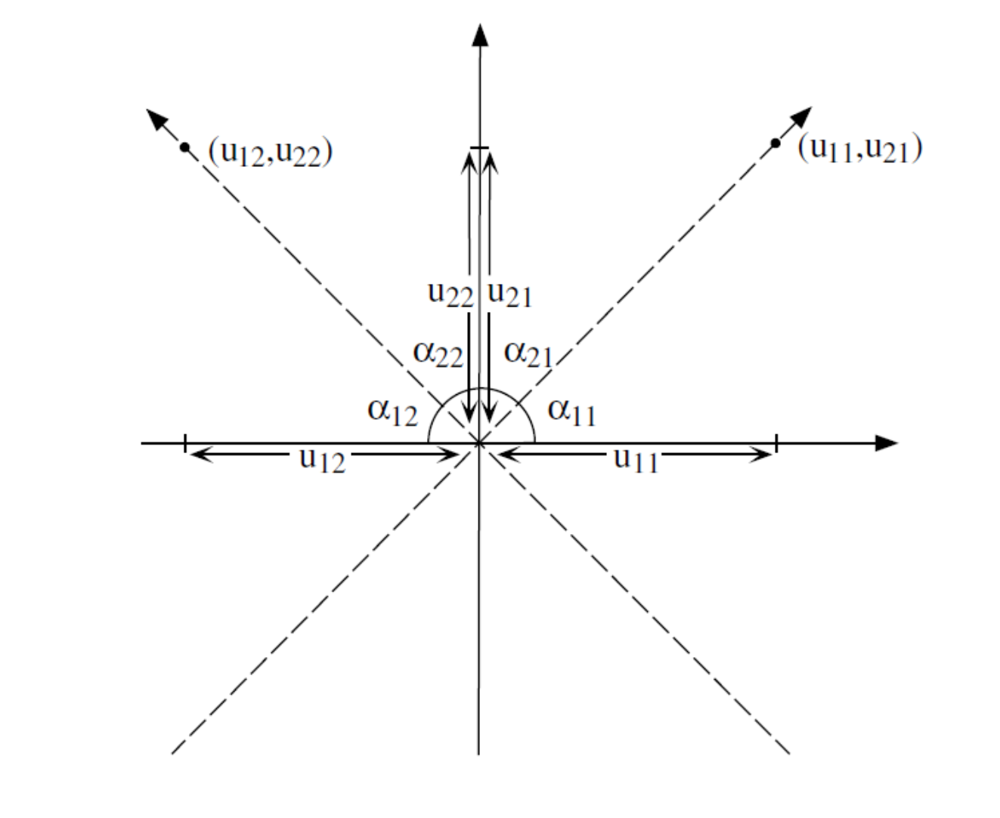

## Вы сможете

- Найти собственные значения и собственные векторы матрицы и объяснить их смысл.
- Переходить из исходной системы системы координат в систему координат, связанную с главными осями.
- Оценивать информативность главных осей.
- Изображать исходные данные в новой системе координат.
- Проводить сингулярное разложение любой матрицы.
- Убирать "лишнюю" информацию из матрицы.

```{r setup, include = FALSE, cache = FALSE, purl = FALSE}
# output options
options(width = 70, scipen = 6, digits = 3)
library(knitr)
library(ggplot2)
library(grid)
library(gridExtra)
library(dplyr)


# chunk default options
opts_chunk$set(fig.align='center', tidy = FALSE, fig.width = 7, fig.height = 3, warning = FALSE)

ar <- arrow(type = "closed", length = unit(0.15,"cm"))
```


```{r echo=F}
theme_set(theme_bw())
```


# Level 8:  Собственные значения, собственные векторы и главные оси 

## Проблема {.columns-2 .smaller}

Пусть есть некоторый набор данных

```{r}
set.seed(123456789)

x1 <- rnorm(500, 30, 4)
y1 <- rnorm(500, 700, 50)
x2 <- rnorm(500, 40, 5)
y2 <- 10 * x2 + 200 + rnorm(500, 0, 100)

XY <-data.frame(x = c(x1, x2), y = c(y1, y2) )
```


```{r echo=FALSE}
set.seed(123456789)

x1 <- rnorm(500, 30, 4)
y1 <- rnorm(500, 700, 50)
  
  # 10 * x1 + rnorm(500, 0, 100)

x2 <- rnorm(500, 40, 5)
y2 <- 10 * x2 + 200 + rnorm(500, 0, 100)


XY <-data.frame(x = c(x1, x2), y = c(y1, y2) )

# XY <- XY %>% filter(x<55) %>% filter(x>45)

x <-  XY$x
y <- XY$y


Pl_cloud <- 
qplot(XY$x, XY$y) + labs(x = "Переменная 1", y = "Переменная 2") 

```

Проекция на каждую из осей может не дать информацию о структуре многомерного облака.
НО! Для двумерного случая эта проблема не так важна.

```{r echo=F, message=F}
Pl_hist_x <- 
ggplot(XY, aes(x = x)) + geom_histogram() + labs(x = "Переменная 1")

Pl_hist_y <- 
ggplot(XY, aes(x = y)) + geom_histogram()  + labs(x = "Переменная 2")


```


```{r echo=F, message=F}
library(patchwork)

Pl_cloud/plot_grid(Pl_hist_x, Pl_hist_y)
```


## Переформулировка проблемы {.columns-2 .smaller}

В исходной матрице большинство векторов неортогональны, то есть взаимозависимые (между ними существует корреляция).  

### Корреляция между переменными 
```{r}
XY_cent <- as.data.frame(scale(XY, 
                               center = T, scale = F))

head(XY_cent)

```


```{r}
Cos_alpha <- 
  with(XY_cent,
       (x %*% y) / 
         (norm(t(x), type = "F") * 
            norm(t(y), type = "F"))  ) 

Cos_alpha

cor(XY$x, XY$y)
```

Наличие корреляции между векторами - это проблема, так как в каждой из переменных "спрятана" информация и о другой переменной. 

Задача сводится к тому, чтобы заменить исходные векторы (признаки) новыми комплексными признаками, которые были бы взаимно независимыми, то есть ортогональными. 

Каждый из этих векторов несет определенную часть  информации об исходной системе векторов (берет на себя некоторую долю общей дисперсии). 


## Собственные числа и собственные векторы  {.smaller .columns-2}

Связь между векторами в исходной матрице $\textbf{Y}$ выражается через ковариационную  матрицу  $\textbf{S}$ или корреляционную матрицу ($\textbf {R}$).   

$\textbf{S}$ - это квадратная симметричная матрица.

Задача сводится к тому, чтобы разложить матрицу $\textbf{S}$ на две части

***Первая часть.*** Вектор **собственных значений** $\bf{\lambda}$, или, что то же самое, матрица $\bf{\Lambda}$ 

$$ 
\bf{\Lambda} =  
\begin{pmatrix}
\lambda_{1} & 0 & \cdots & 0 \\
0 & \lambda_{2} & \cdots & 0 \\    
\vdots & \vdots & \ddots & \vdots \\
0 & 0 & \cdots & \lambda_{p}
\end{pmatrix}
$$

По главной диагонали лежат **собственные значения**, все остальные значения равны нулю  

***Вторая часть.*** Каждому собственному значению $\lambda_i$ ставится в соответствие так называемый **собственный вектор**  $\textbf{u}_i$. Совокупность собственных векторов формирует матрицу собственных векторов $\textbf{U}$. Собственные векторы перпендикулярны друг другу (ортогональны). 


## Связь между матрицами

Связь между матрицей $\bf{\Lambda}$ и $\textbf{S}$ выражается следующим уравнением

$$
\textbf{S}\textbf{U} = \textbf{U}\bf{\Lambda} 
$$


где   
$\textbf{S}$ - матрица ковариации    
$\textbf{U}$ - матрица собственных векторов     
$\bf{\Lambda}$ - Диагональная матрица собственных значений     


## Разложение ковариационной матрицы

Если


$$
\textbf{S}\textbf{U} = \textbf{U}\bf{\Lambda} 
$$

то

$$
\textbf{S} = \textbf{U}\bf{\Lambda}\textbf{U}^{-1} 
$$
НО!

**Важное свойство**: Если квадратная матрица состоит из ортогональных векторов (ортогональная матрица), то $\textbf{X}^\prime  = \textbf{X}^{-1}$


Тогда 

$$
\textbf{S} = \textbf{U}\bf{\Lambda}\textbf{U}^\prime 
$$

## Разложение ковариационной матрицы


$$
\textbf{S} = \textbf{U}\bf{\Lambda}\textbf{U}' 
$$


Это позволяет раскладывать матрицу $\textbf{S}$  на составляющие (**eigenvalues decomposition**, или спектральное разложение). 

Каждое собственное число в матрице $\bf{\Lambda}$ (и соответствующий ему вектор из матрицы $\textbf{U}$) несет часть информации об исходной матрице $\textbf{S}$.  

Разложение матрицы позволяет использовать не всю информацию, а только ее наиболее важную часть. 


## Геомтерическая интерпретация: *Главные оси*     {.smaller}

Мерой количества информации может служить изменчивость, то есть дисперсия. Поэтому очень правильно было бы перейти к системе координат (осям), которые несли бы максимум информации. Это означает, что варьирование вдоль этих осей должно быть максимальным. 

Именно это и позволяет сделать спектральное разложение ковариационной матрицы. 


 

## Геомтерическая интерпретация: *Главные оси*     {.smaller}

Во многих многомерных методах требуется найти оси максимального варьирования 

```{r, purl=TRUE, echo=F}
qplot(XY$x, XY$y) + labs(x = "Переменная 1", y = "Переменная 2") + 
  geom_point(aes(x = mean(x), y = mean(y)), size = 4, color = "yellow") + 
  stat_ellipse(type = "norm", level = 0.98) 

    # geom_segment(aes(x = mean(x), y = mean(y), xend = (mean(x) + 1.96*sd(x)), yend = (mean(y) + 1.96*sd(y))),  arrow = ar, color = "blue", size = 2)

```


Главные оси проходят через центроид ($\mathbf{\mu} = [\mu_1, \mu_2 \dots \mu_n]$) и некоторую точку на поверхности эллипса ($\mathbf{var} = [var_1, var_2 \dots var_n]$).

Задача: найти такую точку.

Эта точка соответствует максимальной длине вектора, соединяющего центроид и данную точку.


## Нормализуем векторы {.smaller}

```{r, purl=TRUE}
x_norm <- XY$x/sqrt(sum(XY$x)^2)
y_norm <- XY$y/sqrt(sum(XY$y)^2)


XY_norm <- data.frame(x = x_norm, y = y_norm)


ggplot(XY_norm , aes(x = x, y = y)) + geom_point() +  
  geom_point(aes(x = mean(x), y = mean(y)), size = 4, color = "yellow")  + 
  labs(x = "Нормализованная Переменная 1", y = "Нормализованная Переменная 2")

```


## Центрируем нормализованные векторы {.smaller}


```{r, purl=TRUE, fig.height=4}
XY_norm_cent <- as.data.frame(scale(XY_norm, center = TRUE, scale = FALSE))

ggplot(XY_norm_cent , aes(x = x, y = y)) + geom_point() + geom_vline(xintercept = 0) + geom_hline(yintercept = 0) +   
  geom_point(aes(x = mean(x), y = mean(y)), size = 4, color = "yellow") + 
  labs(x = "Центрированная Нормализованная Переменная 1", y = "Центрированная Нормализованная Переменная 2")
```


## Находим ковариационную матрицу {.smaller}

```{r, purl=TRUE}
mXY_norm_cent <- as.matrix(XY_norm_cent)

Sxy_norm_cent <- t(mXY_norm_cent) %*% mXY_norm_cent /(nrow(mXY_norm_cent) - 1)

Sxy_norm_cent
```


## Находим собственные числа и собственные векторы {.smaller} 

```{r, purl=TRUE}
eig <- eigen(Sxy_norm_cent) # Стандартная функция R для извлечения собственных чисел и собственных векторов

Lambda <- eig$values # Собственные числа

Lambda

U <- eig$vectors # Собственные векторы

U
```


## Собственные векторы ортогональны

Проверим

```{r}
U[,1] %*% U[,2]

```


## Стандартизованные собственные векторы {.smaller}
Собственные векторы безразмерны.

Но их можно масштабировать, выразив в величинах стандартных отклонений $\textbf{U}_{scaled} = \textbf{U}\bf{\Lambda}^{1/2}$  

Почему так?

$\textbf{U}_{scaled} \textbf{U}'_{scaled} = [\textbf{U}\bf{\Lambda}^{1/2}][\textbf{U}\bf{\Lambda}^{1/2}]' = \textbf{U}\bf{\Lambda}\textbf{U}' = \textbf{U}\bf{\Lambda}\textbf{U}^{-1} = \textbf{S}$

Ковариационная матрица для стандартизованной матрицы собственных векторов совпадает с ковариационной матрицей исходной матрицы

## Стандартизованные собственные векторы {.smaller}
Проверим...

```{r, purl=TRUE}
U_scaled <- U %*% sqrt(diag(Lambda)) #

(U %*% sqrt(diag(Lambda))) %*% t(U %*% sqrt(diag(Lambda)))

```

Сравним

```{r}
Sxy_norm_cent
```


## Рисуем собственные векторы {.smaller}

```{r, purl=TRUE}

PC1 <- data.frame(x = c(mean(XY_norm_cent$x), U_scaled[1, 1]), 
                  y = c(mean(XY_norm_cent$y),  U_scaled[2,1]))

PC2 <- data.frame(x = c(mean(XY_norm_cent$x),  U_scaled[1, 2]), 
                  y = c(mean(XY_norm_cent$y),  U_scaled[2,2]))

ggplot(XY_norm_cent, aes(x = x, y = y)) + geom_point() +  
  geom_point(aes(x = mean(x), y = mean(y)), size = 4, color = "yellow") + 
  geom_line(data = PC1, aes(x = x, y = y), color = "yellow", size = 1)  +
  geom_line(data = PC2, aes(x = x, y = y), color = "yellow", size = 1) +
  coord_equal() 


```

## Рисуем главные оси {.smaller .columns-2}

<!--  -->

<!-- <small>Из  Legendre & Legendre, 2012</small> -->

<!--  -->

<!-- $$ -->
<!-- \cos(\alpha_{11}) = u_{11}\\ -->
<!-- \cos(\alpha_{21}) = u_{21}\\ -->
<!-- \cos(\alpha_{12}) = u_{12}\\ -->
<!-- \cos(\alpha_{22}) = u_{22} -->
<!-- $$ -->

Матрица собственных векторов

```{r}
U
```

```{r,  fig.height=3, fig.align='left', purl=TRUE}
  ggplot(XY_norm_cent, aes(x = x, y = y)) + 
  geom_point() +  
  geom_point(aes(x = mean(x), y = mean(y)), 
             size = 4, color = "yellow") + 
  geom_line(data = PC1, aes(x = x, y = y), 
            color = "yellow", size = 1.5)  +
  geom_line(data = PC2, aes(x = x, y = y), 
            color = "yellow", size = 1.5) +
  coord_equal() + 
  geom_abline(slope = tan(acos(U[1,1])), 
              color = "blue")+ 
  geom_abline(slope = (U[2,2])/(U[1,2]), 
              color = "blue") 

```


<!-- <br> -->
<!-- <br> -->
<!-- <br> -->


<!-- ```{r} -->
<!-- Pl_main_axis -->
<!-- ``` -->


Для удобства восприятия лучше повернуть систему координат так, чтобы ось максимального варьирования была расположена горизонтально.


## Вращение осей {.smaller .columns-2}


<small>Из  Legendre & Legendre, 2012</small>

$$
\cos(\alpha_{11}) = u_{11}\\
\cos(\alpha_{21}) = u_{21}\\
\cos(\alpha_{12}) = u_{12}\\
\cos(\alpha_{22}) = u_{22}
$$


Вращающая матрица

```{r, purl=TRUE}
angle <- -1 * acos(U[1,1]) #Отрицательный угол, так как 
# поворачиваем оси по часовой стрелке

Rot <- matrix(c(cos(angle), sin(angle), 
                -sin(angle), cos(angle)), nrow = 2)
Rot
```

## Вращение осей {.smaller}

Новые оси

```{r, purl=TRUE}
XY_norm_cent_rot <- as.data.frame(t(Rot %*% t(mXY_norm_cent)))

Pl_main_axis_rotated <- ggplot(XY_norm_cent, aes(x = x, y = y)) + 
  geom_point(color = "gray") + 
  geom_point(data = XY_norm_cent_rot, aes(x = V1, y = V2)) + 
  labs(x = "Первая главная ось", y = "Вторая главная ось") +
  geom_hline(yintercept = 0) + 
  geom_vline(xintercept = 0)

Pl_main_axis_rotated

```

## Вращение осей {.smaller}

Новые и старые оси

```{r}
Pl_main_axis_rotated +
  geom_point(aes(x = mean(x), y = mean(y)), 
             size = 4, color = "yellow") +
  geom_line(data = PC1, aes(x = x, y = y), 
            color = "yellow", size = 1.5)  +
  geom_line(data = PC2, aes(x = x, y = y), 
            color = "yellow", size = 1.5) +
  coord_equal() + 
  geom_abline(slope = tan(acos(U[1,1])), 
              color = "blue") +
  geom_abline(slope = (U[2,2])/(U[1,2]), 
              color = "blue") 

```

## Проблема решена! (.smaller)

```{r echo=F, message=F}
Pl_PC1 <-
ggplot(XY_norm_cent_rot, aes(x = V1)) + geom_histogram(bins = 30) + labs(x = "Координаты по первой главной оси")

Pl_PC2 <-
ggplot(XY_norm_cent_rot, aes(x = V2)) + geom_histogram(bins = 30) + labs(x = "Координаты по первой главной оси")

```

```{r echo=F, message=F}
plot_grid(Pl_PC1, Pl_PC2)
```

```{r echo=F, message=F}
plot_grid(Pl_hist_x, Pl_hist_y)
```

Кроме того! 
Теперь мы знаем, что первая главная ось отвечает за определенную долю дисперсии.

```{r}
Lambda
```

```{r}
Lambda[1]/sum(Lambda)
```


## Главное о снижении размерности {.smaller}

1.Информацию об исходной матрице $\textbf{Y}$ можно сконцентрировать в ковариационной матрице

$$
\textbf{S} = \frac{1}{n - 1} \textbf{Y}_{centered}'\textbf{Y}_{centered}
$$

2.Матрицу ковариации можно разложить на собственные числа и собственные векторы 


$$
\textbf{S} = \textbf{U}\bf{\Lambda}\textbf{U}^{-1} 
$$

3.Собственные векторы ортогональны и позволяют созадать новую систему координат. Новые оси (главные оси) "опираются" на собственные векторы. 

4.Новые координаты точек могут быть вычислены так

$$
\bf {Y_{new} = Y \times U}
$$

5.Каждая ось в новой системе координат несет некоторую часть информации об исходной системе координат. Информативность осей определяется величиной собственных чисел. 

6.Вместо многомерной системы координат (n осей) мы можем использовать всего несколько (например, две) ниаболее информативные главные оси.


## Задание
Исследуйте структуру матрицы *X*.
```{r}
set.seed(123456789)

x1 <- c(rnorm(250, 30, 4), rnorm(250, 60, 4)) 
x2 <- rnorm(500, 70, 50)
x3 <- rnorm(500, 40, 5)
x4 <- c(rnorm(100, 10, 5), rnorm(100, 40, 5), rnorm(100, 70, 5), rnorm(200, 100, 5)) 
x5 <- c(rnorm(250, 50, 5), rnorm(250, 100, 5)) 


X <-data.frame(x1 = x1, x2 = x2, x3 = x3, x4 = x4, x5 = x5)

```

1. Постройте методами матричной алгебры ковариационную матрицу
2. Проведите ее спектральное разложение (вычислите ее собственные числа и собственные векторы).
3. Оцените информативность главных осей.
4. Изобразите точки в пространстве первой и второй главной оси.


## Решение {.smaller}

```{r}
# Нормализуем векторы в исходной матрице 
length_X <- apply(as.matrix(X), MARGIN = 2, 
                  FUN = function(x) sqrt(sum(x^2)) )
  
X_norm <- X / length_X 
  
X_norm_cent <- as.data.frame(scale(X_norm, 
                                   center = TRUE, scale = FALSE))

mX_norm_cent <- as.matrix(X_norm_cent)

Sx_norm_cent <- t(mX_norm_cent) %*% mX_norm_cent /(nrow(mX_norm_cent) - 1)

eig <- eigen(Sx_norm_cent)

Lambda <- eig$values 

U <- eig$vectors 

U_scaled <- U %*% sqrt(diag(Lambda)) 

PC <- as.matrix(X_norm_cent) %*% U 


```

## Решение {.smaller}

Исходные данные в новой системе координат

```{r}
qplot(PC[ ,1], PC[ ,2])  
```


Информативность новых осей

```{r}
Lambda / sum(Lambda) * 100
```


# Level 9: Сингулярное разложение матриц (Singular value decomposition)

## Теорема Экарта-Янга {.smaller}
Любую прямоугольную матрицу $\textbf{Y}$ можно представить в виде произведения трех матриц: 

$$
\textbf{Y}_{n \times p} = \textbf{U}_{n \times p} \textbf{D}_{p \times p} \textbf{V}'_{p \times p} 
$$

То есть можно найти три "вспомогательных" матрицы, через которые можно выразить любую другую матрицу. 

---

$$
\textbf{Y}_{n \times p} = \textbf{U}_{n \times p} \textbf{D}_{p \times p} \textbf{V}'_{p \times p} 
$$

Здесь    

$\textbf{Y}_{n \times p}$ - любая прямоугольная матрица $\begin{pmatrix}a_{11} & a_{12} & \cdots & a_{1c} \\ a_{21} & a_{22} & \cdots & a_{2p} \\  \vdots & \vdots & \ddots & \vdots \\ a_{r1} & a_{n2} & \cdots & a_{np} \end{pmatrix}$   

$\textbf{D}_{p \times p}$ - диагональная матрица $\begin{pmatrix} d_{11} & 0 & \cdots & 0 \\ 0 & d_{22} & \cdots & 0 \\ \vdots & \vdots & \ddots & \vdots \\ 0 & 0 & \cdots & d_{pp} \end{pmatrix}$

По главной диагонали располагаются "особые" числа, называющиеся **сингулярными числами**. Сингулярные числа ранжируются от большего к меньшему.

$\textbf{U}_{n \times p}$ и $\textbf{V}_{p \times p}$ - левая и правая матрицы сингулярных векторов.

## Сингулярное разложение матрицы средствами R {.smaller}
```{r, purl=TRUE}
set.seed(123456789)
B <- matrix(round(runif(50, 1, 5))  , byrow = T, ncol=5) #Некоторая матрица
SVD <- svd(B) #Сингулярное Разложение матрицы B с помощью функции svd()
V <- SVD$v #"Вспомогательная" матрица - левые сингулярные векторы
D <- SVD$d #Вектор сингулярных чисел
U <- SVD$u #"Вспомогательная" матрица - правые сингулярные векторы 


```

Вычислим $\textbf{V} \textbf{D} \textbf{U}'$

```{r, purl=TRUE}
U %*% diag(D) %*% t(V) 
```

## Задание

Вычислите матрицу, которая получится при использовании только 1 и 2 сингулярного числа для матрицы $\textbf{B}$, использованной на предыдущем слайде.


## Решение
```{r, purl=TRUE}
U[,1:2] %*% diag(D[1:2]) %*% t(V[,1:2]) 

```


## Важное свойство сингулярных чисел

Если вычислить матрицу на основе не всех, а части сингулярных чисел, то новая матрица будет подобна исходной матрице.


```{r, echo=FALSE, purl=FALSE}
library(ggplot2)
Dat <- data.frame(Init = rep(as.vector(B), 4), SingValue = rep(2:5, each = length(as.vector(B))), Calc = c(as.vector((U[,1:2] %*% diag(D[1:2]) %*% t(V[,1:2]))), as.vector((U[,1:3] %*% diag(D[1:3]) %*% t(V[,1:3]))), as.vector((U[,1:4] %*% diag(D[1:4]) %*% t(V[,1:4]))), as.vector((U[,1:5] %*% diag(D[1:5]) %*% t(V[,1:5]))))) 

ggplot(Dat, aes(x = Init, y = Calc)) + geom_point(size = 2) + labs(x = "значения в исходной матрицы", y = "значения в редуцированной матрице") + facet_wrap(~SingValue) + geom_abline(slope = 1)  

```


## Применение свойства сингулярных чисел в сжатии изображений

```{r,echo=FALSE, purl=TRUE}
load("data/face.rda")

gg_face <- function(x) {
  library(reshape2)
  library(ggplot2)
    rotate <- function(x) t(apply(x, 2, rev))
  dd <- rotate(x)
  ddd <- melt(dd)
  ggplot(ddd, aes(Var1, Var2)) + geom_tile(aes(fill = value)) + scale_fill_gradient(low = "darkblue",   high =  "white" ) + coord_equal()
}
gg_face(faceData)

```

<small> Пример взят из курса лекций "Data Analysis" by Jeffrey Leek  

(https://github.com/jtleek/dataanalysis/tree/master/week3)</small>


## Произведем сингулярное разложение матрицы `faceData` {.smaller}

```{r, purl=TRUE}
SVD_face <- svd(faceData)

U <- SVD_face$u
D <- SVD_face$d
V <- SVD_face$v

```

## Рекоструируем изображение, используя только часть информации

```{r, purl=TRUE}
reduction <- function(x) U[,1:x] %*% diag(D[1:x]) %*% t(V[, 1:x])
gg_face(reduction(4))
```


## Применение SVD в биологических исследованиях

SVD - это метод, на котором основаны разные типы анализа, связанные со снижением размерности: PCA, CA, CCA, RDA.

О них в следующех лекциях

## Summary
- Линейная алгебра позволяет решать самые разные типы задач.
- Матричные методы лежат в основе очень многих типов анализа.
- В основе многих методов снижения размерности лежит SVD.

## Что почитать
* Legendre P., Legendre L. (2012) Numerical ecology. Second english edition. Elsevier, Amsterdam. Глава 2. Matrix algebra: a summary.

# Not The End


