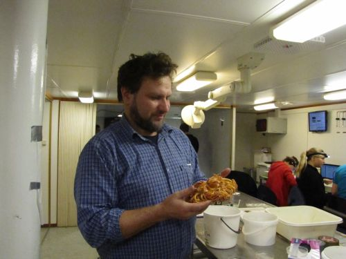

```{r setup, include = FALSE, cache = FALSE, purl = FALSE}
# output options
options(width = 70, scipen = 6, digits = 3)
library(knitr)
# chunk default options
opts_chunk$set(fig.align='center', tidy = FALSE, fig.width = 7, fig.height = 3, warning = FALSE)
```

# Реконструкция и вазуализация корреляционной матрицы

На основе данных датасета "Wolves" из пакета "candisc" была получена матрица корреляций между следующими параметрами черепа волков   

x1 palatal_ _length     
x2 postpalatal length     
x3 zygomatic width      
x4 palatal width outside first upper molars     
x5 palatal width inside second upper molars       
x6 postglenoid foramina width       
x7 interorbital width        
x8 braincase width         
x9 crown length          

Вам необходимо восстановить эту матрицу, используя [ее собственные значения](data/Eigen_wolv.csv) и соответствующие им [собственные векторы](data/U_wolv.csv). После того, как матрица корреляций будет восстановлена, вам необходимо выделить группы наиболее скоррелированных признаков.  


#SVD, как средство редукции информации

##Часть 1. Реконструкция изображения {.columns-2}

Скачайте один из наборов матриц

- Первый набор из трех матриц 

[u1](data/u1.csv)  
[v1](data/v1.csv)   
[d1](data/d1.csv) 

- Второй набор из трех матриц 

[u2](data/u2.csv)  
[v2](data/v2.csv)   
[d2](data/d2.csv) 

Восстановите фотографию, используя следующие наборы сингулярных триплетов:   
- Только 1-й   
- с 1-го по 10-й   
- с 1-го по 100-й   
- с 1 го по 200-й   
- Полный набор триплетов.  


##Часть 2. Сжатие изображения {.columns-2}

Сохраните изображение в виде файла .jpg.



Импортируйте эту фотографию в среду R с помощью функции `readJPEG' из пакета "jpeg". 
Из полученной трехмерной матрицы возьмите только данные по 1-му каналу.   
Полученную двумерную матрицу подвергните сингулярному разложению.     
Сожмите изображение, используя только часть сингулярных триплетов.   
Оцените во сколько раз происходит сжатие исходного изображения.


