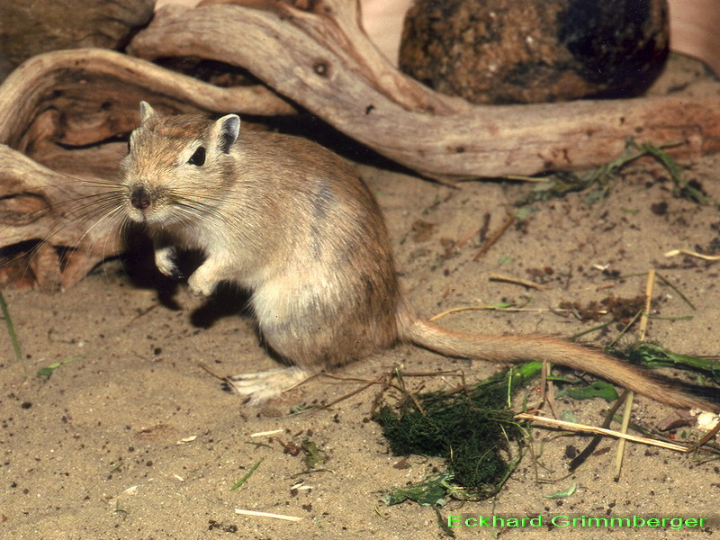

## Вы сможете

- Разобраться с оновными дизайнами тестирования гипотез в рамках дисперсионого анализа
- Применить функции, реализованные в R, для тестирования гипотез с помощью метода PERMANOVA

```{r setup, include=FALSE, cache=FALSE}
# to configure markdown parsing
options(markdown.extensions = c("no_intra_emphasis", "tables", "fenced_code", "autolink", "strikethrough", "lax_spacing", "space_headers", "latex_math"))
# output options
options(width = 70, scipen = 6, digits = 3)

# to render cyrillics in plots use cairo pdf
options(device = function(file, width = 7, height = 7, ...) {
  cairo_pdf(tempfile(), width = width, height = height, ...)
  })
library(knitr)
# chunk default options
opts_chunk$set(fig.align = 'center', tidy = FALSE, fig.width = 7, fig.height = 3, cache = TRUE)
```

# Еще раз про множественные сравнения 

## В чем опасность множественных сравнений?

$\alpha$ --- это __вероятность совершить ошибку первого рода при тестированнии гипотезы__ (= вероятность отвергнуть истинную нулевую гипотезу, = вероятность найти различия там, где их нет).

Обычно принимается, что $H_0$ отвергают на уровне значимости $\alpha = 0.05$. 

Когда у нас два средних --- все просто, сравнение всего одно. Естественно, __вероятность совершить ошибку I рода для группы сравнений $\alpha _{familywise}$ равна уровню значимости для единственного сравнения $\alpha _{per\,comparison}$__.

$\alpha _{familywise} = \alpha _{per\,comparison}$

Но если сравнений много, то растет вероятность совершить хотябы одну ошибку I рода (найти различия там, где их нет).

## Если сравнений много...

Например, если мы хотим попарно сравнить три значения, нам понадобится сделать 3 сравнения.

Пусть мы решили, что в каждом из сравнений будем использовать уровень значимости $\alpha_{per\,comparison} = 0.05$.

Тогда в каждом из сравнений вероятность совершить ошибку первого рода будет $\alpha_{per\,comparison} = 0.05$.

Следовательно, вероятность сделать хотябы одну ошибку I рода в группе из 3 сравнений будет $_{familywise} = 0.05 + 0.05 + 0.05 = 0.05 \cdot 3 = 0.15$

## Чем больше сравнений, тем больше вероятность обнаружить различия там, где их на самом деле нет.

__Вероятность совершить хотябы одну ошибку I рода для всей группы из N сравнений $\alpha _{familywise}$ будет в $N$ раз больше, чем принятая для одного сравнения $\alpha _{per\,comparison}$__

$\alpha _{familywise} = \alpha _{per\,comparison} \cdot N _{comparisons}$

В таблице даны значения $\alpha _{familywise}$ для разного числа сравнений, если $\alpha _{per\,comparison} = 0.05$:

```{r results='asis', echo=FALSE}
x <- 2:5
ncomb <- choose(x, 2)
FWER <- 0.05 * ncomb
df <- data.frame(x, ncomb, FWER)
colnames(df) <- c("Число средних", "Число сравнений", "&alpha;<sub>familywise</sub>")
library(knitr)
kable(df)
```


## Для решения проблемы есть два подхода

1. Ввести поправку Бонферрони (в качестве порога для отвержения $H_0$ брать $\alpha_{per\,comparison} = \alpha _{familywise}/N$, где N - количество попарных сравнений).
2. Изменить схему тестирования гипотезы --- тестировать не три независимых гипотезы, а одну сложную (так это, например, происходит в ANOVA).

## Поправка Бонферрони

$\alpha_{per\,comparison} = \alpha _{familywise}/N$, где N - количество попарных сравнений

Это жесткий способ, т.к с возрастанием числа сравнений приходится резко снижать уровень значимости, и значит, мощность теста тоже снижается. Теперь мы к тому же рискуем не найти различий там, где они на самом деле есть. В таблице даны значения $\alpha _{per\,comparison}$ после поправки Бонферрони, сохраняющие $\alpha _{familywise} = 0.05$:

```{r results='asis', echo=FALSE}
x <- 2:9
ncomb <- choose(x, 2)
APC <- 0.05 / ncomb
df1 <- data.frame(x, ncomb, APC)
df1 <- cbind(df1[1:4, ], df1[5:8, ])
colnames(df1) <- rep(c("Число средних", "Число сравнений", "&alpha;<sub>per comparison</sub>"), 2)
library(knitr)
kable(df1)
```

## Классический дисперсионный анализ


<small>Рональд Эйлмер Фишер</small>

## Дисперсионный анализ

Пусть имеется три градации фактора $A _{1...3}$

| A1  | A2 | A3 |   |
| --------- | --------- | --------- | -- |
| $x_{1,1}$ | $x_{1,2}$ | $x_{1,3}$ |    |
| $x_{2,1}$ | $x_{2,2}$ | $x_{2,3}$ |    |
| $x_{3,1}$ | $x_{3,2}$ | $x_{3,3}$ |    |
| $\bar{X}_{A1}$ |$\bar{X}_{A2}$ | $\bar{X}_{A3}$ | $\bar{X}_{gen}$ |

>- Почему  появляется _межгрупповая_ изменчивость, то есть разные $\bar{X_i}$?
>- Почему  появляется _внутригрупповая_ изменчивость, то есть разные $x_i$?

## Суммарная дисперсия может быть разложена на две составляющие

$SS_{T} = SS_b + SS_w$

### Общая изменчивость

Общая изменчивость - это отклонения ${x_i}$ от $\bar{X}_{gen}$.
$SS_T = \sum (x_i - \bar{X}_{gen})^2$


### Межгрупповая изменчивость

Чем больше межгрупповая изменчивость, тем сильнее влияние фактора. Мера межгрупповой изменчивости - это отклонения $\bar{X_i}$ от $\bar{X}_{gen}$

$SS_b = \sum (\bar{X_i} - \bar{X}_{gen})^2$

### Внутригрупповая изменчивость

Мера внутригрупповой изменчивости - это отклонения ${x_i}$ от $\bar{X}_{i}$. Чем больше внутригрупповая изменчивость, тем сильнее влияние неучтенных факторов.

$SS_w = \sum \sum (x_i - \bar{X}_{i})^2$


## Для тестирования гипотезы о влиянии фактора надо сравнить межгрупповую изменчивость ($SS_b$) и внутригрупповую ($SS_w$). 

Для этого сравнения Фишер предложил статистику 

$F = \frac{SS_b / (a - 1)}{SS_w / (N - a)}$

## F-распределение

Если межгрупповая изменчивость равна внутригрупповой, то _F_ принадлежит _F_-распределению с двумя параметрами $df_b = a - 1$ и $df_w = N - a$, где a-число классов, _N_ - общее количество объектов в анализе.


```{r, echo=FALSE}
library(ggplot2)
theme_set(theme_bw())
ggplot(data.frame(x = seq(0,5,0.1), y = df(seq(0,5,0.1), 3, 36)), aes (x = x, y = y)) + geom_line (size = 2, color = "blue") + xlab("F for df = 3 and df = 36") + ylab ("Probability") 
```


## Основные дизайны в ANOVA

1. Однофакторный дизайн (One-way ANOVA)
2. Многофакторный ортогональный дизайн (Multi-way orthogonal ANOVA)
3. Иерархический дизайн (Nested ANOVA)  
etc... 

Еще много разных дизайнов

Величину, которую мы изучаем называют зависимой переменной   
Величины, от которых она зависит называют предикторами (независимыми переменными), или факторами

Предикторы бывают дискретными и непрерывными


## Однофакторный дизайн (один дискретный предиктор)

A1  | A2 | A3
----- | ------ | ------
 x | x | x
 x | x | x
 x | x | x

выявляется влияние фактора А


## Многофакторный ортогональный дизайн (два и более дискретных предиктора)

$factor A / factor B$  | A1 | A2 | A3
----- | ----- | ----- | -----
 B1| x | x | x
 B1| x | x | x
 B1| x | x | x
  |   |   |  
 B2| x | x | x
 B2| x | x | x
 B2| x | x | x
  |   |   |   
 B3| x | x | x
 B3| x | x | x
 B3| x | x | x

Выявляется влияние фактора А, B и A*B   

## Иерархический дизайн

один или более предикторов, иерархически починенные некоторому группирующему фактору, "блоку"

Блок $B$  | A1 | A2 | A3
------------- | ------------- | ------------- | -------------
 B1| x | x | x
 B1| x | x | x
 B1| x | x | x
  |   |   |  
 B2| y | y | y
 B2| y | y | y
 B2| y | y | y
  |   |   |   
 B3| z | z | z
 B3| z | z | z
 B3| z | z | z

Выявляется влияние фактора В и фактора А внутри градаций фактора B   


## ANOVA разработан для одномерных данных. 

Что делать если мы хотим оценивать объект по многим признакам сразу?

Примеры:

* Сообщество как целое
* Поведение как целое
* Ответы респондентов на взаимосвязанные вопросы в анкетах

> - Варианты решений:
        - MANOVA (Fisher, 1925, Wilks, 1932)
        - distance-based Redundancy Analysis (db-RDA) (Legendre, Anderson, 1999)
        - perMANOVA (Anderson, 2001; McArdle, Anderson, 2001)

## Многомерный дисперсионный анализ (MANOVA)

Давно разработан параметрический метод MANOVA (Multivariate Analysis Of Variance). Он дает возможность проводить анализ аналогичный ANOVA. В основе MANOVA лежат представление о многомерном нормальном распределении и расcтояниях между центроидами.

В MANOVA сравниваются:

- __отклонения точек от групповых центроидов__ (аналог $SS_{within}$)
- __отклонения групповых центроидов от общего центроида__ (аналог $SS_{between}$).

<div class="columns-2">


<small>Anderson, 2001</small>

<br /><br /><br /><br /><br /><br /><br />

Ограничения MANOVA:

- Нормальность распределения
- Гомогенность дисперсий


</div>

## distance-based Redundancy Analysis (dbRDA) {.columns-2}


Рис. из Legendre, Anderson, 1999.

Подробнее о db-RDA расскажем в конце курса.

## Permutational Multivariate Analysis of Variance (PERMANOVA) {.columns-2}


<small>Марти Джейн Андерсон</small>

<br /><br /><br /><br />


## Пример: Поведение песчанок в тесте открытое поле

**Гипотеза:** Разные виды песчанок демонстрируют различия поведения в тесте "Открытое поле"

<div class="columns-2">

<center>

</center>

Виды:

* Карликовая песчанка (_Gerbillus gerbillus_)
* Монгольская песчанка (_Meriones unguiculatus_)
* Жирнохвостая песчанка (_Pachyuromys duprasi_)

Оценка поведения песчанок трех видов по семи признакам

* Время до выхода в квадрат открытого поля
* Количество актов мочеиспускания
* Количество актов дефекации
* Количество пересеченных квадратов
* Число вертикальных стоек
* Количество актов смещенной активности
* Время проведенное в центре квадрата открытого поля

</div>

## Данные наблюдений

```{r}
pesch <- read.csv("data/pesch.csv", header = TRUE, sep = ";")
head(pesch)
```

## Трансформация данных

Поскольку измеренные признаки варьируют в разных масштабах целесообразно провести лгарифмирование данных

```{r}
options(digits = 4)
log_pesch <- pesch
log_pesch[,3:ncol(pesch)] <- log(pesch[,3:ncol(pesch)] +1)
head(log_pesch)
```

## Задание

Постройте ординацию объектов в осях MDS и раскрасьте точки в соответствии с видами

## Решение

```{r ord-pesch, message=FALSE}
library(ggplot2)
library(vegan)
theme_set(theme_bw())
mds_pesch <- metaMDS(log_pesch[, 3:ncol(pesch)], distance = "euclidian")
mds_pesch <- as.data.frame(mds_pesch$points)
mds_pesch$Species <- pesch$Species
ggplot(mds_pesch, aes(x = MDS1, y = MDS2, colour = Species)) + geom_point(size = 5)
```

## Различаются ли виды песчанок по набору поведенческих признаков?

```{r ord-pesch, echo=FALSE, message=FALSE}
```

>- Мы можем проверить это при помощи PERMANOVA

## Применим метод PERMANOVA реализованный в функции `adonis()`

```{r}
library(vegan)
permanova_pesch <- adonis(log_pesch[3:9] ~ log_pesch$Species, method = "euclidean")
permanova_pesch
```

Мы видим традиционную для ANOVA таблицу результатов. Что здесь что?

## Cумма квадратов отклонений объектов от центроидов равна сумме квадратов взаимных расстояний, деленной на число объектов {.columns-2}

Для Евклидовых расстояний эта закономерность была известна давно (например, Kendall, Stuart 1963).


<small>Anderson, 2001</small>

Обычно сначала непосредственно вычисляли центроиды, и затем --- сумму квадратов отклонений от них.

В случае Евклидова расстояния центроиды найти просто --- это средние значения соответствующих координат. 

Для других мер сходства-различия центроиды найти гораздо сложнее. Например, для коэффициента Брея-Куртиса (не метрика), среднее значение не будет соответствовать центроиду.

<br /><br /><br /><br />

## Марти Антерсон показала, что можно обойтись без вычисления центроидов {.columns-2}


Можно непосредственно из матрицы любых коэффициентов сходства-различия найти и общую и внутригрупповые суммы квадратов, не прибегая к вычислению центроидов.

## Разложение дисперсии становится очень простым

<div class="columns-2">


<small>Anderson, 2001</small>

<br /><br />

Пусть всего _N_ элементов, принадлежащих _a_ группам по _n_ элементов в каждой, _d_ - расстояние между _i_-тым и _j_-тым объектами, $\epsilon$ - 1 если объекты _i_ и _j_ из одной группы и 0, если из разных.

</div>

$SS_{total} = \frac{1}{N}\sum \sum {d_{ij}^2}$  
Сумма квадратов взаимных расстояний --- это сумма квадратов субдиагональных элементов, деленная на число объектов _N_. 

$SS_{within} = \frac{1}{n}\sum \sum {d_{ij}^2 \dot \epsilon_{ij}}$  
Внутригрупповая сумма квадратов --- это cумма всех сумм квадратов расстояний между элементами для каждой группы, деленная на _n_ число объектов в группе.

Тогда межгрупповая сумма квадратов $SS_{between} = SS_{total} - SS_{within}$

## псевдо-F статистика

<div class="columns-2">

__MANOVA__


<small>Anderson, 2001</small>

<br /><br />

__PERMANOVA__


$F = \frac{SS_b/(a-1)}{SS_w/(N-a)}$

</div>


## Оценка значимости псевдо-F статистики

Для оценки достоверности псевдо-F используется премутационная процедура:

* Случайным образом перетасовываются строки исходной матрицы 
* после каждого акта пермутации вычисляется $F_{perm}$
* Уровень значимости
* Внимаие! для гнездового дизайа процедура пермутаци имеет свои особенности (обсудим позднее).

$p = \frac {F_{perm} \ge F}{Number of permutations}$

## Ограничения PERMANOVA

1. Крайне желательно использование сбалансированных комплесов (В adonis() этого ограничения нет, но за это приходится платить отсутствием функции для post-hoc анализа).
2. Этот метод чувствителен к различиям в степени варьирования в пределах групп (гетероскедастичность)

Для проверки равенства внутригрупповых дисперсий в пакете vegan  специальной функции нет, но можно использовать функцию _betadisper()_, которая изначально предназначена для сравнения $\beta$-разнообразия сообществ в местах с разными условиями 

Эта функция вычисляет внутригрупповые центроиды и координаты точек в пространстве главных координат (Principal coordinates analysis = Metric MDS)  

```{r}
dist_pesch <- vegdist(log_pesch[,3:ncol(pesch)], method  = "euclidian")
PCO_pesch <- betadisper(dist_pesch, log_pesch$Species)
```

## Эта функция позволяет также нарисовать наши объекты в пространстве PCO 

```{r, echo=FALSE}
library(graphics)
plot(PCO_pesch)
```

## Достоверность различий отклонений от центроидов в разных группах проверяется с помощью ANOVA 

```{r}
anova(PCO_pesch)
```

В нашем случае достоверных различий между варьированием внутригрупповых расстояний не выявлено  

## Для визуализации можно нарисовать боксплот 

```{r, echo=FALSE}
boxplot(PCO_pesch)
```


## Гипотеза протестирована!
### Как трактовать эти результаты?

## Интерпретация результатов perMANOVA

```{r, echo=FALSE}
library(ggplot2)
#dist_pesch <- vegdist(log_pesch[,3:ncol(pesch)], method = "euclidian")
mds_pesch <- metaMDS(log_pesch[,3:ncol(pesch)], distance = "euclidian")
mds_pesch <- as.data.frame(mds_pesch$points)
mds_pesch$Species <- pesch$Species
pl_pesch <- ggplot(mds_pesch, aes(x = MDS1, y = MDS2, colour = Species))
pl_pesch + geom_point(size = 5)
```

На приведенной ординации видно, что точки, соответствующие Монгольским песчанкам сегрегированы от остальных. 
Для выявления попарных различий нужны попарные сравнения.

## Post-hoc анализ

Внимание! В пакете `vegan` этого анализа нет. Но мы можем сделать простейшую его версию самостоятельно.

Проведем попарные сравнения между группами, то есть

* Карликовые VS Монгольские
* Карликовые VS Жирнохвостые
* Монгольские VS Жирнохвостые

```{r}
pair <- combn(unique(as.character(log_pesch$Species)), 2)
ncomb <- dim(pair)[2]
x <- log_pesch[, -c(1:2)]
y <- log_pesch$Species
for (i in 1:ncomb) {
  filter <- y %in% pair[, i]
  posthoc <- adonis(x[filter, ] ~ y[filter], method = "euclidean")$aov.tab$Pr[1]
  cat(pair[, i], ": p = ", posthoc, "\n", sep = " ")
}
```

## Введем попарвку Бонферрони

Если мы принимаем $\alpha = 0.05$, как порог для отвержения $H_0$, то для отвержения $H_0$ при множественных сравнениях $\alpha$ становится $\alpha = \frac{0.05}{Number of comparisons}$ 
Для нашего случая, когда используется 3 сравнения, $\alpha = \frac{0.05}{3} = 0.017$
То есть за достоверные будем принимать те значения p, которые будут меньше 0.017, а не 0.05

## Задание

Выясните какой из признаков сильнее всего различается между видами?

## Решение

Один из вариантов ответа - процедура SIMPER
```{r}
simper_pesch <- simper(log_pesch[, 3:9], log_pesch$Species, permutations = 999)
summary(simper_pesch)
```

## Многофакторный ортогональный дизайн в PERMANOVA
 
Выясним влияет ли пол и вид полевок на поведение. 

Редуцируем исходные данные (в случае с Жирнохвостыми полевками были изучены только самки)  
```{r}
log_pesch2 <- log_pesch[log_pesch$Species != "zhirnokhvost", ]
```

## Проведем двухфакторный анализ PERMANOVA

```{r}
twofact_pesch <- adonis(log_pesch2[,3:ncol(pesch)] ~ log_pesch2$Gender * log_pesch2$Species, method = "euclidian")

twofact_pesch
```

## Здесь возможен (и более корректен) гнездовой дизайн 

```{r}
nested_pesch <- adonis(log_pesch2[,3:ncol(pesch)] ~  log_pesch2$Gender, strata = log_pesch2$Species, method = "euclidian")

nested_pesch
```

Внимание! Пермутации производятся только в пределах группирующего параметра, указанного в параметре `strata`

## Задание

+ Создайте датафрейм из файла `simulated_data.csv` (Это данные симулированные по алгоритму, приведенному в справке по функции `adonis()`)
+ В полученном датафрейме описано обилие двух видов на экспериментальных площадках двух типов: без добавления и с добавлением NO3, по 6 повторнотей в каждом эксперименте. Эксперименты были незаисимо проведены на 3 полях. 
+ Оцените, зависит ли структура совместного поселения этих двух видов от концентрации NO3.

## Решение

```{r}
com <- read.csv("data/simulated_data.csv", sep = ',', header = T)

# Ошибочный дизай
com_permanova <- adonis(com[,1:2] ~ com$NO3)

# Правильный дизайн
com_permanova2 <- adonis(com[,1:2] ~ com$NO3, strata = com$field)

```

## Summary

+ Для тестирования гипотез, связанных со множественными сравнениями, необходимы различные формы дисперсионных анализов. + PERMANOVA дает возможность тестировать сложные гипотезы в отношении явлений, описанных по многим переменным. 
+ При использовании PERMANOVAb и других форм многофакторного дисперсионного анализа важно незапутаться в дизайне.

## Другие программы

* *Primer 6.0 + PERMANOVA* Коммерческий продукт. Пожалуй самая удобная программа для применения метода PERMANOVA.
* *PAST* Здесь метод называется NPMANOVA. Из некоммерческих продуктов - пожалуй самый лучший. R пока отстает...
* *Оригинальная программа М. Андерсон (PEMANOVA)*. Можно скачать из сети. К ней прилагается программа *PERMDISP*, предназначенная для проверки на равенство дисперсий. Чудовищно неудобный ввод. Зато можно использовать почти любой дизайн (однофакторный, многофакторный, иерархический, с ковариатами). Важно, что факторы могут рассматриваться и как фиксированные и как случайные.

## Что почитать

* Anderson, M.J. 2001. A new method for non-parametric multivariate analysis of variance. Austral Ecology, 26: 32–46.
* Anderson, M.J. 2005. PERMANOVA: a FORTRAN computer program for permutational multivariate analysis of variance. Department of Statistics, University of Auckland, New Zealand.
* Anderson, M.J. (2004). PERMDISP: a FORTRAN computer program for permutatinoal analysis of multivariate dispersions (for any two-factor ANOVA design) using permutation tests. Department of Statistics, University of Auckland, New Zealand. 
* Legendre P., Legendre L. (2012) Numerical ecology. Second english edition. Elsevier, Amsterdam.
