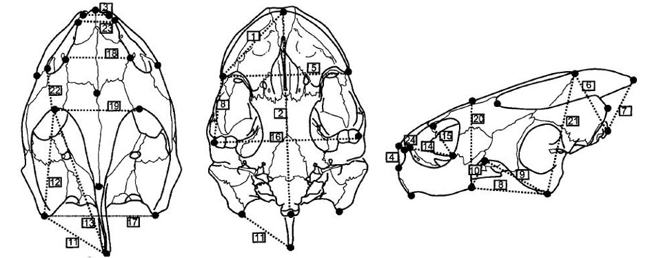
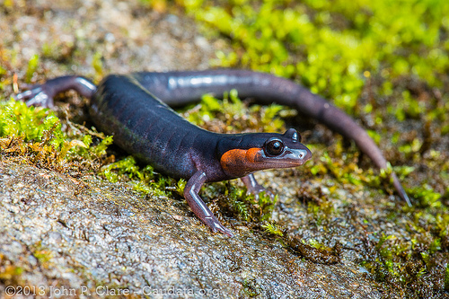
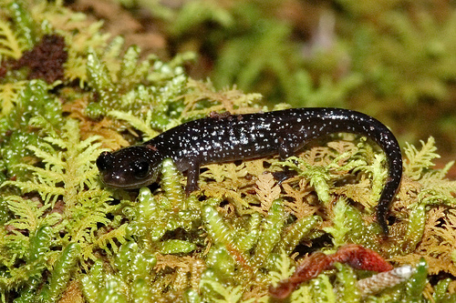
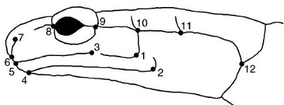
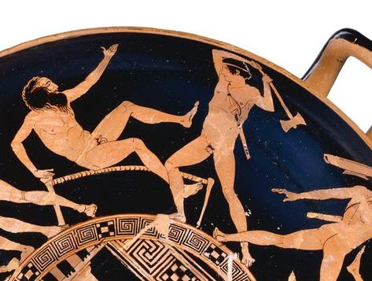
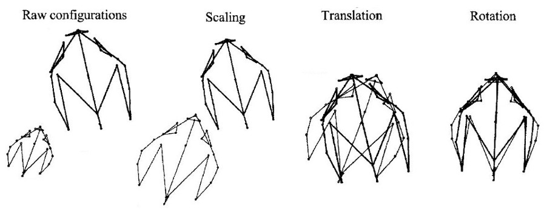

```{r setup, include = FALSE, cache = FALSE, purl = FALSE}
# output options
options(width = 70, scipen = 6, digits = 3)
library(knitr)
# chunk default options
opts_chunk$set(fig.align='center', tidy = FALSE, fig.width = 7, fig.height = 3, warning = FALSE)
```

```{r, libs-funs, echo=FALSE}
library(ggplot2)
library(grid)
theme_set(theme_bw(base_size = 20) + theme(legend.key = element_blank()))
update_geom_defaults("point", list(shape = 19, size = 4))
library(gridExtra)
```

## Анализ морфометрических данных при помощи анализа главных компонент

- Классический подход к морфометрии
- Геометрическая морфометрия
- Эволюция формы

### Вы сможете

- Проанализировать морфометрические данные корректно удалив влияние абсолютного размера
- Рассказать, что происходит во время обобщенного прокрустова анализа
- Проанализировать данные о координатах меток используя методы геометрической морфометрии
- Понимать, каким образом происходит отображение филогенетического древа в пространство форм


# Классический подход к морфометрии


## Классический подход к морфометрии

Для анализа формы различных структур анализируются расстояния между метками, а не их координаты.

Признаки сильно интегрированных структур, например частей скелета, лучше анализировать совместно друг с другом. Один из вариантов анализа - анализ главных компонент.


## Пример: морфометрия черепах

Черепахи - единственные живые представители анапсид (череп не имеет височных окон). Морфология черепа важна для их систематики (Claude et al., 2004).

Данные - 24 разных измерения черепов черепах 122 ныне живущих пресноводных, морских и наземных видов и одного ископаемого.



<div class = "footnote">Рис. 30.1 из Zuur et al. 2007</div>


## Читаем данные

```{r}
turt <- read.table("data/turtles.txt", header = TRUE)
turt$Environment3 <- factor(turt$Environment3, levels = c(0, 1, 2, 9), labels = c("Freshwater", "Terrestrial", "Marine", "Fossil"))
colnames(turt)
```

<div class = "footnote">Данные из Zuur et al. 2007</div>


## Чтобы понять, нужно ли стандартизовать исходные данные, построим боксплот

```{r fig.height=4}
boxplot(x = turt[8:31])
```

> - Наверное, лучше стандартизовать


## Делаем анализ главных компонент по стандартизованным данным

```{r}
library(vegan)
turt_pca <- rda(turt[, 8:31], scale = TRUE)
```

## Сколько компонент достаточно для описания данных?

```{r}
eig <- eigenvals(turt_pca)[1:5]
eig*100/sum(eig) # доля объясненной изменчивости
screeplot(turt_pca, bstick = TRUE)
```

>- Первая компонента объясняет очень много, остальные - почти ничего. Одной компоненты достаточно?
>- Нет! Не все так просто.

## Что странного в этой картинке?

```{r biplot-raw, fig.height=4, fig.width=6}
biplot(turt_pca, display = "species", scaling = 2)
```

- Как вы думаете, почему у всех переменных большие нагрузки по первой компоненте?

- Что отражает первая компонента?

## При анализе сырых морфометрических данных первая компонента отражает размер объектов и, возможно, немножко - их форму

```{r biplot-raw, echo=FALSE, fig.height=4, fig.width=6}
```


## Классические способы избавиться от влияния размера:

- использовать одну из исходных переменных как оценку "размера": использовать в PCA остатки от регрессий исходных признаков от "размера"
- стандартизация исходных данных при помощи деления на величину "размера" для каждого образца (корень из суммы квадратов измерений)
- сделать двойное центрирование (логарифмированных) исходных данных
- и т.д. и т.п.

## Двойное центрирование

Нам достаточно центрировать строки, т.к. столбцы будут центрированы автоматически в процессе анализа главных компонент.

```{r}
# Функция, которая может центрировать вектор
center <- function(x){
  x - mean(x, na.rm = TRUE)
}
# применяем эту функцию к каждой строке
dbcent <- t(apply(turt[, 8:31], 1, center))
# получившийся датафрейм пришлось транспонировать,
# поскольку apply() результаты от каждой строки
# возвращает в виде столбцов
```

## После двойного центрирования большие собственные числа у нескольких компонент

```{r, fig.height=3}
turt_db_pca <- rda(dbcent)
eig_db <- eigenvals(turt_db_pca)[1:5]
eig_db*100/sum(eig_db)
screeplot(turt_db_pca, bstick = TRUE)
```


## После двойного центрирования у переменных высокие нагрузки на несколько компонент, влияние размера удалено

```{r, fig.height=4}
biplot(turt_db_pca, display = "species", scaling = 2)
```

Интерпретируем как обычно: компонента отражает несколько признаков


## Ординация черепах по морфометрии черепов (двойное центрирование данных)

```{r tradit-pca, echo=FALSE, fig.show='hold', fig.width=10, fig.height=4, purl=FALSE}
op <- par(mfrow = c(1, 2), mar = c(4, 4, 0.5, 0.5), cex = 1.3)
biplot(turt_db_pca, display = "species", scaling = 2)
# цвета для графика факторных координат
colvec <- c("orange2", "limegreen", "steelblue", "red3")
# пустой график
plot(turt_db_pca, type = "n", scaling = 1)
# точки, раскрашенные по уровням фактора turt$Environment3
points(turt_db_pca, display = "sites", scaling = 1, pch = 21, 
       col = colvec[turt$Environment3], bg = colvec[turt$Environment3])
# легенда
legend("bottomright", legend = levels(turt$Environment3), bty = "n", pch = 21, 
       col = colvec, pt.bg = colvec)
par(op)
```

- У пресноводных большие D12 и D13, и маленькая D2. У морских наоборот
- Ископаемая черепаха похожа на нынешних морских


## Код для графика ординации черепах по морфометрии черепов

```{r tradit-pca, eval=FALSE, purl=TRUE}
```


# Геометрическая морфометрия

### Но настоящие джедаи теперь анализируют координаты меток, а не расстояния между ними!

## Пример: Форма головы Апалачских саламандр рода _Plethodon_

_Plethodon jordani_ и _P.teyahalee_ встречаются вместе и раздельно.
В совместно обитающих популяциях меняется форма головы обоих видов. В разных группах популяций этот процесс параллельно приводит к одинаковым результатам. По-видимому, одной из причин параллельной эволюции может быть межвидовая конкуренция (Adams, 2004, 2010).

<div class="columns-2">



_Plethodon jordani_ - Jordan's Salamander by [John P Clare on Flickr](https://flic.kr/p/dMfNq6)



_Plethodon_ cf. _teyahalee_ by [squamatologist on Flickr](https://flic.kr/p/8m82g6)

</div>

## Морфометрия головы саламандр



```{r}
# install.packages("geomorph", dependencies = TRUE)
library(geomorph)
data(plethodon)
str(plethodon, vec.len = 2, give.attr = F)
```

<div class = "footnote">рис. из Adams, 2004, 2010</div>


## Сырые морфометрические данные еще не выравнены

Все образцы разного размера и разной ориентации в пространстве. На этом графике --- два образца для примера.

```{r fig.height=4.5}
plotRefToTarget(plethodon$land[, , 1], plethodon$land[, ,10],
                method = "points", mag = 1, 
                links = plethodon$links)
```


## Если нарисовать не выравненные образцы, получится полная каша. Что делать?

Слева - три образца, справа - все. Жирные точки - центроиды соответствующих меток

```{r, fig.height=4, fig.show='hold'}
op <- par(mfrow = c(1, 2), mar = c(4, 4, 1, 1))
plotAllSpecimens(plethodon$land[, , 1:3], links=plethodon$links)
plotAllSpecimens(plethodon$land,links=plethodon$links)
par(op)
```


## Геометрическая морфометрия

1. Влияние размера удаляется при помощи обобщенного прокрустова анализа (масштабирование, поворот и сдвиг координат)
1. Преобразованные координаты меток используются как признаки объектов (конкретных особей) в анализе главных компонент. Получается морфопространство. Главные компоненты отражают изменения формы.

- можно получить усредненную форму для любой группы выравненных координат
- можно сравнить форму любой особи со средней формой
- можно проследить изменение формы вдоль осей главных компонент

## Прокрустов анализ



<small>Тезей убивает разбойника Прокруста (источник https://mrpsmythopedia.wikispaces.com/Procrustes)</small>

## Шаг 1. Выравниваем данные при помощи обобщенного прокрустова анализа

Generalized Procrustes Analysis (GPA)

Минимизируем сумму квадратов расстояний между одноименными метками, меняя масштаб, поворачивая и сдвигая координаты. Вот как это выглядит на данных про черепах:



<div class = "footnote">Рис. 30.8 из Zuur et al. 2007 с изменениями</div>


## Выравниваем головы саламандр

```{r, fig.height=5}
gpa <- gpagen(plethodon$land, print.progress = FALSE)
plotAllSpecimens(gpa$coords,links=plethodon$links)
```


## Усредненная форма

```{r, fig.height=4}
ref <- mshape(gpa$coords) 
plotRefToTarget(ref, ref, method = "TPS", links = plethodon$links)
```


## Можем посмотреть, как отличается любой из образцов от усредненной формы

Изменение формы можно представить графически несколькими способами

```{r comparis, echo=FALSE, fig.show='hold', fig.height=5, fig.width=10}
# матрица, в которой хранится разметка общего графика
m <- matrix(data = c(1, 2,
                     3, 3),
            nrow = 2, ncol = 2, byrow = TRUE)
l <- layout(m, heights = c(1, 1), widths = c(1, 1))
# layout.show(l) # можно просмотреть разметку

# Графики
op <- par( mar = c(0, 0, 0, 0))
# 1) изменение конфигурации обозначено векторами
plotRefToTarget(ref, gpa$coords[, , 11],
                method = "vector", mag = 1,
                links = plethodon$links)
# 2) формы обозначены точками
plotRefToTarget(ref, gpa$coords[, , 11],
                method = "points", mag = 1,
                links = plethodon$links)
# 3) сплайн
plotRefToTarget(ref, gpa$coords[, , 11],
                method = "TPS", mag = 1,
                links = plethodon$links)
par(op)
```


## Код для графиков сравнения образцов с усредненной формой

```{r comparis, echo=TRUE, eval=FALSE}
```


## Шаг 2. Создаем морфопространство

__Анализ главных компонент по координатам меток для выравненных образцов__. Главные компоненты отражают изменения формы.

```{r fig.width=10, fig.height=5}
ord <- gm.prcomp(gpa$coords)
plot(ord, main = "PCA")
```


## Можно раскрасить по группам

```{r pca-p, fig.width=10, fig.height=5, echo=FALSE}
op <- par(mar = c(4, 4, 1, 1))
gp <- as.factor(paste(plethodon$species, plethodon$site)) # группа должна быть фактором
# задаем соответствие цветов уровням фактора
colvec <- c("Jord Allo" = "yellow2", 
            "Jord Symp" = "orange", 
            "Teyah Allo" = "green4", 
            "Teyah Symp" = "green1")
# вектор цветов в порядке заданном фактором gp
colvec <- colvec[match(gp, names(colvec))]
# график
plot(ord, bg = colvec, pch = 21, col = "grey20")
# легенда
legend("topright", legend = levels(gp), 
                   bty = "n", pch = 21, 
                   col = "grey20", 
                   pt.bg = levels(as.factor(colvec)))
par(op)
```

## Код для графика ординации и для легенды

```{r pca-p, eval=FALSE}
```

## Доля объясненной изменчивости и факторные координаты

```{r}
expl <- round(ord$d[1:5]/sum(ord$d) * 100, 1) # Доля изменчивости объясненной 1-5 компонентами
head(ord$x[, 1:5]) # Факторные координаты по 1-5 компонентам
```

## Чтобы легко рисовать изменения формы вдоль главной компоненты нам понадобится функция {.smaller}

```{r, fig.show='hold', fig.height=4}
plot_shape_change <- function(ord, ref_shape, PC,
                              horiz = TRUE,
                              gridPars = NULL, ...){
  if(horiz){
    op <- par(mfrow = c(1, 2), mar = c(0, 0 , 0, 0))
    plotRefToTarget(M1 = ref_shape, M2 = ord$shapes[[PC]]$min,
                    gridPars = gridPars,  ...)
    plotRefToTarget(M1 = ref_shape, M2 = ord$shapes[[PC]]$max,
                    gridPars = gridPars, ...)
    par(op)
    } else {
     op <- par(mfrow = c(2, 1), mar = c(0, 0 , 0, 0))
     plotRefToTarget(M1 = ref_shape, M2 = ord$shapes[[PC]]$max,
                     gridPars = gridPars,  ...)
     plotRefToTarget(M1 = ref_shape, M2 = ord$shapes[[PC]]$min,
                     gridPars = gridPars, ...)
     par(op)
    }
}

```

## Изменение формы вдоль главных компонент относительно средней формы {.smaller}

```{r fig.height=1.25}
plot_shape_change(ord, ref_shape = gpa$consensus, PC = 1, links = plethodon$links, method = "TPS") 
```

```{r, fig.width=3, fig.height=2.5}
plot_shape_change(ord, ref_shape = gpa$consensus, PC = 2, links = plethodon$links, method = "TPS", horiz = FALSE) 
```

## Можно нарисовать одновременно изменение формы вдоль обеих компонент и ординацию

```{r forms-pca-p, echo=FALSE, results='hide', fig.show='hold', fig.width=10, fig.height=5, purl=FALSE}
my_gridPar <- gridPar(tar.pt.size = 0.6, grid.lwd = 0.7)
library(cowplot)
gg_pca <- plot_grid(
  ~ plot_shape_change(ord, ref_shape = gpa$consensus, PC = 2,
                      horiz = FALSE, links = plethodon$links,
                      method = "TPS", gridPars = my_gridPar),
  ~ {plot(ord, bg = colvec, pch = 21, col = "grey20")
    legend("topright", legend = levels(gp),  bty = "n", 
           pch = 21, col = "grey20", 
           pt.bg = levels(as.factor(colvec)))},
  NULL,
  ~ plot_shape_change(ord, ref_shape = gpa$consensus, PC = 1,
                      links = plethodon$links, 
                      method = "TPS", gridPars = my_gridPar),
  ncol = 2, rel_heights = c(5, 1), rel_widths = c(1, 4)
)

gg_pca
```


## Код для графика

```{r forms-pca-p, echo=TRUE, eval=FALSE, purl=TRUE}
```

# Эволюционные изменения формы


## Фило-морфо пространство

Если у вас есть данные о средних формах для каждого вида и данные о филогении (из любого источника), то можно изобразить эволюционные изменения формы

Этапы:

1. Выравнивание средних форм для таксонов при помощи обобщенного прокрустова анализа
1. Ординация таксонов при помощи анализа главных компонент
1. Поиск анцестральных состояний количественных признаков (форм) методом максимального правдоподобия
1. Наложение филогенетического дерева и анцестральных форм на график ординации


## Фило-морфопространство саламандр рода Plethodon

P. serratus, P. cinereus, P. shenandoah, P. hoffmani, P. virginia, P. nettingi, P. hubrichti, P. electromorphus, P. richmondi

```{r}
data(plethspecies)
str(plethspecies, vec.len = 2, give.attr = F)
```


## Выравниваем средние формы для видов

```{r}
species_gpa <- gpagen(plethspecies$land) #GPA-alignment
```


## Наложение филогенетического дерева и анцестральных форм на график PCA ординации

Филоморфопространство

```{r, fig.height=5}
pca_with_phylo <- gm.prcomp(species_gpa$coords, phy = plethspecies$phy)
plot(pca_with_phylo, phylo = TRUE)
```


## Take-home messages

- Классический подход к морфометрии
    - анализируют расстояния между метками
    - для корректного анализа необходимо удалить влияние размера и оставить форму, но сделать это корректно почти невозможно
- Геометрическая морфометрия
    - анализируют координаты меток
    - различные конфигурации выравнивают при помощи обобщенного прокрустова анализа
    - преобразованные координаты точек используют в анализе главных компонент
    - чтобы визуализировать эволюцию форм, можно наложить филогенетическое древо на ординацию


## Дополнительные ресурсы

- Bookstein, F.L., 2003. Morphometric Tools for Landmark Data Geometry and Biology. Cambridge University Press.
- Claude, J., 2008. Morphometrics With R. Springer.
- GEOL G562 - Geometric Morphometrics [WWW Document], n.d. URL http://www.indiana.edu/~g562/PBDB2013/ (accessed 4.1.15).
- Zelditch, M., Swiderski, D.L., Sheets, D.H., Fink, W.L., 2004. Geometric Morphometrics for Biologists. Academic Press.
- Zuur, A.F., Ieno, E.N., Smith, G.M., 2007. Analysing ecological data. Springer.
