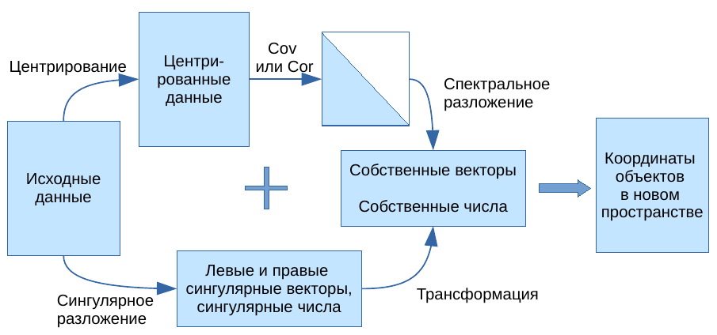
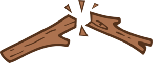

```{r setup, include = FALSE, cache = FALSE, purl = FALSE}
# output options
options(width = 70, scipen = 6, digits = 3)
library(knitr)
# chunk default options
opts_chunk$set(fig.align='center', tidy = FALSE, fig.width = 7, fig.height = 3, warning = FALSE)
```

## Вы сможете

- Проводить анализ главных компонент при помощи функций из пакета `vegan`
- Оценивать долю дисперсии, объясненной компонентами
- Снизить размерность данных, оставив небольшое число компонент
- Интерпретировать смысл компонент по их факторным нагрузкам
- Строить ординацию объектов в пространстве главных компонент
- Создавать комплексные переменные и использовать их в других видах анализов

# Постановка задачи для анализа главных компонент

## Зачем нужен анализ главных компонент?

Когда признаков много, можно представить все объекты как облако точек в многомерном пространстве. Обычно в биологических исследованиях признаки объектов взаимозависимы (между ними есть ненулевая ковариация или корреляция).


Migration by Don McCullough
on [Flickr](https://flic.kr/p/fEFhCj)

## Не все проекции несут важную информацию


black shadows for a white horses / les negres ombres dels cavalls blancs by  Ferran Jordà
on [Flickr](https://flic.kr/p/9XJxiL)

## Можно найти оптимальную проекцию, чтобы сохранить максимум информации в минимуме измерений


Cat's shadow by Marina del Castell on [Flickr](https://flic.kr/p/ebe5UF)

## Анализ главных компонент (Principal Component Analysis, PCA)

- Ординация объектов по многим признакам.

- Описание системы взаимосвязей между множеством исходных признаков и ранжирование признаков по важности.

- Снижение размерности многомерных данных (dimension reduction) и создание синтетических взаимонезависимых признаков для других анализов (например, для регрессии, дискриминантного анализа)

## Пример: Размеры медуз

Данные о размерах медуз _Catostylus mosaicus_ (Lunn & McNeil 1991). Медузы собраны в реке Хоксбери (Новый Южный Уэльс, Австралия): часть --- на острове Дангар, другая --- в заливе Саламандер.

<div class="columns-2">


Blubber jellies! by  Kirsti Scott
on [Flickr](https://flic.kr/p/nWikVp)

```{r, echo = FALSE, purl = FALSE}
jelly <- read.delim("data/jellyfish.csv")
head(jelly, 10)
```

</div>

## Задача анализа главных компонент

Нужно найти такую трансформацию исходных данных, чтобы "новые" переменные:

- содержали всю исходную информацию
- были независимы друг от друга
- были ранжированы в порядке убывания важности (например, в порядке убывания их дисперсии)

Интуитивно, мы можем добиться этого, если проведем одну ось вдоль направления, в котором максимально вытянуто облако исходных данных. Вторую ось проведем перпендикулярно первой (и они будут независимы).

```{r echo = FALSE, purl = FALSE, message=FALSE}
library(ggplot2)
theme_set(theme_bw() + theme(legend.key = element_blank()))
update_geom_defaults("point", list(shape = 19))

X_raw <- jelly[, 2:3]

# График исходных данных
gg <- ggplot(as.data.frame(X_raw), aes(x = width, y = length)) + 
  geom_point(size = 2) 
# gg + coord_equal(expand = c(0, 0))

# Центрируем
X <- scale(X_raw, center = TRUE, scale = FALSE)
A <- cov(X)    # Матрица ковариаций
E <- eigen(A)  # Спектральное разложение
# Координаты точек в новом пространстве
Y <- X %*% E$vectors

# График точек в новом пространстве
gg_rotated <- gg %+% as.data.frame(Y) + 
  aes(x = V1, y = V2) + 
  geom_hline(yintercept = 0) + 
  geom_vline(xintercept = 0) + 
  labs(x = "PC1", y = "PC2") %+% 
  coord_equal() 

# Исходные данные
jelly <- read.delim("data/jellyfish.csv")
X_raw <- jelly[, 2:3]
X <- scale(X_raw, center = TRUE, scale = FALSE) # Центрируем
A <- cov(X)    # Матрица ковариаций
E <- eigen(A)            # Спектральное разложение
U <- E$vectors           # Собственные векторы
Lambda <- E$values       # Собственные числа

library(cowplot)
plot_grid(gg + ggtitle("До"),
          gg_rotated + ggtitle("После"),
          align = "h")

# # собственные векторы
dimnames(U) <- list(colnames(X),paste0("PC", 1:ncol(X)))
# # Собственные числа
Explained <- Lambda/sum(Lambda)       # Доля объясненной изменчивости
# Факторные координаты
Y <- X %*% U # Координаты точек в новом пространстве
```

## Вспомним, как устроен PCA.



## Результаты работы PCA  {.columns-2 .smaller}

- __Собственные векторы__ (__факторные нагрузки__)
  - перпендикулярны друг другу (ортогональны, независимы) 
  - задают __главные компоненты__ --- направления новых осей
  - линейные комбинации исходных признаков
  - упорядочены в порядке убывания дисперсии
- __Собственные числа__
  - показывают дисперсию вдоль главных компонент
  - упорядочены в порядке убывания дисперсии
  - используются для вычисления доли общей изменчивости, связанной с каждой из главных компонент
- __Факторные координаты__
  - координаты объектов в пространстве главных компонент

<br/>

```{r echo=FALSE, fig.width=5, fig.height=4.5, message=FALSE}
plot_grid(gg + ggtitle("До"),
          gg_rotated + ggtitle("После") + labs(x = "PC1", y = "PC2"),
          ncol = 1,
          align = "hv", axis = "b")
```

```{r echo=FALSE, fig.width=9, message=FALSE}
# plot_grid(gg + ggtitle("До"),
#           gg_rotated + ggtitle("После") +
#   aes(colour = jelly$location) +
#   scale_color_brewer("Location", palette = "Set1") +
#   labs(
#        x = paste0("PC1, ", round(Explained[1] * 100, 1), "%"),
#        y = paste0("PC2, ", round(Explained[2] * 100, 1), "%")),
#   rel_widths = c(1, 1.3),
#           align = "hv", axis = "l")
```


## Результаты работы PCA

- Главные компоненты 
  - новые "синтетические" признаки объектов, которые сочетают несколько исходных признаков
  - упорядочены по убыванию доли объясненной изменчивости
  - используя разное число главных компонент можно снизить размерность исходных данных

```{r echo=FALSE, fig.width=9, message=FALSE}
gg_rotated +
  aes(colour = jelly$location) +
  scale_color_brewer("Location", palette = "Set1") +
  labs(title = "Результаты PCA",
       x = paste0("PC1, ", round(Explained[1] * 100, 1), "%"),
       y = paste0("PC2, ", round(Explained[2] * 100, 1), "%"))
```

- PC1 --- "размер медузы" --- больше всего изменчивости
- PC2 --- остаточная изменчивость

# Действительно многомерные данные

## Пример: Потребление белков в странах Европы с разными видами продуктов питания


<small>Paleo Diet by zsoolt on [Flickr](https://flic.kr/p/pPK1nz)</small>

<div class = "footnote">Данные из Weber, 1973</div>


## Открываем данные {.smaller}

```{r R.options=list(width = 100)}
protein <- read.table(file="data/protein.csv", sep="\t", dec=".", header=TRUE)
protein$region <- factor(protein$region)
rownames(protein) <- protein$country
head(protein)
```

<div class = "footnote">Данные из Weber, 1973</div>

## Делаем PCA

```{r pca-owl, message=FALSE, fig.width=5, fig.height=3, eval=TRUE, echo=-c(3, 5), fig.align='left'}
library(vegan)
prot_pca <- rda(protein[, -c(1, 2)], scale = TRUE)
op <- par(mar = c(5, 4, 0, 2) + 0.1)
biplot(prot_pca)
par(op)
```

## Делаем PCA

```{r pca-owl, message=FALSE, fig.width=5, fig.height=4, eval=FALSE, echo=-c(3, 5), purl=FALSE}
```

<div class="columns-2">

```{r pca-owl, message=FALSE, fig.width=5, fig.height=5, eval=TRUE, echo=FALSE, purl=FALSE}
```


</div>

## Разбираемся с результатами PCA

```{r message=FALSE}
summary(prot_pca)
```

# 1. Сколько компонент нужно оставить?

## Собственные числа показывают вклады главных компонент в общую изменчивость

```
Eigenvalues, and their contribution to the correlations 

Importance of components:
                         PC1    PC2    PC3    PC4     PC5     PC6  ...  
Eigenvalue            4.0064 1.6350 1.1279 0.9547 0.46384 0.32513 ...
Proportion Explained  0.4452 0.1817 0.1253 0.1061 0.05154 0.03613 ...
Cumulative Proportion 0.4452 0.6268 0.7521 0.8582 0.90976 0.94589 ...
```

```{r purl=FALSE}
eigenvals(prot_pca) # собственные числа
```

## Сколько компонент нужно оставить, если мы хотим редуцировать данные?

- Эмпирические правила (выберите любое, но одно)
    - Компоненты у которых соб. число > 1 (правило Кайзера-Гатмана)
    - В сумме объясняют заданный % от общей изменчивости (60-80%) - слишком субъективно
    - Объясняют больше чем по Broken Stick Model.
    


```{r}
eigenvals(prot_pca) # собственные числа

bstick(prot_pca) # ожидаемое по Broken Stick Model
```

## График собственных чисел

```{r}
screeplot(prot_pca, type = "lines", bstick = TRUE) # график собственных чисел
```

# 2. Графики факторных нагрузок и ординации

## Параметр `scaling`

Внимание! Координаты объектов или переменных можно получить в нескольких вариантах, отличающихся масштабом. От этого масштаба будет зависеть интерпретация.

```{r, echo=FALSE, results='asis', purl = FALSE}
df <- data.frame(
  scaling = c("1, sites", "2, species", "3, symmetric", "0, none"),
  bip = c("биплот расстояний", "биплот корреляций", "", ""),
  scaled = c("координаты объектов масштабированы (х корень из соб. чисел)", "координаты признаков масштабированы (х корень из соб. чисел)", "масштабированы координаты объектов и признаков (х корень 4-й степени из соб. чисел)", "нет масштабирования"),
  dist = c("аппроксимируют евклидовы", "НЕ аппроксимируют евклидовы", "", ""),
  ang = c("нет смысла", "отражают корреляции", "", "")
  )

colnames(df) <- c("scaling", "Название графика", "Масштаб", "Расстояния между объектами", "Углы между векторами")

kable(df)
```


## Графики

```{r, fig.width=7, fig.height=5}
op <- par(mfrow = c(1, 2))
# График факторных нагрузок
biplot(prot_pca, display = "species", scaling = "species")
# График факторных координат
biplot(prot_pca, display = "sites")
par(op)
```

## Те же самые графики можно построить в ggplot2

```{r load-p, echo=FALSE}
# Данные для графиков
df_load <- as.data.frame(scores(prot_pca, display = "species", 
                                choices = c(1, 2, 3), scaling = "species"))
# поправки для размещения подписей
df_load$hjust <- ifelse(df_load$PC1 >= 0, -0.1, 1)
df_load$vjust <- ifelse(df_load$PC2 >= 0, -0.1, 1)

library(grid) # для стрелочек
ar <- arrow(length = unit(0.25, "cm"))

## График нагрузок в ggplot
p_load <- ggplot(df_load) + 
  geom_text(aes(x = PC1, y = PC2, label = rownames(df_load)), 
            size = 3, vjust = df_load$vjust, hjust = df_load$hjust) + 
  geom_segment(aes(x = 0, y = 0, xend = PC1, yend = PC2), 
               colour = "grey40", arrow = ar) + 
  coord_equal(xlim = c(-2, 2), ylim = c(-2, 2))
```

```{r, ord-p, echo=FALSE}
## График ординации в ggplot
df_scores <- data.frame(protein[, 1:2],
  scores(prot_pca, display = "sites", choices = c(1, 2, 3), scaling = "sites"))

p_scores <- ggplot(df_scores, aes(x = PC1, y = PC2, colour = region)) + 
  geom_text(aes(label = country)) +
  coord_equal(xlim = c(-1.2, 1.2), ylim = c(-1.2, 1.2))
```

```{r, warning=FALSE, fig.width=10, echo=FALSE}
plot_grid(p_load, p_scores, align = "h",
          rel_widths = c(0.36, 0.64))
```

## Исходный код графика нагрузок

```{r load-p, eval=FALSE, purl = FALSE}
```

## Исходный код графика ординации

```{r ord-p, eval=FALSE, purl = FALSE}
```

# 3. Интерпретация компонент

## Интерпретация компонент {.smaller}

<div class="columns-2">

Факторные нагрузки оценивают вклады переменных в изменчивость по главной компоненте

- Модуль значения нагрузки --- величина вклада 
- Знак значения нагрузки --- направление вклада

```{r}
scores(prot_pca, display = "species", 
       choices = c(1, 2, 3), scaling = 0)
```

> - Т.е. первую компоненту можно назвать "Мясо -- злаки и орехи"

<br/><br/>

### Первая главная компонента:

Высокие __положительные нагрузки по первой главной компоненте__ у переменных `cereals` и `nuts`. Значит, чем больше значение PC1, тем больше потребление этих продуктов.

Высокие __отрицательные нагрузки__ у переменных `eggs`, `milk`, `whitemeat`, `redmeat`. Т.е., чем меньше значение PC1, тем больше их потребление. 

```{r echo=FALSE, purl=FALSE}
p_load
```


</div>

## Интерпретация компонент  {.smaller}

<div class="columns-2">

Факторные нагрузки оценивают вклады переменных в изменчивость по главной компоненте

- Модуль значения нагрузки --- величина вклада 
- Знак значения нагрузки --- направление вклада

```{r}
scores(prot_pca, display = "species", 
       choices = c(1, 2, 3), scaling = 0)
```

> - Т.е. вторую компоненту можно назвать "Рыба и овощи"

<br/><br/>

### Вторая главная компонента:

Высокие __положительные нагрузки по второй главной компоненте__ у переменных `fish`, `frveg`. Значит, чем больше значение PC2, тем больше потребление рыбы, овощей.

Высоких __отрицательных нагрузок по второй главной компоненте__ нет ни у одной из переменных. 

```{r echo=FALSE, purl=FALSE}
p_load
```

</div>


# PCA и другие методы

##  {.smaller}

<div class="columns-2">

### PCA

- Метод обучения "без учителя" (unsupervised learning)
- Все переменные-признаки равноправны
- Задачи:
  - описать сходство объектов
  - снизить размерность данных
  - интерпретировать связи между переменными
- Главные компоненты --- линейные комбинации переменных, задающие направления максимального варьирования исходных данных. 

<br/>

### Линейная регрессия

- Метод обучения "с учителем" (supervised learninig)
- Переменные делятся на зависимые (один или несколько откликов) и независимые (предикторы)
- Задачи:
  - описать зависимость значений отклика от предикторов
  - предсказать значения отклика при известных значениях предикторов
- Линия регрессии --- направление, вдоль которого минимален разброс значений зависимой переменной (сумма квадратов остатков).

</div>

```{r echo=FALSE, purl=FALSE, fig.width=5, fig.height=3}
set.seed(392987)
dat <- data.frame(x = 1:100) %>% 
  mutate(y = 15 + 0.8 * x + rnorm(100, 0, 20),
         y_lm_yx = predict(lm(y ~ x)),
         x_lm_xy = predict(lm(x ~ y)),
         )
#covariance
xyCov <- cov(scale(dat[, c("x", "y")], scale = FALSE))
eigenVectors <- eigen(xyCov)$vectors

# Где-то ошибка со знаком собственных векторов
# intercept = mean(y) - tan(acos(eigenVectors[1,1])) * mean(x)
dat %>% 
  ggplot(aes(x = x, y = y)) + 
  geom_point(alpha = 0.3) +
  geom_abline(aes(slope = tan(acos(eigenVectors[1,1])), intercept = mean(y) - tan(acos(eigenVectors[1,1])) * mean(x), colour = "PC1")) +
  geom_line(aes(x = x, y = y_lm_yx, colour = "lm(x~y)")) +
  geom_line(aes(x = x_lm_xy, y = y, colour = "lm(y~x)")) +
  
  guides(colour = guide_legend(override.aes = list(linetype = c(1, 1, 1)))) +
  scale_colour_manual(values = c("PC1" = "#E41A1C", "lm(y~x)" = "#377EB8", "lm(x~y)" = "#4DAF4A"), breaks = c("PC1", "lm(y~x)", "lm(x~y)")) +
  coord_fixed() +
  labs(colour = "")
```


##  

<div class="columns-2">

### PCA

- PCA представляет многомерные данные в пространстве независимых осей, ранжированных по важности, поэтому __есть возможность оставить только самые важные оси изменчивости__.

- Расстояния между объектами на любой ординации PCA соответствуют их евклидовым расстояниям в пространстве главных компонент.

- Исходные признаки --- количественные переменные, связанные друг с другом линейно. Для описания различий между такими объектами подходит евклидово расстояние.


### nMDS

- nMDS пытается найти отображение многомерного пространства в заданном числе измерений (например, на плоскости) __с максимальным сохранением информации из всех измерений__.

- Ранги расстояний между объектами на nMDS будут соответствовать их рангам в исходной матрице различий.
<br/><br/>

- Исходные признаки могут быть любыми, т.к. может быть использована любая мера различий между объектами.

</div>

## Результаты PCA и nMDS будут похожи, если для nMDS-ординации использовано евклидово расстояние {.smaller}

```{r echo=FALSE, message=FALSE, fig.width = 7, fig.height=4, purl = FALSE, fig.align='center'}
ord_nmds <- metaMDS(scale(protein[, 3:ncol(protein)]),
                    distance = "euclidean",
                    trace = 0, autotransform = FALSE)
nMDS <- ggplot(as.data.frame(ord_nmds$points), aes(x=MDS1, y=MDS2)) + 
  geom_text(aes(color = protein$region, label = protein$country)) + 
  coord_equal()
plot_grid(p_scores + guides(color=FALSE) + ggtitle("PCA"),
  nMDS + guides(color=FALSE) + ggtitle("nMDS"),
  align = "h")
```


# Создание составных переменных при помощи PCA

## Создание составных переменных

Факторные координаты --- это новые составные признаки, которых можно использовать вместо исходных переменных

Свойства факторных координат:

- Среднее = 0, Дисперсия = 1
- Не коррелируют друг с другом

Применение:

  - Уменьшение числа зависимых переменных --- для дисперсионного анализа
  - Уменьшение числа предикторов --- во множественной регрессии

```{r, echo=FALSE, purl = FALSE}
# Значения факторов (= факторные координаты)
head(scores(prot_pca, display = "sites", 
       choices = c(1, 2, 3), scaling = "sites"))
```

## При помощи дисперсионного анализа можно проверить, различается ли значение первой главной компоненты ("Мясо -- злаки и орехи") между разными регионами Европы

```{r}
# Значения факторов (= факторные координаты)
df <- data.frame(region = protein$region,
  scores(prot_pca, display = "sites", choices = c(1, 2, 3), scaling = "sites"))
mod <- lm(PC1 ~ region, data = df)
anova(mod)
```

> - Регионы Европы различаются по потреблению мяса, злаков и орехов

## Проверка условий применимости дисперсионного анализа

```{r, fig.width=10, fig.height=4, echo = FALSE}
mod_diag <- fortify(mod)
res_p <- ggplot(data = mod_diag, aes(x = .fitted, y = .stdresid)) + geom_point(aes(size = .cooksd)) + geom_hline(yintercept = 0) + geom_smooth(method="loess", se=FALSE) 
mean_val <- mean(mod_diag$.stdresid)
sd_val <- sd(mod_diag$.stdresid)
norm_p <- ggplot(mod_diag, aes(sample = .stdresid)) + geom_point(stat = "qq") + geom_abline(intercept = mean_val, slope = sd_val)
plot_grid(res_p, norm_p, ncol = 2, rel_widths = c(0.55, 0.45))
# 
```

> - Условия применимости дисперсионного анализа выполняются


## График значений первой компоненты по регионам

```{r, pc1_p, fig.width = 10, fig.height=6, echo=FALSE}
df$region <- reorder(df$region, df$PC1, FUN=mean)
ggplot(df, aes(x = region, y = PC1, colour = region)) + 
  stat_summary(geom = "pointrange", fun.data = "mean_cl_boot", size = 1) + 
  theme(axis.text.x = element_text(angle = 30, vjust = 1, hjust = 1)) 
```


## Пост-хок тест

```{r}
TukeyHSD(aov(mod))
```


## Take-home messages

- Применение метода главных компонент (PCA):
    - снижение размерности данных
    - исследование связей между переменными
    - построение ординации объектов
    - создание комплексных переменных
- Терминология:
    - Собственные числа --- вклад компонент в общую изменчивость
    - Факторные нагрузки --- корреляции исходных переменных с компонентами --- используются для интерпретации
    - Значения факторов --- новые координаты объектов в пространстве уменьшенной размерности


## Что почитать

- Borcard, D., Gillet, F., Legendre, P., 2011. Numerical ecology with R. Springer.
- Legendre, P., Legendre, L., 2012. Numerical ecology. Elsevier.
- Oksanen, J., 2011. Multivariate analysis of ecological communities in R: vegan tutorial. R package version 2–0.
- The Ordination Web Page http://ordination.okstate.edu/ (accessed 05.04.17).
- Quinn, G.G.P., Keough, M.J., 2002. Experimental design and data analysis for biologists. Cambridge University Press.
- Zuur, A.F., Ieno, E.N., Smith, G.M., 2007. Analysing ecological data. Springer.

