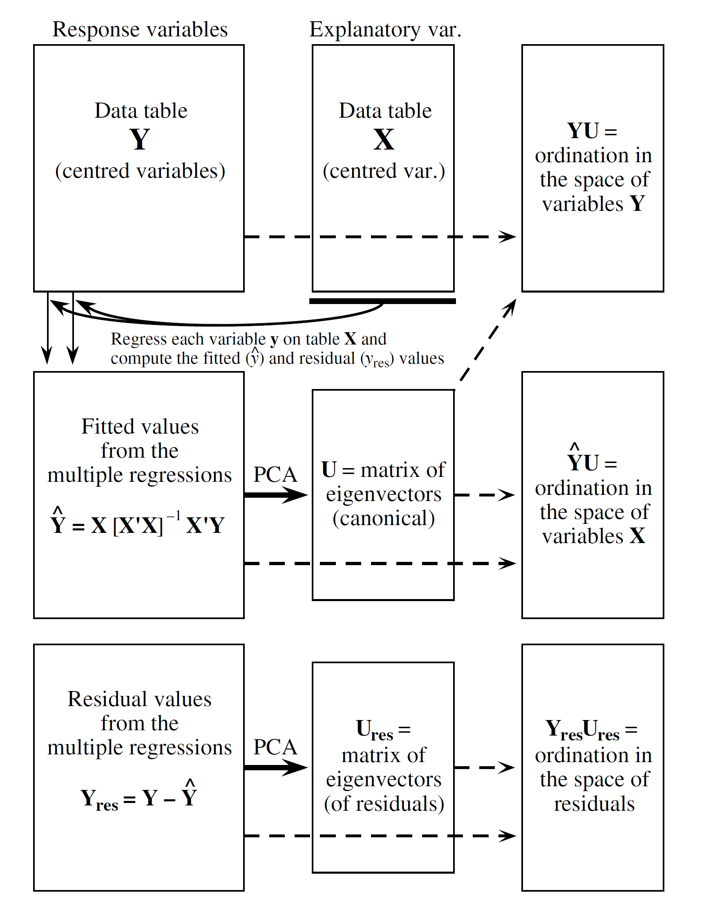

```{r setup, include=FALSE, cache=FALSE}
#-- RUN THE FRAGMENT BETWEEN LINES BEFORE COMPILING MARKDOWN
# to configure markdown parsing
options(markdown.extensions = c("no_intra_emphasis", "tables", "fenced_code", "autolink", "strikethrough", "lax_spacing", "space_headers", "latex_math"))
#------
# output options
options(width = 70, scipen = 6, digits = 3)

# to render cyrillics in plots use cairo pdf
options(device = function(file, width = 7, height = 7, ...) {
 cairo_pdf(tempfile(), width = width, height = height, ...)
 })
library(knitr)
# chunk default options
opts_chunk$set(fig.align='center', tidy = FALSE, fig.width = 5, fig.height = 5, warning=FALSE, echo=FALSE, message=FALSE, cache = FALSE)
```

## Вы сможете

- Проводить канонический корреспондентный анализ
- Оценивать долю объясненной инерции
- Интерпретировать канонические оси по координатам переменных
- Строить ординацию объектов в пространстве канонических осей
- Проверять значимость модели ординации
- Разделять общую изменчивость на компоненты при помощи частного канонического корреспондентного анализа


## Связь нескольких наборов переменных: виды и среда {.columns-2 .smaller}

**Пример: ** клещи-орибатиды на сплавине одного из канадских озер

На площадке 10 х 2.6м взяли стратифицированную случайную выборку на 7 типах субстратов (70 проб). Исследователи хотели разделить влияние среды и положения в пространстве на структуру сообщества клещей-орибатид (Borcard & Legendre 1994).


Oribatid mite with a visiting friendly springtail by [Andy Murray on Flickr](https://flic.kr/p/bqAFBs)


Tourbière/Peat bog* by [peupleloup on Flickr](https://flic.kr/p/51F8Ks)

* - peat bog - зыбун, сплавина (плавина)

##Читаем данные

```{r message = FALSE}
library(vegan)
data(mite)
data(mite.env)
data(mite.xy)
head(mite[ , 1:6], 2)
str(mite.xy)
str(mite.env)
```

##Схема асположения проб
```{r}
library(ggplot2)
library(gridExtra)
th <- theme(legend.text = element_text(size = 13), legend.title = element_text(size = 14), legend.position = "bottom", text = element_text(size = 10))
th_narrow <- th + theme(legend.key.width = unit(3, "mm"))

theme_set(theme_bw(base_size = 18))
update_geom_defaults("point", list(shape = 19))
p <- ggplot(mite.xy, aes(x = x, y = y)) + geom_point()
p + coord_fixed() + th
```

---

```{r mite-maps, echo = FALSE, message = FALSE, results='hide', fig.height = 6, fig.width = 14, cache=TRUE}
gginterp <- function(x, y, envir, nx, ny){
  # функция интерполирует значения переменных среды
  require(akima)
  require(reshape2)
  # Интерполяция
  fld <- interp.new(x = x, y = y, z = envir, xo=seq(min(x), max(x), length = nx), yo=seq(min(y), max(y), length = ny))
  # Перевод результатов в "длинную" форму
  df_env <- melt(fld$z, na.rm = TRUE)
  colnames(df_env) <- c("x", "y", "envir")
  # Замена по порядковым номерам настоящими значениями переменных среды
  df_env$x <- fld$x[df_env$x]
  df_env$y <- fld$y[df_env$y]
  return(df_env)
}

ggmapinterp <- function(x, y, envir, nx, ny){
  # функция рисует график интерполированной переменной
  df_env <- gginterp(x, y, envir, nx, ny)
  require(ggplot2)
  p <- ggplot(data = df_env, aes(x = x, y = y, z = envir)) +
    geom_tile(aes(fill = envir)) # + stat_contour(colour = "gray40")
  return(p)
}

# модификация темы для всех графиков
th <- theme(legend.text = element_text(size = 13), legend.title = element_text(size = 14), legend.position = "bottom", text = element_text(size = 10))
th_narrow <- th + theme(legend.key.width = unit(3, "mm"))

# Для легенды
p0 <- ggmapinterp(x = mite.xy$x, y = mite.xy$y, envir = mite.env$SubsDens, nx = 50, ny = 200) + geom_point(data = mite.xy, aes(x = x, y = y, z = NULL, shape = mite.env$Substrate)) + 
  scale_fill_continuous(name = "Плотность субстрата", low = "white", high = "green", guide = "none") +
  scale_shape_manual(name = "Субстрат", values=1:7, labels = c("Сфагн1", "Сфагн2", "Сфагн3", "Сфагн4", "Раст. остатки", "Голый торф", "Поверхность" )) + th

# Плотность субстрата
p1 <- ggmapinterp(x = mite.xy$x, y = mite.xy$y, envir = mite.env$SubsDens, nx = 50, ny = 200) + geom_point(data = mite.xy, aes(x = x, y = y, z = NULL, shape = mite.env$Substrate)) + scale_fill_continuous(low = "white", high = "green") +   scale_shape_manual(name = "Субстрат", values=1:7, labels = c("Сфагн1", "Сфагн2", "Сфагн3", "Сфагн4", "Раст. остатки", "Голый торф", "Поверхность" ), guide = "none") + th + ggtitle("Плотность\nсубстрата") + guides(fill = FALSE, shape = F)

# Содержание воды
p2 <- ggmapinterp(x = mite.xy$x, y = mite.xy$y, envir = mite.env$WatrCont, nx = 50, ny = 200) + geom_point(data = mite.xy, aes(x = x, y = y, z = NULL, shape = mite.env$Substrate)) + scale_fill_continuous( low = "white", high = "blue") +   scale_shape_manual(name = "Субстрат", values=1:7, labels = c("Сфагн1", "Сфагн2", "Сфагн3", "Сфагн4", "Раст. остатки", "Голый торф", "Поверхность" ), guide = "none") + th + ggtitle("Содержание\nводы") + guides(fill = FALSE, shape = F)

# Количество кустарников
p3 <- ggmapinterp(x = mite.xy$x, y = mite.xy$y, envir = mite.env$Shrub, nx = 50, ny = 200) +  geom_point(data = mite.xy, aes(x = x, y = y, z = NULL, shape = mite.env$Substrate)) +   scale_fill_continuous(low = "white", high = "darkgreen", breaks = c(1, 2, 3), labels = c("Нет", "Мало", "Много")) +   scale_shape_manual(name = "Субстрат", values=1:7, labels = c("Сфагн1", "Сфагн2", "Сфагн3", "Сфагн4", "Раст. остатки", "Голый торф", "Поверхность" ), guide = "none") + th + ggtitle("Покытие \nкустарники") + guides(fill = FALSE, shape = F)


p4 <- ggmapinterp(x = mite.xy$x, y = mite.xy$y, envir = mite.env$Topo, nx = 50, ny = 200) +  geom_point(data = mite.xy, aes(x = x, y = y, z = NULL, shape = mite.env$Substrate)) + scale_fill_continuous(low = "white", high = "orange", breaks = c(1, 2), labels = c("Ровно", "Кочка")) +  scale_shape_manual(name = "Субстрат", values=1:7, labels = c("Сфагн1", "Сфагн2", "Сфагн3", "Сфагн4", "Раст. остатки", "Голый торф", "Поверхность" ), guide = "none") + th + ggtitle("Топографические \nхарактеристики") + guides(fill = FALSE, shape = F)


#extract legend
#https://github.com/hadley/ggplot2/wiki/Share-a-legend-between-two-ggplot2-graphs
g_legend<-function(a.gplot){
  tmp <- ggplot_gtable(ggplot_build(a.gplot))
  leg <- which(sapply(tmp$grobs, function(x) x$name) == "guide-box")
  legend <- tmp$grobs[[leg]]
  return(legend)}

mylegend<-g_legend(p0 + theme(legend.position = "bottom", legend.key = element_blank()))

library(gridExtra)
grid.arrange(arrangeGrob(p1, p2, p3, p4, nrow = 1), mylegend, nrow = 2, heights = c(10, 1))
```

## Косвенный градиентный анализ

- ищем ось макс. варьирования (анализ главных компонент (PCA), корреспондентный анализ (CA))    
- затем регрессионый анализ в завсимости от предикторов 


>- Опасности:
  > - теряем связи переменных среды и отброшенных компонент высоких порядков. 
    - __Выход__ использовать прямой градиентный анализ.
  > - PCA нужны линейные зависимости (т.к. матрица ковариаций или корреляций). Если связи нелинейны - искривление градиентов.
    - __Выход__ использовать другие расстояния (CA использует хи-квадрат).

## Прямой градиентный анализ

Прямой градиентный анализ еще называют **каноническим** анализом.  

Канонической формой функции или выражения в математике называют такую упрощенную  форму, к которой можно свести функцию или выражение без потери самой важной информации.   

Например, канонической формой матрицы ковариации является матрица собственных 
значений


## Канонический анализ

В общем виде каноничесий анализ сводится к тому же, что мы видели в CA и PCA, то есть к поиску собственных значений (задающих оси максимального варьирования) и собственных векторов (коэффициентов, определяющих координаты в новом пространстве).

НО! Оси ордиации определяются переменными среды.

##Принципиальная схема канонического анализа {.flexbox .vcenter .smaller} 



  
из Legendre & Legendre, 2012


## Вспомним регрессионный анализ


$$
\hat{y_i} = \beta_0 + \beta_1x_{i1} + \beta_2x_{i2} + \dots + \beta_px_{ip}
$$

Здесь
$\hat{y}$ - предсказанные значения (fitted values)

$x_1, x_2 \dots x_p$ - предикторы

$\beta_0, \beta_1, \beta_2 \dots + \beta_p$ - коэффициенты 

## Регрессионный анализ в матричном виде

Как всегда, независимая чсть модели - это модельная матрица **X**   
Зависимая часть в анализе - это не вектор **y**, как мы привыкли, а матрица **Y**   
Коэффициенты, будут представлены тоже в виде матрицы $\beta$. 

Тогда матрица предсказанных значений

$$
\hat {\textbf Y}  = \boldsymbol {\beta \times  X}
$$

При этом матрица коэффициентов - это 

$$
\boldsymbol{\beta} = \boldsymbol {[X'X]^{-1}X'Y}
$$

Матрица остатков - это
$$
\boldsymbol {Y_{resid} = Y - \hat {Y}}
$$

##SVD и канонический анализ 
Основан на SVD трех матриц:     
1. SVD матрицы исходных значений ($\boldsymbol{Y}$) - дает информацию об общей изменчивости в системе - это просто PCA или СА.     
2. SVD матрицы предсказнных значений ($\boldsymbol{\hat{Y}}$) - дает информацию системе, ограниченной (Constrained) предкторами ($\boldsymbol{X}$).     
3. SVD матрицы остатков ($\boldsymbol{Y_{resid}}$) - дает информацию о системе за вычитом влияния предикторов.     


## Канонический корреспондентный анализ (CCA)

- Основан на корреспондентном анализе, то есть вместо исходных данных используется матрица **Q** (см. дополнительные материалы "За кулисами CA и CCA").
- Мера изменчивости в этом анализе - $Inertia$.
- Нужно две матрицы данных: матрица зависимых переменных  и матрица предикторов.
- Нужно найти такие компоненты матрицы зависимых переменных, которые являются линейными комбинациями предикторов и отражают максимум инерции

### Условия применимости такие же как у CA


## Новые оси

- __Канонические__ - Корреспондентный анализ на основе матрицы предсказанных значений.
- __Неканонические__ - корреспондентный анализ таблицы остатков от регрессии координат по предикторам (каноническим осям) от переменных среды.

##Два подхода к анализу

Рассмотрение ординации в канонических осях дает информацию о связи между видами, сайтами и средой.

Анализ неканонических осей - отношения между видами или сайтами после того, как учтен эффект среды.

## CCA - канонический кореспондентный анализ в vegan

- Зависимые переменные (отклики) - обилие видов
- Независимые переменные (предикторы) - переменные среды

##Задание
Используя представления об ограниченной ординации в форме RDA, постройте, по аналогии, ограниченную ординацию в форме CCA. Объект, содержащий результаты должен называться `mite_cca`

В качестве предикторов  в модели возьмите следующие факторы из датафрейма `mite.env`: SubsDens, WatrCont, Substrate, Topo


##Решение
```{r, echo=TRUE}
mite_cca <- cca(mite ~ SubsDens + WatrCont + Substrate + Topo, data = mite.env)
```


## Общая инерция и ее разложение

О ней можно судить __по суммам собственных чисел __ (ограниченных и неограниченных осей)


```
Partitioning of mean squared contingency coefficient:
              Inertia Proportion
Total           1.696      1.000
Constrained     0.735      0.433
Unconstrained   0.961      0.567
```

## Важность различных компонент {.smaller}

Можно более подробно оценить, как распределяется изменчивость между осями

В общем наборе осей (их 34 + 9 = 43!)
```
Eigenvalues, and their contribution to the mean squared contingency coefficient 

Importance of components:
                       CCA1  CCA2   CCA3   CCA4   CCA5    CCA6 ...
Eigenvalue            0.426 0.129 0.0667 0.0443 0.0321 0.01447 ...
Proportion Explained  0.251 0.076 0.0393 0.0261 0.0189 0.00853 ...
Cumulative Proportion 0.251 0.327 0.3666 0.3927 0.4117 0.42020 ...

```

Только в ограниченных (канонических) осях (их всего 9!)
```
Accumulated constrained eigenvalues
Importance of components:
                       CCA1  CCA2   CCA3   CCA4   CCA5   CCA6 ...
Eigenvalue            0.426 0.129 0.0667 0.0443 0.0321 0.0145 ...
Proportion Explained  0.580 0.175 0.0907 0.0603 0.0437 0.0197 ...
Cumulative Proportion 0.580 0.755 0.8458 0.9061 0.9498 0.9695 ...

```


- Часть изменчивости структуры сообществ орибатид действительно удается объяснить изменениями среды. Канонические оси объясняют 43% общей инерции если рассматривать всю изменчивость (т.е. 43 оси). Из них первые две оси объясняют 33 % общей изменчивости.

Но, если рассматривать первые две канонические оси в пределах только ограниченных осей (т.е. 9 осей) - то среда объясняет целых 75%


## Распределение изменчивости, потенциально объяснимой факторами

```
Accumulated constrained eigenvalues
Importance of components:
                       CCA1  CCA2   CCA3   CCA4   CCA5   CCA6   CCA7 ...
Eigenvalue            0.426 0.129 0.0667 0.0443 0.0321 0.0145 0.0107 ...
Proportion Explained  0.580 0.175 0.0907 0.0603 0.0437 0.0197 0.0145 ...
Cumulative Proportion 0.580 0.755 0.8458 0.9061 0.9498 0.9695 0.9840 ...
```

- Первая ограниченная ось объясняет 58%, вторая 17% того, что можно потенциально связать с воздействием среды, остальные оси почти ничего не объясняют. Значит, характеристики среды, в принципе, можно свести к двум комплексным независимым переменным.


## Собственные векторы, нагрузки переменных = “species scores”

- обилие каких видов сильнее варьирует вдоль оси?

```{r eval=FALSE}
scores(mite_cca, display = "species", choices = 1:5)
```

## Другие части результатов

- Собственные векторы  (“species scores”) координаты видов
- Координаты объектов  (“site scores”) 
- Координаты объектов в канонических осях (“Site constraints”)
- (“Biplot scores”) координаты для биплотов
- Центроиды сайтов для бинарных переменных среды на диаграмме ординации (“Centroids for factor constraints”)

## Корреляции между откликами (обилиями видов) и предикторами (средой)

```{r}
spenvcor(mite_cca)
```

> - Несмотря на то, что канонические оси объясняют не очень большое количество изменчивости, почти все они сильно или умеренно коррелируют с характеристиками среды.


## Визуализация ординации


- Какие предикторы важнее всего?
- Какими факторами определяется значение зависимых переменных?

Триплоты:

- переменные-отклики ("species"),
- объекты ("sites")
- переменные-предикторы (непрерывные в виде векторов, дискретные в виде центроидов)

Биплоты:

- отклики + предикторы
- объекты + предикторы


## Примеры триплотов {.columns-2 .smaller}

Осторожно, в CCA есть два типа координат объектов:

- WA - "weighted average scores" -  без ограничений переменными среды, но при этом они отличаются от координат полученных в CA
- LC - "linear combination scores" -  результат множественной регрессии WA-координат по линейным комбинациям переменных среды. Palmer (1993) рекомендовал графики с ними, потому что WA непонятно как интерпретировать - и это по-умолчанию используется в `vegan`

```{r tidy = F, fig.width = 4, fig.height=4}
plot(mite_cca, scaling = 1, main = "scaling 1")
```

```{r tidy = F, fig.width = 4, fig.height=4}
plot(mite_cca, scaling = 2, main = "scaling 2")
```


## Отношения между видами и средой (scaling = 2) {.columns-2 .smaller}

- Проекция вида под прямым углом на переменную - оптимум вида по этой переменной 
- Вид вблизи центроида качественной переменной - скорее всего часто встречается на сайтах с такими качествами
- Расстояния между центроидами и центроидами и объектами __НЕ равны__ $\chi^2$

```{r tidy = F, fig.width = 5}
plot(mite_cca, scaling = 2, 
     display = c("sp", "cn"), 
     main = "biplot cca, scaling 2")
```


## Пример интерпретации графика в scaling = 2

```{r}
plot(mite_cca, scaling = 2, display = c("sp", "cn"), main = "biplot cca, scaling 2")
```


## Отношения между объектами и средой (scaling = 1)

- Проекция объекта под прямым углом на колич. переменную - приблизительная позиция объекта вдоль этой переменной 
- Объект вблизи центроида качественной переменной скорее всего обладает данным качеством
- Расстояние между центроидами качественных переменных и между центроидами объектов - $\chi^2$

```{r tidy = F, fig.width = 5}
plot(mite_cca, scaling = 1, 
     display = c("lc", "cn"), 
     main = "biplot cca, scaling 1")
```

## Пример интерпретации графика в scaling 1

```{r}
plot(mite_cca, scaling = 1, display = c("lc", "cn"), main = "biplot cca, scaling 1")
```

# Проверка значимости ординации

## Общий тест на значимость ординации

- Тестируем гипотезу о том, что отношения между структурой сообщества и средой значимы - $H _0$: обилие видов в пробах не зависит от значений переменных среды
- основан на пермутациях: случайно перемешиваем данные и проверяем, насколько редко будет наблюдаться связь сильнее, чем данная

- статистика - сумма всех канонических соб. чисел

## Общий тест: влияют ли факторы на зависимые переменные?

### Есть ли связь структуры сообщества со средой?

```{r, echo=TRUE}
anova(mite_cca)
```

> - Структура сообщества связана с условиями среды

## Тест факторов, type I эффекты: Какие факторы влияют на зависимые переменные?

> - Структура сообщества клещей зависит от плотности и типа субстрата, от содержания воды и топографии
- Осторожно, это Type I эффекты. Они зависят от порядка включения факторов в модель!

```{r, echo=TRUE}
anova(mite_cca, by="term")
```

## Тест факторов, type III эффекты: Какие факторы влияют на зависимые переменные?

>- Если протестировать каждый из факторов отдельно, при условии, что остальные уже в модели, получится, что тип субстрата не влияет, а влияют остальные факторы.

```{r, echo=TRUE}
anova(mite_cca, by="mar")
```

## Тест значимости осей, ограниченных факторами:

- $H_0$: изменение состава сообщества в пробах вдоль данной оси не зависит от переменных среды
- пермутационный тест: случайно переставляем данные и проверяем, насколько редко данная ось объясняет больше изменчивости чем в исходном анализе. Если редко, то варьирование вдоль оси значимо

>- Структура сообщества значимо меняется вдоль первых 5 канонических осей

```{r, echo=TRUE}
anova(mite_cca, by="axis")
```


## Ограничения CCA

>- Редкие виды - использовать когда репрезентативная выборка или удалить из анализа
- Чтобы снизить вес больших численностей видов - логарифмировать
- Доля объясненной изменчивости (% of total inertia) - аналогично $R^2$ - смещенная оценка. Простых поправок не придумано.
- Симметричные распределения переменных среды (преобразования)
- Нельзя включать шумные переменные среды 
- Нельзя трансформацию Хелингера - будет уже не $\chi^2$

## Частная ординация

- зависимость от одного набора переменных (предикторов), когда влияние другого (ковариат) исключено. 

Техника: множественная регрессия предикторов от ковариат. Остатки от этой регрессии (то, что от ковариат не зависит) - в CCA в качестве переменных среды.

<div class = "footnote">Legendre & Legendre 1998</div>


## Попробуем частную ординацию и пространственный анализ

Общую изменчивость делим на части :
- связана с переменными среды,
- с пространственными координатами, 
- может быть объяснена тем и другим вместе,
- не объяснена ни тем не другим.

```{r, echo=TRUE}
mod <- varpart(mite, ~ SubsDens + WatrCont + Substrate + Topo, ~ x + y, data = cbind(mite.env, mite.xy))
```

## Выделяем компоненты изменчивости {.columns-2 .smaller}

```{r}
mod
```

<div class = "footnote">Borcard et al., 1992</div>

```{r}
plot(mod)
```

## Take home messages

>- Канонический корреспондентный анализ позволяет описать, как стуктура изменчивости определяется внешними переменными.
>- При помощи частного канонического корреспондентного анализа можно разделять изменчивость на несколько компонент.

## Дополнительные ресурсы

- Borcard, D., Gillet, F., Legendre, P., 2011. Numerical ecology with R. Springer.
- Jongman, R.H.G., Ter Braak, C.J.F., Van Tongeren, O.F.R. (eds.), 1995. Data analysis in community and landscape ecology. Cambridge University Press
- Legendre, P., Legendre, L., 2012. Numerical ecology. Elsevier.
- Oksanen, J., 2011. Multivariate analysis of ecological communities in R: vegan tutorial. R package version 2–0.
- The Ordination Web Page URL http://ordination.okstate.edu/ (accessed 10.21.13).
- Quinn, G.G.P., Keough, M.J., 2002. Experimental design and data analysis for biologists. Cambridge University Press.
