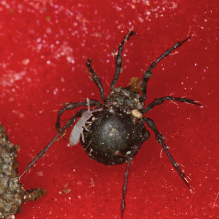
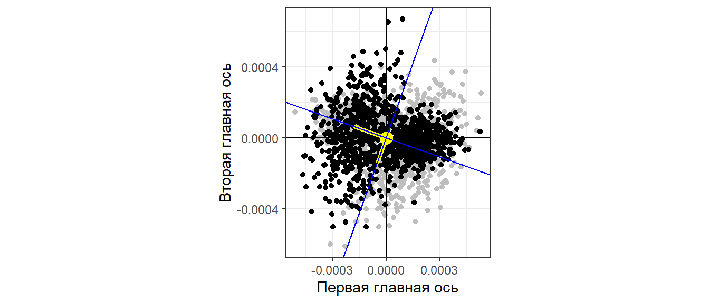

```{r setup, include = FALSE, cache = FALSE, purl = FALSE}
# output options
options(width = 70, scipen = 6, digits = 3)
library(knitr)
# chunk default options
opts_chunk$set(fig.align='center', tidy = FALSE, fig.width = 7, fig.height = 3, warning = FALSE)
```

```{r, libs-funs, echo=FALSE}
library(ggplot2)
library(grid)
theme_set(theme_bw(base_size = 16) + theme(legend.key = element_blank()))
update_geom_defaults("point", list(shape = 19, size = 4))
library(gridExtra)
library(dplyr)
library(cowplot)
library(ggvegan)


```

## Корреспондентрый анализ и анализ главных компонент

- Сложности при анализе видового состава сообществ при помощи анализа главных компонент
    - Анализ сырых данных

- Корреспондентный анализ
    - Анализ таблиц сопряженности, хи-квадрат
    - Оси в корреспондентном анализе
    - Интерпретация графиков в корреспондентном анализе

### Вы сможете

- Находить проявление "эффекта подковы" в анализе главных компонент
- Проводить корреспондентный анализ таблиц сопряженности
- Объяснить, что именно означает взаиморасположение точек объектов и переменных на графиках результатов корреспондентного анализа
- Интерпретировать графики результатов корреспондентного анализа


# Анализ видового состава сообществ. 

## Пример: Птицы в лесах Австралии

Обилие 102 видов птиц в 37 сайтах в юго-восточной Австралии (Mac Nally, 1989; данные из Quinn, Keough, 2002). Можно ли описать отношения между сайтами небольшим числом главных компонент?

```{r}
library(readxl)
birds <- read_excel(path = "data/macnally.xlsx")

# имена переводим в нижний регистр
colnames(birds) <- tolower(colnames(birds))
```


## Задание: {.smaller}
- Проведите анализ главных компонент и получите вот такую иллюстрацию


```{r fig.height=4, message=FALSE, echo=F}
library(vegan)
bird_pca <- rda(birds[ , -c(1, 2)], scale = TRUE)
# summary(bird_pca)
screeplot(bird_pca,  bstick = TRUE) # график собственных чисел
```

Сколько главных компонент имеет смысл рассматривать?


## Задание: {.smaller}
- Оцените информативность компонент и получите вот такую таблицу   

```{r, echo=F}
bird_pca_summary <- summary(bird_pca)
bird_pca_summary$cont$importance
```


## Задание: {.smaller}

- Постройте ординацию сайтов и видов в осях 1-й и 2-й главных компонент и получите вот такую иллюстрацию

```{r, echo=F, fig.height=4}
plot(bird_pca, display = "sites", type = "t")
```


## Решение: PCA и анализ информативности {.smaller}

```{r fig.height=4, message=FALSE, echo=TRUE}
library(vegan)
bird_pca <- rda(birds[ , -c(1, 2)], scale = TRUE)
# summary(bird_pca)
screeplot(bird_pca,  bstick = TRUE) # график собственных чисел
```

> - Первые две компоненты объясняют умеренное количество изменчивости


## Решение: Факторные нагрузки {.smaller}

```{r fig.height=4, echo=TRUE}
biplot(bird_pca, display = "species", scaling = "symmetric", type = "t")
```

> - У многих переменных факторные нагрузки велики сразу на две оси. Это может быть неудобно.

## Решение: Ординация сайтов  {.smaller}

Сайты 29 и 14 на самом деле расположены далеко друг от друга и мало похожи. Почему же они сближены на графике?

```{r fig.height=4, echo=TRUE}
plot(bird_pca, display = "sites") 
```

Обратите внимание, ординация сайтов в виде подковы!

> - Так происходит от того, что завышены корреляции между переменными из-за большого числа нулей

<!-- ## Что делать если появился "эффект подковы"? {.columns-2 .smaller} -->

<!-- **Решение №1** -->
<!-- нужна трансформация исходных данных -->

<!-- - Вместо Эвклидова расстояния между объектами (на этом основан PCA) используется расстояние Хеллингера (Hellinger distance) -->

<!-- $$  -->
<!-- D_{y_1, y_2} = \sqrt{\sum (\sqrt{\frac{y_{1,i}}{y_{1,total}}} - \sqrt{\frac{y_{2,i}}{y_{2,total}}})^2} -->
<!-- $$ -->

<!-- То есть исходные данные в строках стандартизируются по сумме строк -->


<!-- ```{r, echo = FALSE} -->
<!-- birds_ch <- decostand(birds[ , -c(1, 2)], "norm") # chord distance -->
<!-- ``` -->

<!-- **Решение №2** -->
<!-- Изменить метод анализа -->

<!-- - MDS  -->
<!-- - CA -->


<!-- ## Задание: Проведите анализ главных компонент по трансформированным данным -->

<!-- Сравните долю дисперсии, объясненной первыми двумя компонентами с результатами анализа нетрансформированных данных. -->

<!-- - В каком случае объясненная дисперсия больше? -->

<!-- Сравните получившиеся ординации объектов. -->

<!-- - Исчез ли "эффект подковы" после трансформации? -->
<!-- - Изменилась ли группировка объектов? -->

<!-- ## Анализ главных компонент -->

<!-- ```{r, results='hide'} -->
<!-- birds_h <- decostand(birds[ , -c(1, 2)], "hellinger") -->
<!-- bird_h_pca <- rda(birds_h) -->
<!-- bird_mds <- metaMDS(birds[,-c(1,2)]) -->
<!-- ``` -->


<!-- ## Собственные числа -->

<!-- ```{r fig.height=5} -->
<!-- screeplot(bird_h_pca, bstick = TRUE) -->
<!-- ``` -->


<!-- ## Ординация до и после трансформации данных {.smaller} -->

<!-- ```{r fig.width = 10, fig.height = 4.5, fig.show='hold'} -->
<!-- op <- par(mfrow = c(1, 3), cex = 0.9, mar = c(4, 4, 2.5, 0.5)) -->
<!-- plot(bird_pca, display = "sites", scaling = 1, main = "PCA,\nбез трансформации", type = "p") -->
<!-- plot(bird_h_pca, display = "sites", scaling = 1, main = "PCA,\nтрансформация Хеллингера", type = "p") -->

<!-- plot(bird_mds, display = "sites", main = "MDS", type = "p") -->

<!-- par(op) -->
<!-- ``` -->


## Эффект подковы в симулированном примере

Построим искусственный градиент

```{r, echo = FALSE, message=FALSE, warning=FALSE, fig.height=5}
abundance <- function(k){
  d <- -(1:100)^2 + k*(1:100) + 500 
  d[d<0] <- 0
  d
}


dat <- data.frame(Site = 1:100, Sp1 = abundance(5), Sp2 = abundance(50), Sp3 = abundance(100)/10, Sp4 = abundance(150)/10, Sp5 = abundance(200)/10, Sp6 = abundance(250)/10 )

dat2 <- dat[, -1] + rnorm(100, 0, 200)
dat2[dat2 < 0] <- 0
rownames(dat2) <-make.unique(as.character(dat$Site))

Pl_grad <- ggplot(dat2, aes(x = 1:100))+ geom_point(aes(y=Sp1), color = "black", size = 1)  + geom_point(aes(y=Sp2), color = "green", size = 1) +  geom_point(aes(y=Sp3), color = "red", size = 1)  + geom_point(aes(y=Sp4), color = "blue", size = 1) + geom_point(aes(y=Sp5), color = "darkblue", size = 1) + geom_point(aes(y=Sp6), color = "pink", size = 1) + geom_smooth(aes(y=Sp1), color = "black", se = F)  + geom_smooth(aes(y=Sp2), color = "green", se= F) +  geom_smooth(aes(y=Sp3), color = "red", se = F)  + geom_smooth(aes(y=Sp4), color = "blue", se = F) + geom_smooth(aes(y=Sp5), color = "darkblue", se = F) + geom_smooth(aes(y=Sp6), color = "pink", se = F) + labs(x = "Точки сбора", y = "Обилия видов")


```


```{r,  echo=F, message=FALSE}
res_pca <- dat2 %>% rda(.) 
# res_ca <- dat2 %>% cca(.) 

sites <- as.data.frame(scores(res_pca)$sites)

Pl_grad_pca <- ggplot(sites, aes(PC1, PC2, color = 1:100)) + geom_point() + guides(color ="none")

```


```{r echo=FALSE, message=FALSE, warning=FALSE, fig.height=5}
Pl_grad

```


## Эффект подковы в симулированном примере
<br>
<br>
```{r, echo=F, message=FALSE, fig.width=10, fig.height=5}

plot_grid(Pl_grad + geom_point(aes(x =1:100, y = 0, color = 1:100)) +guides(color ="none"), Pl_grad_pca)

```


## Для успешного применения анализа главных компонент нужно:

- Линейные связи между переменными (т.к. матрица корреляций или ковариаций, подразумевает линейность связей)
- Исключить наблюдения, в которых есть пропущенные значения
- Если много нулей - трансформация данных
- Если очень много нулей - удалить такие переменные из анализа (иногда это большая редукция!)
- Если есть один или несколько пространственных градиентов, то часто лучше отказаться от PCA и использовать другие типы анализов.


## Пример: клещи {.columns-2 .smaller}

Клещи-орибатиды на сплавине одного из канадских озер

На площадке 10 х 2.6м взяли стратифицированную случайную выборку  (70 проб) на 7 типах субстратов. (Borcard & Legendre 1994).




Oribatid mite with a visiting friendly springtail by [Andy Murray on Flickr](https://flic.kr/p/bqAFBs)


Tourbière/Peat bog* by [peupleloup on Flickr](https://flic.kr/p/51F8Ks)

* - peat bog - зыбун, сплавина (плавина)

## Структура данных {.columns-2 .smaller}

```{r, echo=FALSE}
library(vegan)
data(mite)
data(mite.xy)
```

```{r, echo=FALSE, fig.align='left', fig.height=6}
ggplot(mite.xy, aes(x =x, y = y )) + geom_point() + coord_equal()
```


```{r}
library(vegan)
data(mite)
head(mite[, 1:5])

```


## Задание: {.smaller}

- Проведите анализ главных компонент, Нарисуйте биплот, сохраняющий эвклидовы расстояния между объектами. Получите вот такие иллюстрации

```{r, fig.width=5,  echo=F}

mite_pca <- rda(mite, scaling = TRUE)

```


```{r fig.height=5, echo=F}

op <- par(mfrow = c(1, 2))

screeplot(mite_pca, bstick = T)
biplot(mite_pca,  scaling = "sites", type = "t")

par(op)
```


## Решение 

```{r, fig.height=5, eval=FALSE, echo=TRUE}
mite_pca <- rda(mite)

screeplot(mite_pca, bstick = T)

biplot(mite_pca,  scaling = "sites", type = "t")
```

## PCA vs MDS

```{r, results='hide'}
mite_mds <- metaMDS(mite, trace = F)
```

```{r, fig.height=4, echo=FALSE}
op <- par(mfrow = c(1, 2))
biplot(mite_pca, display = "sites", main = "PCA", type = "p")
plot(mite_mds, display = c("sites"),  main = "MDS")
par(op)

```


Проблемы PCA: 

- Есть отскакивающее значение
- Вырисовывается "подкова"


## Может лучше MDS?

### Pro   
- MDS может работать с любыми данными 
- MDS лучше отражает градиенты

### Contra   
- MDS не дает в явном виде информации о **связи признаков**    
- **Оси MDS безлики** их информативность не поддается оценке    
- Оси MDS трудно использовать как **комплексные признаки**    

>- Существует третий путь - **Корреспондентный анализ**

# Корреспондентный анализ (Correspondence analysis)

## Корреспондентный анализ "в темную" {.smaller}

```{r}
mite_ca <- cca(mite) 
head(summary(mite_ca))
```

## Ординация проб

```{r, echo=FALSE, fig.width=10, fig.height=5}
op <- par(mfrow = c(1, 3))
plot(mite_pca, display = "sites", main = "PCA", type = "p")
plot(mite_mds, display = "sites",  main = "MDS")
plot(mite_ca, display = "sites", type = "p", main = "CA")
par(op)
```

## Ординация проб

```{r, echo=T, eval=F, fig.width=10, fig.height=5}
op <- par(mfrow = c(1, 3))
plot(mite_pca, display = "sites", main = "PCA", type = "p")
plot(mite_mds, display = "sites",  main = "MDS")
plot(mite_ca, display = "sites", type = "p", main = "CA")
par(op)
```


## Cвязь проб и видов

```{r, echo=FALSE, fig.height=6, fig.width=10}
op <- par(mfrow = c(1, 2))

plot(mite_ca, display = "sites")
plot(mite_ca, display = "species")

par(op)

```


## Cвязь проб и видов

```{r, echo=T, eval=F, fig.height=6, fig.width=10}
op <- par(mfrow = c(1, 2))

plot(mite_ca, display = "sites")
plot(mite_ca, display = "species")

par(op)

```


## Cвязь проб и видов

Можно на одном графике

```{r, fig.height=6, echo=FALSE}

op <- par(mfrow = c(1, 2))

plot(mite_ca, scaling = 2, main = "scaling = 1 (sites)")
plot(mite_ca, scaling = 1, main = "scaling = 2 (species)")
# plot(mite_ca, scaling = 1, main = "scaling = 3 ")

par(op)


```


## Cвязь проб и видов

```{r, echo=T, eval=F, fig.height=6}

op <- par(mfrow = c(1, 2))

plot(mite_ca, scaling = 2, main = "scaling = 1 (sites)")
plot(mite_ca, scaling = 1, main = "scaling = 2 (species)")
# plot(mite_ca, scaling = 1, main = "scaling = 3 ")

par(op)


```


# Механика корреспондентного анализа

## Таблицы сопряжености
В основе CA лежит исследование таблиц сопряженности, которые описывают насколько связаны два явления:  

- Виды (столбцы) и экологические условия (сайты)
- Фенотипические классы (cтолбцы) и генотипы (строки)
- Фенотипы (столбцы) и географические выделы (строки)


## Таблицы сопряжености

Для примера используем задачку из классической генетики, где анализируется цвет и форма горошин   

Пусть наши данные выглядят вот так

| Горох | Желтый | Зеленый |
| ---- | ---- | ---- |
| Гладкий | 99 | 42 |
| Морщинистый | 29 | 13 |


## Таблицы сопряжености
Представим эти данные в виде матрицы  
```{r, echo=TRUE}
peas <- matrix(c(99, 42, 29, 13), byrow = T, ncol = 2)
peas
```

В ячейках содержится **наблюдаемая частота** - O  (от "observed") события X (цвет горошины) при условии события Y (форма горошины). 

Мы хотим проверить есть ли связь между этими двумя явлениями.  
То есть, на языке генетиков, сцеплены ли гены X и Y.

## Таблицы сопряжености
Мы хотим выяснить, являются ли цвет и форма семян независимыми признаками.

Если эти два признака независимы, то наша *нулевая модель* выглядит так 
$$
M_0: Ft = Ft\cdot p_{y,w}  + Ft \cdot p_{y,s} + Ft \cdot p_{g,w} + Ft \cdot p_{g,s}
$$   


где   
$Ft$ - общая численность  
$p_{y,w}$ - Вероятность встретить желтых морщинистых  
$p_{y,s}$ - Вероятность встретить  желтых гладких  
$p_{g,w}$ - Вероятность встретить  зеленых морщинистых   
$p_{g,s}$ - Вероятность встретить  желтых гладких  


## Таблицы сопряжености
Для вычисления **ожидаемых частот** - **E** (от "expected"), при условии справедливости нулевой модели, нам нужно сделать следующее:

Найти общую численность семян $Ft$ - это просто число, равное сумме всех ячеек.

Найти общие численности гладких и морщинистых семян $f_i$ - это вектор из двух чисел, равных суммам строк (маргинальная сумма строк)   

Найти общие численности желтых и зеленых семян $f_j$ - это вектор из двух чисел, равных суммам столбцов (маргинальная сумма столбцов) 

```{r}
Ft <- sum(peas)

f_i <- apply(peas, 1, FUN = sum)

f_j <- apply(peas, 2, FUN = sum)

```

## Таблицы сопряжености

| Горох | Желтый | Зеленый | Сумма | $p_i$ |
| ---- | ----| ---- | ---- | ---- |
| Гладкий | __99__ | 42 | __141__ | `r 141/183` |
| Морщинистый | 29 | 13 | __42__ | `r 42/183` |
| Сумма | __128__ | __55__ | __183__ |
| $p_j$ | `r 128/183` | `r 55/183` |  |    

<br>
Оценка вероятности быть гладким: $p_s = \frac{141} {183}$   

Оценка вероятности быть морщинистым: $p_w = \frac{42} {183}$   

Оценка вероятности быть желтым: $p_y = \frac{128} {183}$  

Оценка вероятности быть зеленым: $p_g = \frac{55} {183}$ 


## Таблицы сопряжености
В векторном виде

```{r, echo=TRUE}
p_i <- f_i / Ft #Вектор вероятностей для формы
p_j <- f_j / Ft #Вектор вероятностей для цвета

```


## Таблицы сопряжености

Вероятности сочетаний признаков

| Горох | Желтый | Зеленый |
| ---- | ---- | ---- |
| Гладкий | $p_S \times p_y$ | $p_S \times p_g$ |
| Морщинистый | $p_w \times p_y$ | $p_S \times p_y$ |


Но! в этой таблице легко узнать результат матричного произведения двух векторов

$$
\textbf{a} \cdot \textbf{b} =  
\begin{pmatrix}
p_y \\
p_g     
\end{pmatrix}
\times
\begin{pmatrix}
p_s &
p_w     
\end{pmatrix}
$$

## Таблицы сопряжености
Матрица вероятностей сочетаний

```{r, echo=TRUE}
q <- p_i %*% t(p_j) 
q
```

Матрица ожидаемых частот

```{r, echo=TRUE}
round(q * Ft, 1)
```
 
## Хи-квадрат, как мера сопряженности

Из курса статистики мы помним критерий $\chi^2$   


$$
\chi_{total}^2 = \sum {\frac{(O_{ij} - E_{ij})^2} {E_{ij}}}
$$


Вклад каждой ячейки в формирование общего $\chi_{total}^2$

$$
\chi_{ij} =  \frac{ (O_{ij} - E_{ij})} {\sqrt E_{ij} } = \sqrt{Ft} \left[\frac {p_{ij} - p_ip_j}{\sqrt{p_ip_j}}\right]
$$


$Ft$ - Сумма всех частот  

Здесь $\frac{(O_{ij} - E_{ij})} {\sqrt{E_{ij}}}$ - стандартизованный остаток от нулевой модели. 

Чем больше квадрат остатка, тем сильнее значение отклоняется от нулевой модели, которая предсказывает отсутствие связи. Сумма квадратов этих остатков характеризует общее отклонение от нулевой модели, то есть наличие сопряженности.


## Вычисляем $\chi^2$ вручную

```{r, echo=TRUE}
E <- (p_i %*% t(p_j) * Ft)
O <- peas

sum((O-E)^2/E)

```

Сравним с результатами специализированной функции

```{r, echo=TRUE}
chisq.test(x = O, p = q, correct = F)

```

Чем больше значение $\chi^2$ тем сильнее данные отклоняются от нулевой модели, тем выше сопряженность между двумя явлениями. 
В случае с горохом общая сопряженность очень низкая (закон Менделя!)

## Вернемся к клещам

### Струкутра данных

Таблица данных содержит данные по численности `r ncol(mite)` видов в `r nrow(mite)` пробах.

Нулевая модель предсказывает, что между пробами и видами нет сопряжения, то есть разные виды равновероятно могут встречаться в разных условиях.


## Матрица вкладов в формирование общей сопряженности ($\chi^2$)

$$
\textbf{Q} = \frac {p_{ij} - p_ip_j}{\sqrt{p_ip_j}} = \frac{f_{ij}Ft - f_if_j}{Ft \sqrt{f_if_j}} 
$$

Матрица **Q** отличается от матрицы, содержащей $\chi_{ij}$,  только тем, что каждое ее значение разделено на $\sqrt{Ft}$. То есть это будут стандартизованные значения (что очень полезно, так как собственные значения будут меньше или равны 1). 

В этой матрице $p_i$ и $p_j$  маргинальные вероятности, то есть   

$p_i$ - Вероятность встретить особь данного вида  
$p_j$ - Вероятность встретить любую особь в данной пробе

$p_{ij}$ - вероятность встретить особь данного вида в данной пробе


## Вычисляем матрицу вкладов в формирование общей сопряженности

Частоты и вероятности

```{r, echo=TRUE}
f_ij <- mite #Частота встречи данного вида в данной пробе, то есть это первичные даные!

p_ij <- mite/Ft #вероятность встречи данного вида в данной пробе

q <- p_i %*% t(p_j) #вероятность встретить особь в данной пробе. 

Ft <- sum(mite) #Общее количество найденных животных

f_i <- apply(mite, MARGIN = 1, FUN = sum) #Общее количество особей в каждой пробе

p_i <- f_i/Ft #Вектор вероятностей встретить какую-либо особь в данной пробе

f_j <- apply(mite, MARGIN = 2, FUN = sum) #Общее количество особей в каждом виде

p_j <- f_j/Ft #Вектор вероятностей встретить особь данного вида

```

## Несколько слов о терминах

Матрица относительных частот `p_ij` для биолога имеет определенный смысл - это *оценки вероятностей встречи* особи данного вида в данной пробе.

НО! Терминология корреспондентного анализа берет свое начало в прикладной математике, во многом разработанной физиками. В терминологии корреспондентного анализа, суммы по строкам и столбцам в матрице относительных частот называются **массой строки** и **массой столбца**.

В прикладной математике у массы есть **инерция**. 

*Момент инерции* - интеграл элемента массы умноженной на квадрат расстояния до центра масс.   

>- Простим - это математикам... 

## Нулевая модель
 
 Ожидаемые частоты для нулевой модели, то есть при условии, что все пробы и все виды независимы

```{r}
E <- (p_i %*% t(p_j) * Ft) # Ожидаемые частоты

O <- mite # Наблюдаемые частоты (первичные данные)
```

## Критерий $\chi^2$

```{r}
Chi2 <- sum((O-E)^2/E)
Chi2
```


В нашем случае сопряженность очень большая, то есть виды существуют в некоторой (неслучайной) зависимости от локальных условий (сайтов)    

## Инерция

Вычислим величину, которую называют нормированным хи-квадратом, или  *"инерцией"* 

$$
Inertia = \frac{\chi^2}{Ft}
$$

Она показывает удельный вклад каждой особи в формирование общего отклонения от нулевой модели


```{r, echo=TRUE}
Inertia <- Chi2/Ft
Inertia
```


## Вычисляем матрицу вкладов в формирование общей сопряженности

$$
\textbf{Q} = \frac {p_{ij} - p_ip_j}{\sqrt{p_ip_j}} = \frac{f_{ij}Ft - f_if_j}{Ft \sqrt{f_if_j}} 
$$


```{r, echo=TRUE}
#Матрица, вычисленная через вероятности
Q1 <- (p_ij - p_i %*% t(p_j))/sqrt(p_i %*% t(p_j)) 

#Та же матрица, вычисленная через частоты
Q <- (f_ij*Ft - f_i %*% t(f_j))/(Ft*sqrt(f_i %*% t(f_j))) 
```


## Сумма квадратов матрицы вкладов в формирование общей сопряженности

```{r}
Q <- as.matrix(Q)

sum(Q^2)
```

Это та же самая $Inertia$!   

## Inertia

Инерция - это мера отклонения от нулевой модели! 

Чем больше инерция, тем сильнее взаимосвязаны изучаемые явления.

## SVD матрицы вкладов в формирование общей сопряженности

Матрица $\textbf{Q}$ содержит информацию о вкладе каждого вида в каждой пробе в формирование отклонения от нулевой модели, то есть в формирование сопряженности проб и видов.

Вспомним теорему Экарта-Янга

$$
\textbf{Q}_{n \times p} = \textbf{U}_{n \times p} \textbf{D}_{p \times p} \textbf{V}'_{p \times p} 
$$

То есть, с помощью SVD мы сможем представить матрицу **Q** как результат произведения трех "вспомогательных" матриц.   

Но! эти "вспомогательные" матрицы позволяют редуцировать исходную матрицу.

## SVD матрицы вкладов в формирование общей сопряженности
```{r, echo=TRUE}
U <- svd(Q)$u 
D <- diag(svd(Q)$d)
V <- svd(Q)$v

```

## Размерности "вспомогательных" матриц
```{r, echo=TRUE}
dim(U) 
```

```{r, echo=TRUE}
dim(D)
```

```{r, echo=TRUE}
dim(V)
```

## Проверим восстаналивается ли матрица Q, если использовать "вспомогательные" матрицы, полученные в SVD

```{r, echo=TRUE}
Qsvd <- U %*% D %*% t(V) #матрица "восстановленная" из "вспомогательных" матриц 

round(sum(Q - Qsvd)) #разность между исходной и "восстановленной" матрицами
```

Матрица исходная и матрица восстановленная совпадают.   
Все работает!

## Поиск собственных значений и собственых векторов

Однако, разложив исходную матрицу на три "вспомогательных", мы еще не достигли результата - нам необходимо произвести ординацию в **ортогональных** осях. Это можно сделать только с помощью собственных чисел и собственных векторов (eigen values decomposition).  

Этот анализ можно произвести только на основе квадратной матрицы ковариации.    

Как найти матрицу ковариации для матрицы вкладов в формирование общей сопряженности?


## Поиск собственных значений и собственых векторов

Вспомним: Собственные числа и собственные векторы мы искали для матрицы ассоциации (ковариации).

Эта матрица $\textbf{A} = \textbf{X}' \textbf{X}$

Где $\textbf{X}$ - это **центрированная** матрица 

Но! Центрованная матрица, по сути, и есть матрица отклонений от нулевой модели.

Нулевая модель в случае эвклдового простраства  - Значения признака у всех объектов равны среднему.


## Поиск собственных значений и собственых векторов

В случае матрицы сопряжения $\textbf{Q}$ - это тоже матрица отклонений от нулевой модели, поэтому  

$$
\textbf {A} = \textbf{Q}'\textbf{Q}
$$

Матрица **A** - квадратная симметричная матрица 

## Поиск собственных значений и собственых векторов

```{r}
A <- t(Q) %*% Q

eig_values <- eigen(A)$values #Собственные числа матрицы A
eig_vectors <- eigen(A)$vectors #Матрица собственных векторов для матрицы A 

```

## Сравним с результатами SVD

```{r, fig.height=5, echo=TRUE}
qplot(eig_values, diag(D)) + ggtitle("Квадратичная зависимость!" )
```

## Сравним с результатами SVD

Квадраты сингулярных чисел матрицы **Q** равны собственным значениям матрицы ассоциации

```{r, echo=TRUE, fig.height=5}
qplot(eig_values, diag(D)^2 ) + geom_abline()

```


## Сравним с результатами SVD

**Обратите внимание на две особенности**    

1. Собственные значения для матрицы ассоциации **A = Q'Q** равны квадратам сингулярных чисел для матрицы **Q**    
2. Последнее собственное значение матрицы **A** равно нулю! Таково ее свойство (это связано с тем, что частоты в матрице **Q** центрированы).   Поэтому в дальнейшем анализе будет использовано на одно собственное значение меньше.

## $Inertia$ характеризует изменчивость в системе!

Вспомним, что мы вычислили показатель $Inertia$, как сумму квадратов матрицы **Q**, или, что тоже самое, $Inertia$ - это удельный $\chi^2$. Из этого пока не следует, что $Inertia$ показывает общую изменчивость в системе. 

Вспомним, что общая дисперсия в системе - это сумма собственных значений. Ранее мы вычислили вектор `eig_values`, содержащий собственные значения матрицы ассоциации **A** = **Q'Q**. 
Найдем сумму всех собственных значений, то есть суммарную дисперсию.

```{r}
sum(eig_values)
```

Это в точности значение $Inertia$!

## Главные оси  {.smaller}

Вспомним суть перехода от одной системы координат к другой



## Главные оси  {.smaller}

В корреспондентном анализе оси, соответствующие собственным значениям матрицы **A**, называются *главными осями* (principal axes).

Информативность главных осей оценивается как отношение значения данного собственного числа к сумме собственных чисел, то есть к $Inertia$

:::: {style="display: flex;"}

::: {}
```{r, echo=TRUE}
Information <- data.frame(
  CA = 1:length(eig_values), 
  Eigenval =round(eig_values, 5), 
  Prop_Explained = round(eig_values/sum(eig_values), 5), 
  Cumul_Prop=round(cumsum(eig_values/sum(eig_values)),5)
  )

head(round(Information, 3))
```

:::

::: {}


```{r}
tail(round(Information, 3))
```

Обратите внимание, что последнее собственное значение (№35) равно нулю.

:::

::::

## Свойства главных осей

- Главные оси независимы друг от друга (перпендикулярны)
- Каждая последующая объясняет меньше общей инерции (общего $\chi^2$)
- Всего осей может быть не больше чем минимальное из этих значений: (число строк - 1), (число столбцов - 1). Число осей зависит от меньшего из измерений. **Вспомним!** Строки и столбцы в матрице, которую мы изучаем равноправны.     
- Первая ось - переменные, которые объясняют максимум зависимости строк от столбцов (значения которых сильнее всего отличаются от ожидаемых для данных объектов)
- Результаты изображаются в виде точечных графиков, похожих на биплоты.

## Scaling
В PCA мера расстояния между точками n-мерном пространстве -- эвклидово расстояние

$$
D = \sqrt{\sum(y_{i,j} - y_{i,k})^2}
$$

В CA мера расстояния между точками в n-мерном пространстве -- расстояние $\chi^2$

$$
\chi^2 = \sqrt{ \sum {\frac{1}{f_{+j}/Ft}} \left( \frac{f_{1j}}{f_{1+}} - \frac{f_{2j}}{f_{2+}} \right)^2}
$$ 

## Scaling

При ординации в CA должны сохраняться расстояния $\chi^2$ расстояния

Но строки и столбцы равноправны! Следовательно при совместной ординации надо выбрать способ центрирования: либо по столбцам (scaling = 2, или scaling = "species" ), либо по строкам (scaling = 1, или scaling = "sites")

**scaling 1** сохраняет $\chi^2$ расстояния между объектами (строками)


**scaling 2** сохраняет $\chi^2$ расстояния между признаками (столбцами)


## Нарисуем ординацию проб в первых двух главных осях {.smaller}

Для этого нам понадобятся первые две колонки матрицы U полученной в SVD (они соответствуют первым двум сингулярным числам и, стало быть, первым двум собственным значениям и первым двум собственным векторам). 

Поскольку строки и столбцы матрицы **Q** равнозначны, то существет две точки отсчета, два центроида:

центроид строк (пробы) и центроид колонок(виды)

Координаты центроидов задаются векторами:

Центроид строк (пробы): `p_i` 

Центроид колонок (виды): `p_j`  


## Нарисуем ординацию проб в первых двух главных осях {.smaller}

Для вычисления координат проб (объектов, в нашем случае **строк** исходной матрицы) в *главных осях* необходимо значения, приведенные в матрице **U**, разделить на корень из значений координат центроида строк  ($\sqrt{p_i}$), то есть произвести такую матричную операцию:


$$
\textbf {diag}(p_i)^{-1/2} \times U
$$


<!-- ####################### Гибкая разбивка на колонки ####################### -->

<!-- Левая колонка -->
<div style="float: left; width: 50%;">

```{r, echo=TRUE}
CA_samples <- diag(p_i^(-1/2))%*% U[,1:2]

```

```{r, echo=TRUE, fig.width=5}
library(ggplot2)
Pl_CA_st <- 
  ggplot(as.data.frame(CA_samples), aes(x=V1, y=V2) ) + 
  geom_text(label = rownames(mite)) + 
  geom_hline(yintercept=0, linetype = 2) + 
  geom_vline(xintercept = 0, linetype = 2) + 
  theme_bw() + 
  labs(x= "CA1", y = "CA2")
```

</div>


<!-- Правая колонка -->

<div style="float: right; width: 50%;">

```{r, echo=TRUE, fig.width=5}
Pl_CA_st

```

</div>


## Нарисуем ординацию видов в первых двух главных осях {.smaller}

Для вычисления координат видов (признаков, в нашем случае **столбцов** исходной матрицы) в *главных осях* необходимо значения, приведенные в матрице **V** разделить на $\sqrt{p_j}$.   
То есть требуется провести следующее умножение матриц


$$
\textbf {diag}(p_j)^{-1/2} \times V
$$


<div style="float: left; width: 50%;">

```{r, echo=TRUE}
CA_species <- diag(p_j^(-1/2))%*% V[,1:2]

Pl_CA_sp <- 
  ggplot(as.data.frame( CA_species), aes(x = V1, y = V2) )  + 
  geom_hline(yintercept=0, linetype = 2) + 
  geom_vline(xintercept = 0, linetype = 2) + 
  theme_bw() + 
  labs(x= "CA1", y = "CA2") + 
  geom_text(label = names(mite))
```
</div>


<div style="float: left; width: 50%;">

```{r, echo=TRUE, fig.width=5}

Pl_CA_sp

```

</div>


## Сравним с результатами специализированной функции `cca()` из пакета `vegan` {.smaller}

<div style="float: left; width: 50%;">

Собственные значения,   
вычисленные функцией `cca()`
```{r}
summary(cca(mite))$cont$importance [, 1:4]
```

</div>


<div style="float: right; width: 50%;">

Собственные значения,    
вычисленные вручную

```{r}
head(round(Information, 3), 4)
```

</div>


Все аналогично!

## Сравним с результатами специализированной функции `cca()` из пакета `vegan`  {.smaller}

:::: {style="display: flex;"}

:::{}
```{r, echo = FALSE, fig.width=4}
Pl_CA_st
```

:::

::: {}
```{r, echo=FALSE,  fig.width=5, fig.height=4}
plot(cca(mite), display = "sites")
```
:::

::::

Ординация проб. Все аналогично результатам, полученным вручную!


## Сравним с результатами специализированной функции `cca()` из пакета `vegan` {.smaller}

<div style="float: left; width: 50%;">

```{r, echo = FALSE, fig.width=4}
Pl_CA_sp
```

</div>


<div style="float: right; width: 50%;">

```{r, echo = FALSE,  fig.width=5, fig.height=5 }
plot(cca(mite), display = "species")
```

</div>

Ординация видов. Все аналогично результатам, полученным вручную!

## Визуализация результатов CA 


:::: {style="display: flex;"}

:::{}
```{r, echo=FALSE, fig.height=5, fig.width=5}
plot(cca(mite), display = "sites")
```
:::

:::{}
```{r, echo=FALSE, fig.align='right', fig.height=5}
mite_ca_final <- data.frame(mite.xy, scores(mite_ca)$sites)
library(akima)
library(reshape2)
library(plotrix)
library(gridExtra)
interp_map <- interp(x = mite_ca_final$x, y =  mite_ca_final$y, z = mite_ca_final$CA1, duplicate = "mean",nx=100, ny=100, linear=TRUE )

mite_inter <- melt(interp_map$z, na.rm = TRUE)

colnames(mite_inter) <- c("x", "y", "CA1")

mite_inter$x2 <- rescale(mite_inter$x, range(mite_ca_final$x))

mite_inter$y2 <- rescale(mite_inter$y, range(mite_ca_final$y))


ggplot(mite_inter, aes(x=x2, y=y2, fill = CA1)) + geom_tile() + scale_fill_gradient(low = "yellow", high = "red") + coord_equal() + geom_point(data = mite_ca_final, aes(x=x, y=y), color = "black", size = 0.5) + guides(fill = "none") + ggtitle("CA1")
# 
# ######
# 
# interp_map <- interp(x = mite_ca_final$x, y =  mite_ca_final$y, z = mite_ca_final$CA2, duplicate = "mean",nx=100, ny=100, linear=TRUE )
# 
# mite_inter <- melt(interp_map$z, na.rm = TRUE)
# 
# colnames(mite_inter) <- c("x", "y", "CA2")
# 
# mite_inter$x2 <- rescale(mite_inter$x, range(mite_ca_final$x))
# 
# mite_inter$y2 <- rescale(mite_inter$y, range(mite_ca_final$y))
# 
# 
# 
# Pl_CA2 <- ggplot(mite_inter, aes(x=x2, y=y2, fill = CA2)) + geom_tile() + scale_fill_gradient(low = "yellow", high = "red") + coord_equal() + geom_point(data = mite_ca_final, aes(x=x, y=y), color = "black", size = 0.5) + guides(fill = "none") + ggtitle("CA2")
# 
# 
# grid.arrange(Pl_CA1, Pl_CA2, nrow = 1)


```

:::

::::


Становится виден отчетливый градиент!


## Задание

Проведите корреспондентный анализ для данных по птицам Австралии.


## Решение

```{r}
bird_ca <- cca(birds[ , -c(1, 2)], scale = TRUE)
# summary(bird_pca)
screeplot(bird_ca,  bstick = TRUE) # график собственных чисел
```


## Решение


```{r, fig.height=5}
# install.packages("remotes")
# remotes::install_github("gavinsimpson/ggvegan")

library(ggvegan)
autoplot(bird_ca, scaling = "sites") 
```


## Sumary
Принципиальное отличие CA от PCA - это использование матрицы **Q** вместо матрицы исходных значений.   
Матрица **Q** - это матрица вкладов в формирование отклонения от нулевой гипотезы, говорящей, что сопряжения между явлениями нет.   
Вычислительный базис CA - это SVD матрицы **Q**


## Дополнительные ресурсы

- Borcard, D., Gillet, F., Legendre, P., 2011. Numerical ecology with R. Springer.
- Legendre, P., Legendre, L., 2012. Numerical ecology. Elsevier.
- Oksanen, J., 2011. Multivariate analysis of ecological communities in R: vegan tutorial. R package version 2–0.
- The Ordination Web Page URL http://ordination.okstate.edu/ (accessed 10.21.13).
- Quinn, G.G.P., Keough, M.J., 2002. Experimental design and data analysis for biologists. Cambridge University Press.
- Zuur, A.F., Ieno, E.N., Smith, G.M., 2007. Analysing ecological data. Springer.
