## О чем эта лекция

- Обзор и взаимосвязи методов непрямой и прямой ординации
- Специфика данных сообществ в связи с ординацией, эффект подковы
- Экологически-осмысленные трансформации данных
- PCoA, отрицательные собственные числа и поправки для борьбы с ними
- tbRDA
- dbRDA

### Вы сможете

- Выбрать подходящий для данных метод прямой или непрямой ординации
- Идентифицировать эффект подковы и бороться с ним разными способами
- Проводить PCoA, tbRDA и dbRDA в R

```{r setup, include = FALSE, cache = FALSE, purl = FALSE}
# xaringan::summon_remark() #### to update current remark.js

# presentation options
library(xaringanExtra)
# xaringanExtra::use_progress_bar("red", "top", "0.25em")
xaringanExtra::use_tile_view()
xaringanExtra::use_scribble(pen_color = "#BC73E2", palette = RColorBrewer::brewer.pal(9, "Dark2"))
xaringanExtra::use_panelset()
# output options
options(width = 70, scipen = 6, digits = 4)
library(knitr)
# chunk default options
opts_chunk$set(fig.align='center', tidy = FALSE, fig.width = 7, fig.height = 5, warning = FALSE, global.par = TRUE)
par(cex = 2, mar = c(3, 3, 1, 0.1))
```

---

class: middle, center, inverse

# Подходы к анализу состава сообществ

Вспоминаем, что такое непрямая и прямая ординация

---

## Анализ данных о составе сообществ

**Классический подход**

.pull-left-33[

**PCA**
- **Евклидово расстояние**
- Если есть нули в данных, то должны быть "осмысленными"
- Короткие градиенты. Эффект подковы на счетных данных для длинных градиентов
  
**CA**
- **Хи-квадрат расстояние**
- счетные данные, могут быть нули
- Короткие и длинные градиенты. Эффект дуги на длинных градиентах

]
.pull-right-66[
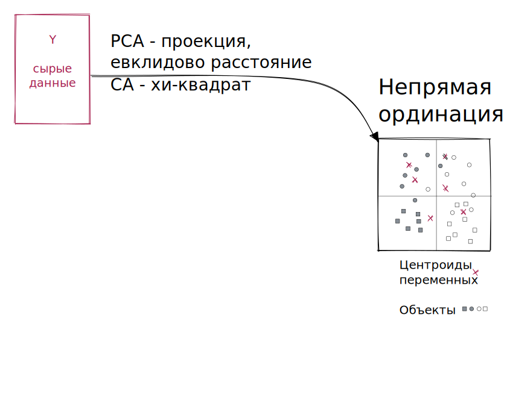
]


---

## Иногда можно преобразовать данные

**Подход, основанный на трансформации данных**

.pull-left-33[

**tbPCA** --- transformation-based PCA

- Данные ---> Расстояние Хеллингера
- Матрица расстояний ---> Трансформация Хеллингера
]
.pull-right-66[
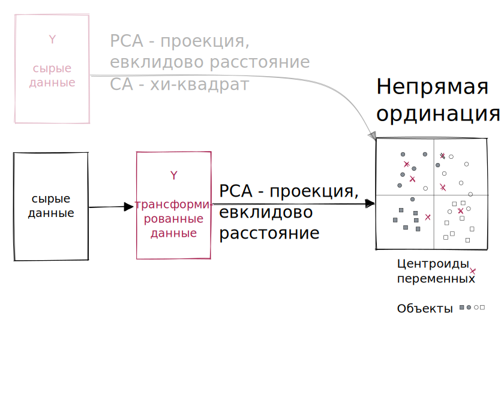
]


---

## Свобода выбора коэффициентов различия

**Многомерное шкалирование**

.pull-left-33[
**PCoA** --- метрическое многомерное шкалирование
- Проекционный метод подобно PCA 

**nMDS** --- неметрическое многомерное шкалирование
- Не проекционный метод, используется информация всех изменений

]
.pull-right-66[

]


---

## Добавим внешние факторы --- прямая ординация

**Классический подход**

.pull-left-33[

**RDA** 
- **Евклидово расстояние** между объектами
- только "короткие" градиенты; плохо работает на "длинных градиентах", где много нулей

  
**CCA**
- **Хи-квадрат расстояние** между объектами
- и "короткие", и "длинные" градиенты (с разным таксономическим составом на разных концах)
]

.pull-right-66[
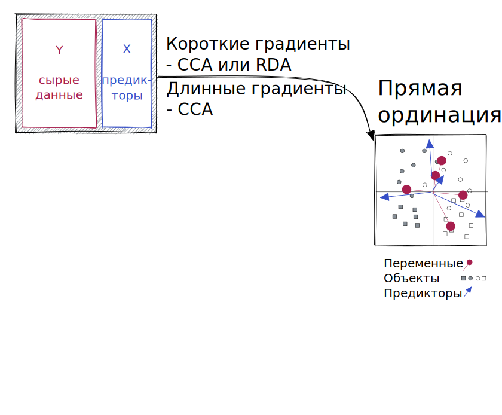
.small[modified after Fig. 11.4, p.648 in Legendre, Legendre, 2012]
]

---

## А если хочется использовать другие коэффициенты?

**Подход, основанный на трансформации данных**

.pull-left-33[

**tbRDA** --- transformation-based RDA (Legendre, Gallagher, 2001)

- Данные ---> Расстояние Хеллингера
- Матрица расстояний ---> Трансформация Хеллингера
]

.pull-right-66[
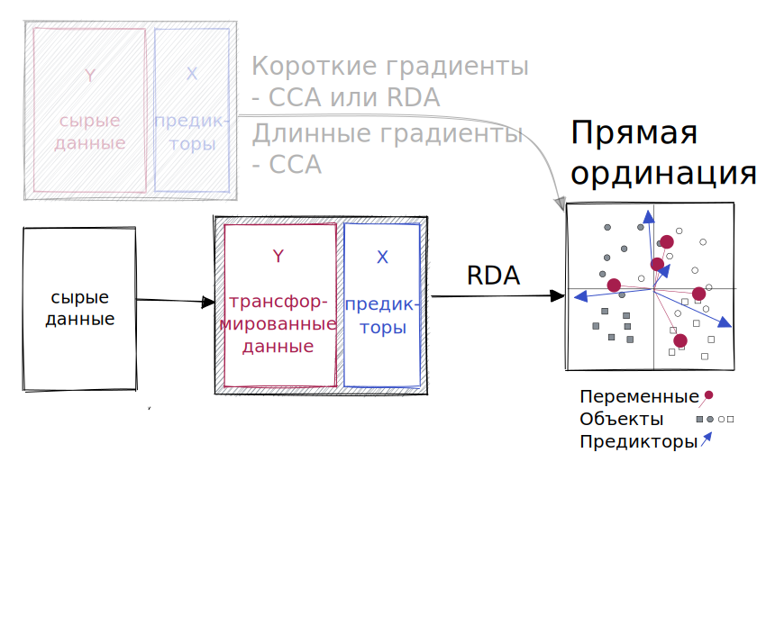
.small[modified after Fig. 11.4, p.648 in Legendre, Legendre, 2012]
]

---

## Но ещё лучше перевести всё в Евклидово пространство

**Подход, основанный на расстояниях**

.pull-left-33[

**dbRDA** --- distance-based RDA (Legendre, Anderson, 1999)

Можно использовать RDA для неевклидовых коэффициентов, если  при помощи PCoA (Principal coordinate analysis) перевести их в Евклидово пространство.

- Данные ---> Матрица расстояний ---> PCoA ---> RDA
]

.pull-right-66[
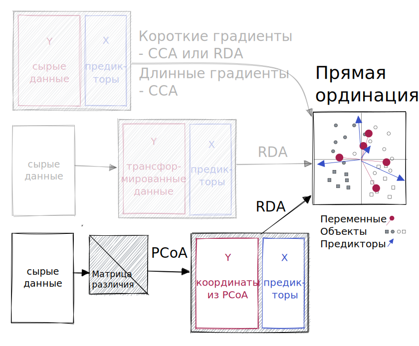
.small[modified after Fig. 11.4, p.648 in Legendre, Legendre, 2012]
]

---

## Все эти методы --- это тот же RDA

**...но есть новые для нас элементы**

.pull-left-33[

- tb-RDA
  - трансформация хорды
  - трансформация Хеллингера
- db-RDA
  - PCoA
  - проблемы с отрицательными собственными числами

]

.pull-right-66[
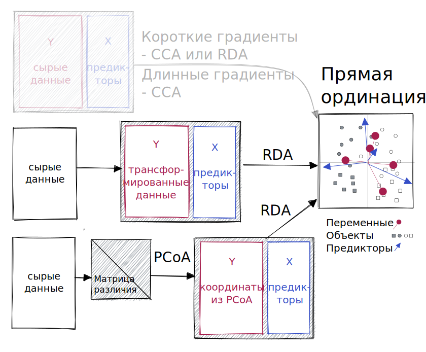
.small[modified after Fig. 11.4, p.648 in Legendre, Legendre, 2012]
]

---

class: middle, center, inverse

# Длинные градиенты

Что же это значит? В чем проблема с их анализом?

---

# PCA

<iframe width="853" height="505" src="https://www.youtube.com/embed/ZDh97N6L3bU" title="YouTube video player" rel="0" frameborder="0" allow="accelerometer; autoplay; loop; clipboard-write; encrypted-media; gyroscope; picture-in-picture" allowfullscreen></iframe>

https://youtu.be/ZDh97N6L3bU

---

# PCA с трансформацией Хелингера

<iframe width="853" height="505" src="https://www.youtube.com/embed/DpZpldfnqpo?start=19" title="YouTube video player" rel="0" frameborder="0" allow="accelerometer; loop; clipboard-write; encrypted-media; gyroscope; picture-in-picture" allowfullscreen></iframe>

https://youtu.be/DpZpldfnqpo

---

# CA

<iframe width="853" height="505" src="https://www.youtube.com/embed/FrfyRhxG4Ug?start=19" title="YouTube video player" rel="0" frameborder="0" allow="accelerometer; loop; clipboard-write; encrypted-media; gyroscope; picture-in-picture" allowfullscreen></iframe>

https://youtu.be/FrfyRhxG4Ug


---

# nMDS


<iframe width="853" height="505" src="https://www.youtube.com/embed/rCDj5IAzYiM?start=19" title="YouTube video player" rel="0" frameborder="0" allow="accelerometer; loop; clipboard-write; encrypted-media; gyroscope; picture-in-picture" allowfullscreen></iframe>

https://youtu.be/rCDj5IAzYiM


---

background-image: url("images/Finnish_Reindeer_178137137.jpeg")
background-position: center
background-size: cover

class: inverse

# Пример: Растительность в сосновых лесах,<br/> где пасутся олени


---

## Растительность в сосновых лесах, где пасутся олени

.pull-left[

Фрагмент из датасета (Henry et al. 1995).


- `varespec` --- покрытие 44 видов на 24 участках в северной Финляндии и на Кольском полуострове.
- `varechem` --- 14 переменных, описывающих условия среды.

(В исходном исследовании была еще информация о выпасе оленей)

Какие факторы среды определяют облик растительного сообщества?

]

.pull-right[
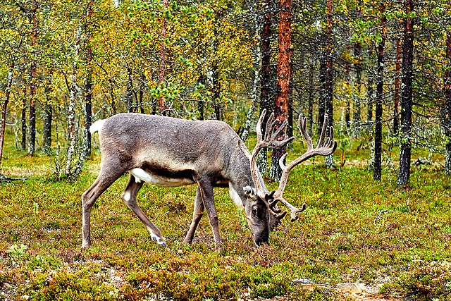

.small[[Mathew Schwartz](https://upload.wikimedia.org/wikipedia/commons/f/fb/Finnish_Reindeer_%28178137137%29.jpeg), [CC BY 3.0](https://creativecommons.org/licenses/by/3.0), via&nbsp;Wikimedia&nbsp;Commons]
]
.pull-down[

]


???

Богатые лишайниками сосновые леса на песчаных почвах. Там пасутся полудомашние олени. Выпас скота влияет на растительность много где, здесь тоже.

nMDS: мхи и лишайники на противоположных концах ординации. Высокая пастбищная нагрузка - в середине.

---

## Знакомство с данными

.scroll-output[
```{r fig.show='hold'}
library("ggplot2")
theme_set(theme_minimal(base_size = 18))
library("cowplot")
library("vegan")

data("varespec")
data("varechem")
head(varespec, 2)
sum(is.na(varespec))
```
]


---

## Задание 1

Сделайте PCA данных о составе сообщества

Сколько изменчивости объясняют первые две главные компоненты?

Нарисуйте график ординации

---

## Решение: PCA данных о составе сообщества

```{r pca-raw}
mod_pca <- rda(varespec)
eigenvals(mod_pca)/sum(eigenvals(mod_pca))*100
biplot(mod_pca, scaling = 2)
```

--

Хорошо заметен "эффект подковы"

---

## Как исправить эффект подковы?

Все варианты основаны на выборе иного коэффициента различия вместо Евклидова расстояния:

- Корреспондентный анализ, CA (хи-квадрат)
- Трансформация данных
  - Расстояние Хеллингера
  - Хордальное расстояние
- Использование другого коэффициента различия
  - Коэффициент Брея-Куртиса

---

class: middle, center, inverse

# Экологически-осмысленные трансформации

.large[~~и где они обитают~~]

---

## Распределения обилия видов асимметричны


```{r asymm, echo=FALSE, purl=FALSE}
library("tidyverse", quietly = T)
varespec_tidy <- varespec %>%
  rownames_to_column("Site") %>% 
  select(c("Site", tail(names(sort(colSums(varespec)))))) %>% 
  pivot_longer(cols = where(is.numeric), names_to = "Species", 
               values_to = "Abundance")
  
ggplot(data = varespec_tidy, aes(x = Abundance)) +
  geom_histogram(bins = 30) +
  facet_wrap(~ Species)
```

???

Широко известный факт, используется в моделях обилия видов (species-abundance models) (обзор моделей см. в работах He, Legendre, 1996, 2002).

---

## Степенные трансформации

$y' = y^{0.5}$; $y' = y^{0.25}$; $y' = log(y + c),\ \text{обычно }c = 1$

```{r power-trans, echo=FALSE, purl=FALSE, fig.show='hold', fig.width=12, fig.height=6}
varespec_tidy %>% dplyr::filter(Species == "Cladarbu") %>% 
  mutate(`y^{0.5}` = sqrt(Abundance), 
         `y^{0.25}` = Abundance^(0.25), 
         `log(y + 1)` = log(Abundance + 1)) %>% 
  pivot_longer(cols = Abundance:last_col(), 
               names_to = "Transformation", 
               values_to = "Value") %>% 
  ggplot(aes(x = Value)) +
  geom_histogram(bins = 30) +
  facet_wrap(~ Transformation)
  
```

---

## После этих трансформаций эффект подковы "смазан"

**Но он не исчез**, т.к. не решена проблема двойных нулей.

```{r power-trans-1, fig.show='hold', fig.width=12}
op <- par(mfrow = c(1, 3), mar = c(4, 4, 1.5, 0.5), cex = 1)
mod_pca <- rda(varespec)
biplot(mod_pca, scaling = 2, main = "сырые данные")
mod_pca <- rda(sqrt(varespec))
biplot(mod_pca, scaling = 2, main = "квадратный корень")
mod_pca <- rda(log(varespec + 1))
biplot(mod_pca, scaling = 2, main = "логарифм")
par(op)
```

---

## Хордальное расстояние

Orlóci, 1967 предложил использовать для анализа состава сообществ. Часто использовали в генетике (Cavalli-Sforza, Edwards, 1967).

$D_{3}(\mathbf{x}_1, \mathbf{x}_2) = \sqrt{2\left( 1 - { \sum_{j=1}^p y_{1j}y_{2j} }\over{ \sqrt{\sum_{j = 1}^p y^2_{1j} \sum_{j = 1}^p y^2_{2j}} }\right)} = \sqrt{\sum_{j = 1}^p \left( {{y_{1j}} \over {\sqrt{\sum_{j = 1}^p y^2_{1j}}}} - {{y_{2j}}\over{\sqrt{\sum_{j = 1}^p y^2_{2j}}}} \right)^2}$ .fn[[*]]

.pull-left-33[
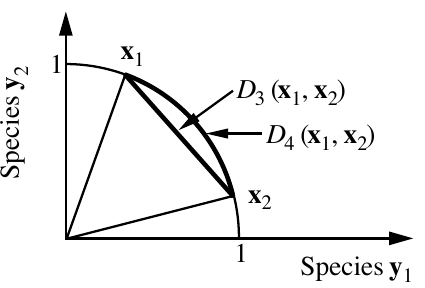

.small[Fig.7.5 Legendre, Legendre, 2012]
]

.pull-right-66[

$$0 \le D_{3} \le \sqrt{2}$$ 
- $\sqrt{2}$ --- нет общих видов
- $0$ --- одинаковая доля видов (но не обязательно численность)

= Евклидово расстояние после нормализации по строкам (вектор, деленный на длину вектора)
]

.footnote[
---------- 
[*] --- Legendre, Legendre, 2012 (коэффициент $D_{3}$, формула&nbsp;7.35,&nbsp;стр.&nbsp;301).
]

???

Legendre, Gallagher, 2001 говорят, что лучше расстояние Хеллингера.

---

## Расстояние Хеллингера

Описал Rao, 1995 (на основе интеграла Хеллингера, Hellinger, 1909)

$\mathbf{D_{17}}(x_1, x_2) = \sqrt{\sum^p_{j = 1}\left[\sqrt{\frac{y_{1j}}{y_{1+}}}\sqrt{\frac{y_{2j}}{y_{2+}}}\right]}$ .fn[[*]]

$$0 \le D_{3} \le \sqrt{2}$$ 

Асимметричный коэффициент (нечувствителен к двойным нулям)

= хордальное расстояние, рассчитанное по корням из обилий видов


.footnote[
---------- 
[*] --- Legendre, Legendre, 2012 (коэффициент $D_{17}$, формула&nbsp;7.56,&nbsp;стр.&nbsp;310)
]


---

.pull-left-45[

### Трансформация хорды

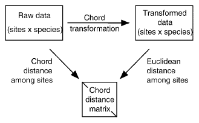

.small[Fig. 2 in Legendre, Gallagher, 2001]

$y'_{ij} = \frac {y_{ij}} {\sqrt{\sum_{j = 1}^p y^2_{ij}}}$

Тр. хорды + Евклидово расстояние = хордальное расстояние

]


.pull-right-55[

### Трансформация Хеллингера

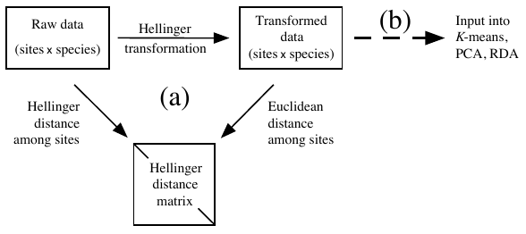
.small[Fig.7.7 in Legendre, Legendre, 2012]

$y'_{ij} = \sqrt{\frac{y_{ij}}{y_{i+}}}$

Тр. Хеллингера + Евклидово расстояние = расстояние Хеллингера

]

???

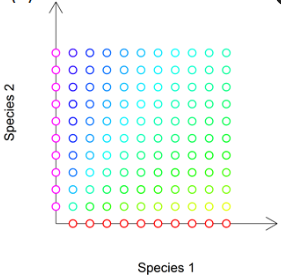
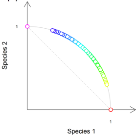
.small[
by [David Zelený](https://davidzeleny.net/blog/2022/03/17/)
]

---

## После трансформаций эффект подковы может исчезнуть

**Но не обязательно**, он останется, если "длинный градиент"

```{r chord-hell, fig.show='hold', fig.width=12}
op <- par(mfrow = c(1, 3), mar = c(4, 4, 1.5, 0.5), cex = 1)
mod_pca <- rda(varespec)
biplot(mod_pca, scaling = 2, main = "сырые данные")
mod_pca <- rda(decostand(varespec, method = "normalize"))
biplot(mod_pca, scaling = 2, main = "хордальное расст.")
mod_pca <- rda(decostand(varespec, method = "hellinger"))
biplot(mod_pca, scaling = 2, main = "расст. Хеллингера")
par(op)
```

---

class: middle, center, inverse

# PCoA

Учимся использовать неевклидовы меры различий в ординации


---

## Principal Coordinate Analysis, PCoA

Gower, 1966

= метрическое многомерное шкалирование, классическое шкалирование

**Цель: создать Евклидово изображение неевклидова пространства, сохраняя отношения между объектами**.

Потенциально можно использовать любую меру различий, даже неевклидову.

Хорошо работает, если исходный коэффициент .red[метрический] (выполняется неравенство треугольника). Если .red[неметрический] --- могут быть проблемы.

---

## PCoA, часть 1

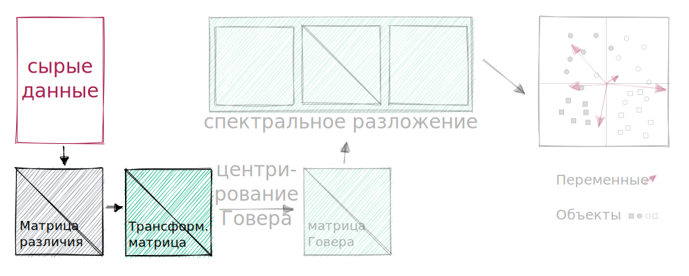

Матрицу коэффициентов различия $D = [D_{hi}]$ преобразуем в матрицу $A = [a_{hi}]$:
$$a_{hi} = - \frac{1}{2} D^2_{hi}$$
???


---

## PCoA, часть 2

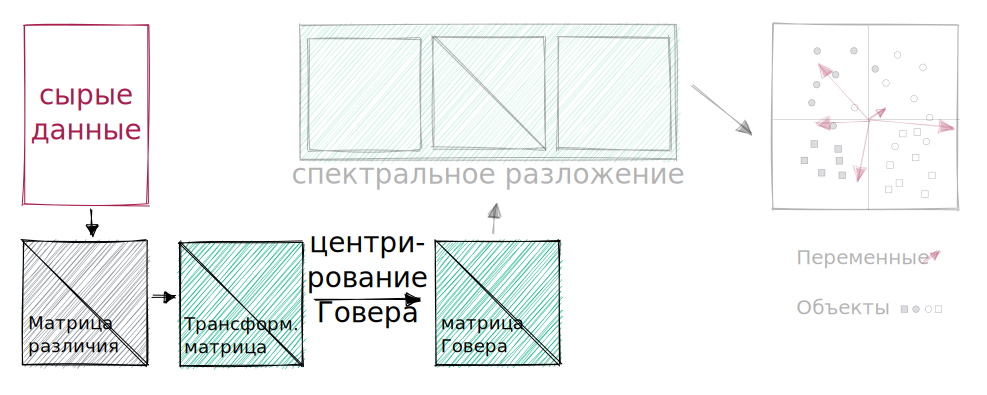

Центрируем матрицу $A$ методом Говера, чтобы получить матрицу $\Delta_{1} = [\delta_{hi}]$:
$$\delta_{hi} = a_{hi} - \bar a_{h} - \bar a_{i} + \bar a$$
- $\bar a_h$  и $\bar a_i$ --- среднее по строке и по столбцу $A$, 
- $\bar a$ --- общее среднее матрицы $A$

???

В виде матриц это можно записать так:
$\Delta _1 = \left( I - \frac{\mathbf{11'}}{n} \right) A \left( I - \frac{\mathbf{11'}}{n} \right)$, 
- $I$ --- единичная матрица $n \times n$
- $\mathbf{1}$ --- единичный вектор-столбец длиной $n$


---

## PCoA, часть 3

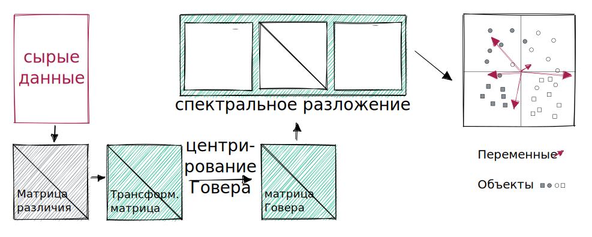

Спектральное разложение Говеровски-центрированной матрицы $\Delta_{1}$:
- собственные числа $\lambda_k$
- нормализованные собственные векторы $\mathbf u_k$ (матрица $\mathbf U$)

Собственные векторы умножаются на корень из их собственных чисел. Минимум одно собственное число равно нулю (т.к.  $\Delta_{1}$ центрирована).

Исходные переменные можно проецировать в пространство ординации.

???

После масштабирования собственные векторы длиной квадратный корень из их собственных чисел $\sqrt{\mathbf{u}'_k \mathbf{u}_k} = \sqrt{\lambda_k}$.

Исходные переменные не используются в PCA, но их можно спроецировать в пространство ординации.
$S_{pc} = \frac{1}{(n - 1)} Y_c'Y_{st}$
$U_{proj} = \sqrt{n - 1} S_{pc} \Lambda^{-0.5}$
$Y_c$ - центрированная матрица данных (или объясняющих переменных). ЕЕ нужно стандартизовать, если переменные в разных шкалах. Может содержать любой набор вспомогательных количественных данных.
$U_{st}$ - Матрица собственных векторов PCoA или ее кусочек (стандартизована по столбцам).
$S_{pc}$ - матрица ковариаций $Y$ и $U_{st}$
$U_{proj}$ - строки матрицы - это p переменных, которые нужно добавить на биплот, столбцы - это координаты.


---

## PCoA в R

.panelset[
.panel[.panel-name[Евклидово р.]

```{r pcoa-eucl, fig.width=5, fig.height=5, warning=TRUE}
#
#
d_eucl <- vegdist(varespec, method = "euclidean")
mod_pcoa_eucl <- cmdscale(d_eucl, k = nrow(varespec) - 1, eig = TRUE)
ordiplot(mod_pcoa_eucl, type = "t")
```

]
.panel[.panel-name[Хордальное р.]

```{r pcoa-chord, fig.width=5, fig.height=5, warning=TRUE}
#
varespec_norm <- decostand(varespec, "normalize")
d_chord <- vegdist(varespec_norm, method = "euclidean")
mod_pcoa_chord <- cmdscale(d_chord, k = nrow(varespec) - 1, eig = TRUE)
ordiplot(mod_pcoa_chord, type = "t")
```

]
.panel[.panel-name[Р. Хеллингера]

```{r pcoa-hel, fig.width=5, fig.height=5, warning=TRUE}
#
varespec_hel <- decostand(varespec, "hellinger")
d_hel <- vegdist(varespec_hel, method = "euclidean")
mod_pcoa_hel <- cmdscale(d_hel, k = nrow(varespec) - 1, eig = TRUE)
ordiplot(mod_pcoa_hel, type = "t")
```

]
.panel[.panel-name[Коэф. Брея-Куртиса]

```{r pcoa-bray, warning=TRUE, fig.width=5, fig.height=4.5}
d_bray <- vegdist(varespec,  method = "bray")
mod_pcoa_bray <- cmdscale(d_bray,  k = nrow(varespec) - 1, eig = TRUE)
ordiplot(mod_pcoa_bray, type = "t")
```
]
]

---

## Задание 2

Получите собственные числа из анализа PCoA по матрице коэффициентов Брея-Куртиса.

---

## Решение: Собственные числа

Посмотрите на них внимательно. Что в них странного?

```{r R.options=list(width=35)}
eigenvals(mod_pcoa_bray)
```

--

.large[Отрицательные собственные числа!]

---

class: middle, center, inverse

# Отрицательные собственные числа

Что в них плохого и как с ними бороться

---

## Причины появления отрицательных собственых чисел

- Использование полуметрических или неметрических мер различия.
- Пропущенные значения (вернее, их обработка некоторыми коэффициентами: Gower, Estabrook & Rogers, Legendre & Chodorowski) 
- Неевклидовость (non-Euclideanarity, Gower, 1982, 1985)


Отрицательные собственные числа для более высоких измерений, но хорошее отображение в первых нескольких измерениях.

---

## Вспомним определения

.content-box-green[
.green[**Метрики**] --- коэффициенты, у которых есть свойства адекватность, позитивность и симметричность, а так же выполняется неравенство треугольника.
]

.content-box-gray[
**Полуметрики** --- для них не выполняется неравенство треугольника
]

.content-box-purple[
.purple[**Неметрики**] --- могут принимать отрицательные значения (не обладают свойством позитивности)
]

--

Если у коэффициента отсутствуют какие-либо из свойств метрик, то такое пространство не получится изобразить в Евклидовом пространстве. Признаком этого являются .red[**отрицательные собственные числа**].

.content-box-red[
.red[**Неевклидовы коэффициенты**] --- пространство, описываемое неевклидовым коэффициентом, невозможно описать в Евклидовом пространстве.
]


---

## Последствия:

Биплоты с разными поправками будут в общих чертах похожи.

Отрицательные собственные числа влияют на вероятность возникновения ошибок I рода в тестах значимости.


???

Методы коррекции pp. 502-504 in Legendre, Legendre, 2012

---

## Боремся с отрицательными собственными числами

- Трансформация матрицы различий.

- Поправка к матрице различий.

---

## Первый вариант --- трансформировать матрицу различий

Для некоторых (даже неевклидовых) коэф. различия есть трансформации, которые переводят их в Евклидовы.

--

Пример для свойств коэффициентов сходства.

| Коэф. сходства | $D = 1-S$ | $D = 1 - S$ <br/> Евклид. | $D = \sqrt{1 - S}$ <br/> метрика | $D = \sqrt{1 - S}$ <br/> Евклид. |
| ---- | ---- | ---- | ---- | ---- |
| Simple matching | метрика | **нет** | да | да |
| Жаккард | метрика | **нет** | да | да |
| Соренсен | полуметрика | **нет** | да | да |
| Кульчинский | неметрика | **нет** | **нет** | **нет** |

---

## Первый вариант --- трансформировать матрицу различий

Для некоторых (даже неевклидовых) коэф. различия есть трансформации, которые переводят их в Евклидовы.

А этот пример --- для коэффициентов различия.

| Коэф. различия | $D$ | $D$ <br/> Евклид. | $\sqrt{D}$ <br/> метрика | $\sqrt{D}$ <br/> Евклид. |
| ---- | ---- | ---- | ---- | ---- |
| Евклидово расст. | метрика | да | да | да |
| Расст. по Манхеттену | метрика | **нет** | да | да |
| Расст. хорды | метрика | да | да | да |
| Хи-квадрат | метрика | да | да | да |
| Расст. Хеллингера | метрика | да | да | да |
| Коэф Брея-Куртиса | полуметрика | **нет** | да | да |

???

Table 7.2 in Legendre, Legendre, 2012


---

## Второй вариант --- внести поправку

При неевклидовости можно сделать поправку к матрице различий (но не слишком большую):

.content-box-purple[
.purple[**Caillez correction**] --- добавить константу к суб- и супрадиагональным элементам матрицы различий $\mathbf{D}$.

Завышена вероятность ошибки I рода в ANOVA (Legendre, Anderson, 1999).
]
.content-box-green[
.green[**Lingoes correction**] --- добавить константу к квадратам суб- и супрадиагональных элементов матрицы различий $\mathbf{D}$. 

Несмещенная вероятность ошибки I рода в ANOVA.
]

???

see 5.5.1 in Borcard, Legendre, 2018

---

## Поправка Сailliez есть в `vegan::cmdscale()`

И эта поправка --- единственная в `cmdscale()`

.panelset[
.panel[.panel-name[Без поправки]
```{r, highlight.output=3}
d_bray <- vegdist(varespec,  method = "bray")
mod_pcoa_bray <- cmdscale(d_bray,  k = nrow(varespec) - 1, eig = TRUE)


eigenvals(mod_pcoa_bray)
```

]
.panel[.panel-name[Сailliez]
```{r, R.options=list(width=60), highlight.output=3}
d_bray <- vegdist(varespec,  method = "bray")
mod_pcoa_bray_cai <- cmdscale(d_bray,  k = nrow(varespec) - 1, eig = TRUE, 
                              add = TRUE) # <<-

eigenvals(mod_pcoa_bray_cai)
```

]
]

---

## Строим график по данным с поправкой Сailliez

.panelset[
.panel[.panel-name[График]

Нанесем на график .red[взвешенные средние видов].

```{r pcoa-bray-cai-plot, echo=FALSE, fig.height=6, results='hide', message=FALSE}
ordiplot(scores(mod_pcoa_bray_cai, choices = c(1, 2)), type = "t")
abline(h = 0, lty = 1, lwd = 0.5)
abline(v = 0, lty = 1, lwd = 0.5)

# Взвешенные средние видов
varespec_wa <- wascores(mod_pcoa_bray_cai$points[, 1:2], varespec)
text(varespec_wa, rownames(varespec_wa), cex = 0.7, col = "red")
```
]
.panel[.panel-name[Код]
```{r pcoa-bray-cai-plot, echo=TRUE, eval=FALSE, purl=FALSE}
```
]
]

---

## Задание 3

Нанесите на график ординации .purple[проекции переменных среды] при помощи `envfit()`.

Используйте только переменные, значимо связанные со структурой сообществ.

```{r pcoa-bray-cai-plot-2, echo=FALSE, fig.height=6, results='hide', message=FALSE}
ordiplot(scores(mod_pcoa_bray_cai, choices = c(1, 2)), type = "t")
abline(h = 0, lty = 1, lwd = 0.5)
abline(v = 0, lty = 1, lwd = 0.5)

# Взвешенные средние видов
varespec_wa <- wascores(mod_pcoa_bray_cai$points[, 1:2], varespec)
text(varespec_wa, rownames(varespec_wa), cex = 0.7, col = "red")

# Решение 3 -----------------------------------------------------
# Проекции переменных среды ->> таблица
mod_pcoa_bray_cai_env <- envfit(mod_pcoa_bray_cai, varechem)

# Значимые наносим на график
plot(mod_pcoa_bray_cai_env, p.max = 0.05, col = "darkviolet")
# --------------------------------------------------------------
```


---

## Решение: График по данным с поправкой Сailliez

.panelset[
.panel[.panel-name[График]

На график нанесены .red[взвешенные средние видов] и .purple[проекции переменных среды].

```{r pcoa-bray-cai-plot-2, echo=FALSE, fig.height=6, results='hide', message=FALSE}
```
]
.panel[.panel-name[Код]
```{r pcoa-bray-cai-plot-2, echo=TRUE, eval=FALSE, purl=FALSE}
```
]
.panel[.panel-name[Таблица результатов envfit]
```{r}
mod_pcoa_bray_cai_env
```

]
]


---

## Если нужна поправка Lingoes --- `ape::pcoa()`

```{r}
library(ape) # здесь есть обе поправки к PCoA
d_bray <- vegdist(varespec,  method = "bray")
```

.panelset[
.panel[.panel-name[Без поправки]

.pull-left[
```{r R.options=list(width = 40)}
mod_pcoa_raw <- pcoa(d_bray)
mod_pcoa_raw$values$Eigenvalues
```
]
.pull-right[
```{r neg-eig-nocor, fig.height=6}
biplot.pcoa(mod_pcoa_raw, varespec)
```
]
]
.panel[.panel-name[Сailliez]
.pull-left[
```{r R.options=list(width = 30)}
mod_pcoa_cai <- pcoa(d_bray, 
              correction = "cailliez")
mod_pcoa_cai$values$Corr_eig
```
]
.pull-right[
```{r neg-eig-cailliez, fig.height=6}
biplot.pcoa(mod_pcoa_cai, varespec)
```
]
]
.panel[.panel-name[Lingoes]
.pull-left[
```{r R.options=list(width = 30)}
mod_pcoa_lin <- pcoa(d_bray, 
                correction = "lingoes")
mod_pcoa_lin$values$Corr_eig
```
]
.pull-right[
```{r neg-eig-lingoes, fig.height=6}
biplot.pcoa(mod_pcoa_lin, varespec)
```
]]
]

---

## Сравнение методов непрямой ординации

PCA
- Короткие градиенты
- Евклидово расстояние. Нужны "осмысленные" нули (double-zero problem).
- Представляет отношения между объектами в Евклидовом пространстве
- Главные компоненты --- функции исходных признаков

PCoA
- "Теряет" информацию о неевклидовой части матрицы D (Legendre, Legendre, 2012)
- Линейная трансформация расстояний между объектами: главные координаты --- функции исходных признаков, выраженных посредством расстояний

CA
- Короткие и длинные градиенты
- Хи-квадрат

nMDS
- Лучше отображает многомерное пространство, чем PCoA.
- Сохраняются ранги расстояний между объектами.
- Нелинейная трансформация между объектами.

---

class: middle, center

# Это всё была непрямая ординация

## А дальше --- прямая ординация


---

class: middle, center, inverse

# tbRDA

RDA по трансформированным данным

---

## Transformation-based RDA, tbRDA

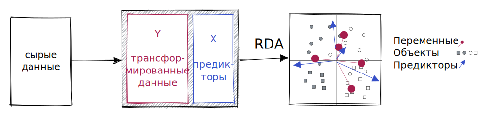

---

### Функция для рисования графиков ординации в ggplot

.scroll-box-28[

```{r}
# ordiggplot Рисует график ординации из vegan в ggplot
ordiggplot <- function(mod, lab_size = 5, lab_var_size = 6,
                       line_size = 0.5, point_size = 2,
                      plot_sites = TRUE, plot_species = TRUE,
                      plot_centroids = TRUE, plot_biplot = TRUE,
                      plot_factorbiplot = TRUE, ...){
  mod_dat <- scores(mod, tidy = TRUE, ...)
  ax_names <- colnames(mod_dat)[1:2]
  names(mod_dat)[1:2] <- c("X", "Y")
  mod_eig <- round(eigenvals(mod) / mod$tot.chi * 100, 2)
  ar <- arrow(angle = 10, length = unit(2, "mm"), type = "closed")
  gg <- ggplot() +
    geom_hline(yintercept = 0, colour = "grey70", size = 0.25) +
    geom_vline(xintercept = 0, colour = "grey70", size = 0.25)
  if(any(mod_dat$score == "sites" & plot_sites)) {
      gg <- gg +
      geom_point(data = filter(mod_dat, score == "sites"),
                 aes(x = X, y = Y), size = point_size) +
      geom_text(data = filter(mod_dat, score == "sites"),
                aes(x = X, y = Y, label = label),
                size = lab_size, hjust = -0.7,
                colour = "grey40")
  }
  if(any(mod_dat$score == "species" & plot_species)) {
      gg <- gg +
        geom_segment(data = filter(mod_dat, score == "species"),
                   aes(x = 0, y = 0, xend = X, yend = Y),
                   size = line_size, colour = "orangered", arrow = ar) +
        geom_text(data = filter(mod_dat, score == "species"),
                  aes(x = X, y = Y, label = label),
                  size = lab_size, hjust = 1.3, vjust = 0.4,
                  colour = "orangered")
  }
  if(any(mod_dat$score == "centroids" & plot_centroids)) {
    gg <- gg + geom_point(data = filter(mod_dat, score == "centroids"),
               aes(x = X, y = Y),
               shape = 13, size = 3,
               colour = "grey20") +
      geom_text(data = filter(mod_dat, score == "centroids"),
                aes(x = X, y = Y, label = label),
                size = lab_var_size, hjust = -0.2,
                colour = "grey20")
  }
  if(any(mod_dat$score == "factorbiplot" & plot_factorbiplot)) {
    gg <- gg + geom_point(data = filter(mod_dat, score == "factorbiplot"),
                          aes(x = X, y = Y),
                          shape = 19, size = 0.5,
                          colour = "blue") +
      geom_text(data = filter(mod_dat, score == "factorbiplot"),
                aes(x = X, y = Y, label = label),
                size = lab_var_size, hjust = -0.2,
                colour = "blue")
  }
  if(any(mod_dat$score == "biplot" & plot_biplot)) {
    gg <- gg + geom_segment(data = filter(mod_dat, score == "biplot"),
                 aes(x = 0, y = 0, xend = X, yend = Y),
                 size = line_size, colour = "blue",  arrow = ar) +
      geom_text(data = filter(mod_dat, score == "biplot"),
                aes(x = X, y = Y, label = label),
                size = lab_var_size, hjust = -0.2,
                colour = "blue")
  }
  gg + coord_cartesian() +
      labs(x = paste0(ax_names[1], " (", mod_eig[1], "%)"),
           y = paste0(ax_names[2], " (", mod_eig[2], "%)"))
  }
```
]

---

## tbRDA с расстоянием Хеллингера

.panelset[
.panel[.panel-name[tbRDA]
```{r}
mod_tbrda <- rda(decostand(varespec, method = 'hellinger') ~  
                   Mn + Baresoil + N, data = varechem)

eigenvals(mod_tbrda)/sum(eigenvals(mod_tbrda))
```
]
.panel[.panel-name[График]
```{r tbrda-scaling-2, fig.width=12, fig.height=6}
# ordiggplot(mod_tbrda, scaling = 1)
ordiggplot(mod_tbrda, scaling = 2) + aes(colour = varechem$Mn)
```
]
.panel[.panel-name[ANOVA]
```{r R.options=list(width=60)}
anova(mod_tbrda, by = "mar")
```
]
]

---

class: middle, center, inverse

# dbRDA

Карт-бланш (ну, почти) на коэффициенты различия

---

## Distance-based RDA, dbRDA

Используется для анализа "неевклидовых" матриц различия

.pull-left[
Для количественных признаков:
  - асимметричный коэф. Говера
  - коэф Уиттакера
  - расстояние Канберра 
  - коэф. Брея-Куртиса, и т.п.
  
Для бинарных признаков:
  - коэф. Соренсена
  - коэф. Жаккара, и т.д.
  ]
.pull-right[
Для других типов данных:
  - симметричный коэф. Говера
  - коэф. Эстабрука-Роджерса
  - обобщенное расстояние Махаланобиса для групп
]


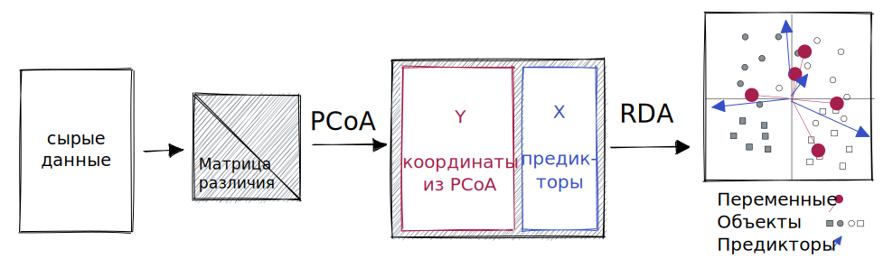

???

Legendre, Legendre, 2012

---

## Два варианта расчетов dbRDA в `vegan`

.pull-left[
**Классический вариант**  
(Legendre, Anderson, 1999)

`vegan::capscale()` --- смещенная вероятность ошибки I рода в многофакторных ANOVA.
.small[
- .purple[Caillez correction] --- `add = "cailliez"`
- .green[Lingoes correction] --- `add = "lingoes"`
  ]
]
.pull-right[
**Новый вариант**  
(McArdle, Anderson, 2001)

`vegan::dbRDA()` --- правильная вероятность ошибки I рода в многофакторных ANOVA.
  - Виды нельзя добавить непосредственно на график.
]

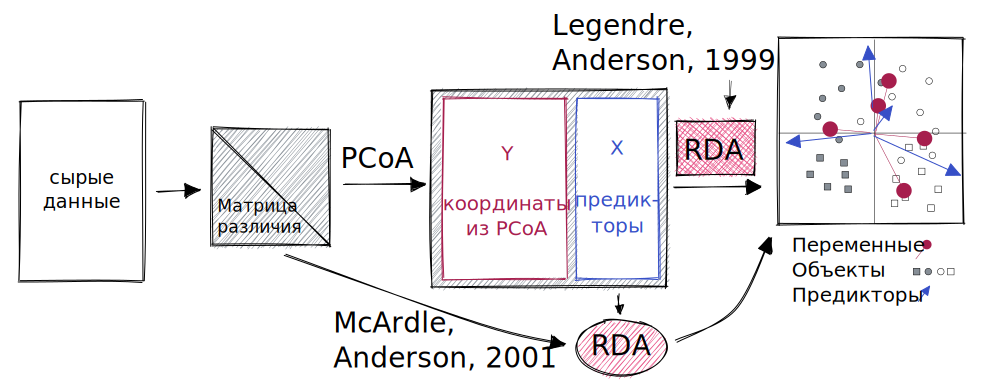

---

## dbRDA по матрице коэффициентов Брея-Куртиса

.panelset[
.panel[.panel-name[С поправкой Лингоуса]

```{r}
mod_dbrda_lingoes <- capscale(varespec ~ Mn + Baresoil + N, 
                              distance = "bray", data = varechem, add = TRUE)

eigenvals(mod_dbrda_lingoes)/sum(eigenvals(mod_dbrda_lingoes))
```
]

.panel[.panel-name[График]
```{r dbrda-scaling-2, fig.width=12, fig.height=6}
# ordiggplot(mod_dbrda_lingoes, scaling = 1)
ordiggplot(mod_dbrda_lingoes, scaling = 2) + aes(colour = varechem$Mn)
```
]

.panel[.panel-name[ANOVA]

```{r}
anova(mod_dbrda_lingoes, by = "mar")

```
]
]

---

## Summary

- Данные, описывающие состав сообщества:
  - имеют асимметричное распределение,
  - содержат много нулей,
  - нули не имеют особого смысла (виды отсутствуют по разным причинам).

--

- В силу этих свойств:
  - для описания сообществ не подходит Евклидово расстояние,
  - для данных, собранных вдоль длинных экологических градиентов, на ординации может возникать эффект подковы.

--

- Экологические данные можно трансформировать:
  - степенные трансформации избавят от асимметрии
  - есть трансформации, позволяющие уйти от Евклидова расстояния
  - некоторые неевклидовы коэффициенты трансформируются в Евклидовы.

--

- PCoA позволяет изобразить пространство любого коэффициента в Евклидовом пространстве. Но, чтобы в ANOVA были правильные вероятности ошибок I рода, не должно быть отрицательных собственных чисел (есть поправки).
- Благодаря PCoA можно использовать в dbRDA любые коэффициенты различия.

---

background-image: url("images/Lac_des_Brenets_2008.jpg")
background-position: center
background-size: cover

# Задание: Рыбы в реке Ду, Франция

---

## Рыбы в реке Ду, Франция

.pull-left[
Данные из Borcard et al., 2011, исходно из PhD диссертации Verneaux (1973).

Verneaux (1973) предложил использовать сообщества рыб в качестве индикаторов состояния рек и ручьев. 

- `doubs$fish` --- Обилие 27 видов рыб в 30 точках на реке Ду
- `doubs$env` --- 11 характеристик условий среды
- `doubs$xy` --- Координаты точек

Проанализируйте, какие факторы среды определяют облик сообществ рыб в реке Ду, если удалить влияние географической близости точек сбора.

```{r}
data("doubs", package = "ade4")
help("doubs", package = "ade4")
```

]

.pull-right[
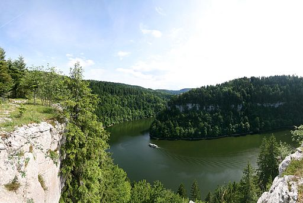
.small[[Schaffhausen](https://commons.wikimedia.org/wiki/File:Lac_des_Brenets_2008.jpg), Public domain, via Wikimedia Commons]
]

???

Река Ду - приток Соны. Находится на юго-востоке Франции (Бургундия) и западе Швейцарии. Исток в горах Юра.

По итогам диссертации Верно предложил классифицировать на 4 зоны: 
- зона форели (trout zone) --- ненарушенные, хорошо оксигенированные и олиготрофные
- grayling zone, 
- barbel zone, 
- bream zone --- эвтрофные и бедные кислородом воды

Verneaux, J. (1973) Cours d'eau de Franche-Comté (Massif du Jura). Recherches écologiques sur le réseau hydrographique du Doubs. Essai de biotypologie. Thèse d'état, Besançon. 1–257.

Borcard, D., Gillet, F. & Legendre, P. (2011) Numerical Ecology with R. Springer, UseR! Edition.

---

## Что почитать

* Legendre P., Legendre L. (2012) Numerical ecology. Second english edition. Elsevier, Amsterdam.
- Oksanen, J. (2022). Design decisions and implementation details in vegan. Vignette of the package vegan. R package version 2.6-2.
