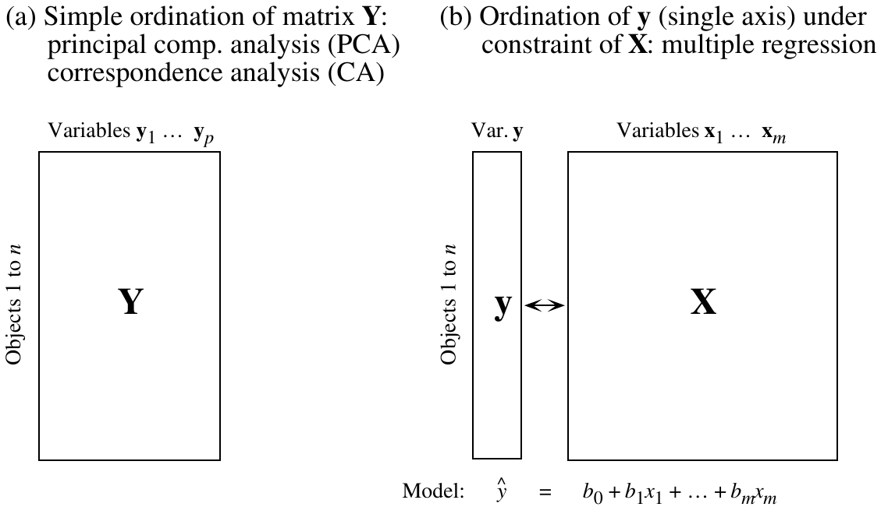
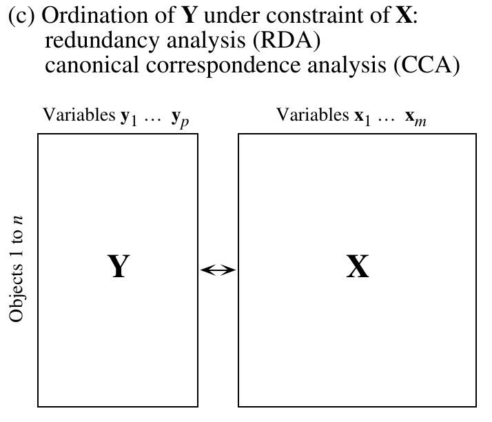
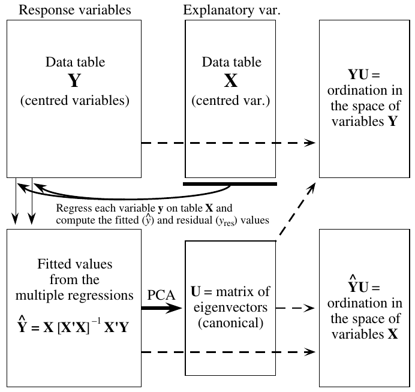
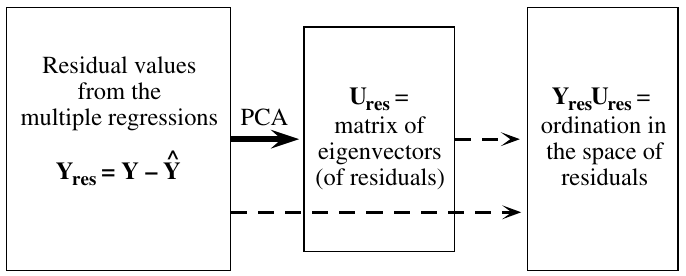

```{r setup, include = FALSE, cache = FALSE}
# to configure markdown parsing
options(markdown.extensions = c("no_intra_emphasis", "tables", "fenced_code", "autolink", "strikethrough", "lax_spacing", "space_headers", "latex_math"))
# output options
options(width = 70, scipen = 6, digits = 3)

# to render cyrillics in plots use cairo pdf
options(device = function(file, width = 7, height = 7, ...) {
  cairo_pdf(tempfile(), width = width, height = height, ...)
  })
library(knitr)
# chunk default options
opts_chunk$set(fig.align='center', tidy = FALSE, fig.width = 7, fig.height = 3)
```

## Анализ избыточности (Redundancy analysis, RDA)

- Связь нескольких наборов переменных
- Анализ избыточности, теория и практика
- Проверка значимости ординации
- Выбор оптимальной модели
- Частный анализ избыточности и компоненты объясненной инерции
- Компоненты объясненной изменчивости

### Вы сможете

- Проводить анализ избыточности
- Оценивать долю объясненной инерции
- Интерпретировать компоненты по нагрузкам переменных
- Строить ординацию объектов в пространстве компонент
- Проверять значимость модели ординации при помощи пермутационного теста
- Разделять объясненную инерцию на компоненты, связанные с разными наборами переменных, при помощи частного анализа избыточности


# Связь нескольких наборов переменных


## Пример: генетика бабочек Euphydryas editha

Частоты разных аллелей фосфоглюкоизомеразы и данные о факторах среды для 16 колоний бабочек _Euphydryas editha_ в Калифорнии и Орегоне


Winged Wonder by [Roger Lynn on Flickr](https://flic.kr/p/6CMVsC)

<div class = "footnote">данные McKechnie et al., 1975</div>


## Как вы думаете, что будет определять генетическую структуру в колониях бабочек?

```{r, fig.height=4, fig.width=4}
library(ade4)
data(butterfly)
# расположение сайтов
s.label(butterfly$xy, contour = butterfly$contour, inc = FALSE)
```


## Структура данных

- `$xy` - координаты колоний
- `$envir` - 4 фактора среды для колоний
- `$genet` - частоты 6 аллелей в колониях
- `$contour` - карта Калифорнии

```{r}
str(butterfly, max.level = 2, give.attr = FALSE, vec.len = 2)
```


## Создадим переменные с более короткими названиями для удобства

```{r}
# частоты аллелей
gen <- butterfly$genet
head(gen, 3)
# переменные среды и географические координаты
env_geo <- cbind(butterfly$envir, butterfly$xy)
head(env_geo, 3)
```


# Анализ избыточности, теория и практика

## Анализ избыточности (RDA, Redundancy analysis)

- Метод прямой ординации (ограниченной ординации = constrained ordination)
- Основан на анализе главных компонент
- Нужно две матрицы данных: матрица зависимых переменных и матрица предикторов
- Нужно найти такие компоненты матрицы зависимых переменных, которые являются линейными комбинациями предикторов и отражают максимум изменчивости.

### Условия применимости RDA

- Линейная зависимость переменных-откликов от предикторов
- Независимость наблюдений (сайтов)
- Сайтов должно быть значительно больше, чем предикторов (как в регрессии, см. проклятие размерности)

## Непрямая ординация и множественная регрессия



Рис. из Legendre, Legendre, 1998

## Прямая (ограниченная) ординация



Рис. из Legendre, Legendre, 1998

## Если множественную линейную регрессию можно обобщить для нескольких зависимых переменных --- получится RDA

$$\hat y _{i} = b _0 + b _1 x _{1i} + b _2 x _{2i} + ... + b _k + \epsilon _{i}$$

Уравнение множественной линейной регрессии можно переписать в виде матриц.

$$\left[\begin{array}{c}
\hat y_1 \\ \hat y_2 \\ \vdots \\ \hat y_n 
\end{array}\right] = 
\left[\begin{array}{cc}
1 & x_{1,1} & x_{1,2} & \cdots & x_{1,k} \\
1 & x_{2,1} & x_{2,2} & \cdots & x_{2,k} \\
\vdots & \vdots & \vdots & \ddots & \vdots \\
1 & x_{n,1} & x_{n,2} & \cdots & x_{n,k}
\end{array}\right] \cdot
\left[\begin{array}{c}
b _0 \\ b _1 \\  b _2 \\ \vdots \\ b _k
\end{array}\right] +
\left[\begin{array}{c}
\epsilon _1 \\ \epsilon _2 \\ \vdots \\ \epsilon _n
\end{array}\right]
$$

Сокращенная форма записи: $\mathbf{\hat y} = \mathbf{X} \mathbf{b} + \mathbf{\epsilon}$, причем $\mathbf{b} = (\mathbf{X}^T\mathbf{X})^{-1}(\mathbf{X}^T \mathbf{y})$.

### Во множественной линейной регрессии $\mathbf{\hat y} = \mathbf{X}(\mathbf{X}^T\mathbf{X})^{-1}(\mathbf{X}^T\mathbf{y})$

### В RDA зависимая переменная --- матрица, т.е. $\mathbf{\hat Y} = \mathbf{X}(\mathbf{X}^T\mathbf{X})^{-1}(\mathbf{X}^T\mathbf{Y})$, 

## Принцип RDA {.columns-2}


<br /><br /><br /><br /><br /><br /><br /><br /><br /><br /><br /><br /><br />

Рис. из Legendre, Legendre, 1998


# RDA в R


## RDA в vegan

- Зависимые переменные (отклики) - генетические данные
- Независимые переменные (предикторы) - переменные среды

```{r, message=FALSE}
library(vegan)
bf_rda <- rda(gen ~ Altitude + Precipitation + Temp_Max + Temp_Min, data = env_geo)
summary(bf_rda)
```


## Структура общей изменчивости

О структуре изменчивости можно судить __по суммам собственных чисел ординационных осей__ (ограниченных и неограниченных)

```{r echo=FALSE}
smr <- summary(bf_rda)

partit <- function(smr){
  if(!is.null(smr$partial.chi)){
    Inertia <- c(smr$tot.chi, smr$partial.chi, smr$constr.chi, smr$unconst.chi)
    nms <- c("Total", "Conditioned", "Constrained", "Unconstrained")
  } else {
    Inertia <- c(smr$tot.chi, smr$constr.chi, smr$unconst.chi)
    nms <- c("Total", "Constrained", "Unconstrained")
  }
  part <- data.frame(Inertia = round(Inertia, 2), Proportion = round(Inertia/smr$tot.chi, 3))
  rownames(part) <- nms
cat("Partitioning of variance:\n")
part
}

partit(smr)
```

- Total - всех осей - общая изменчивость исходной матрицы откликов (генетич. структуры в разных сайтах)
- Constrained - осей, кот. являются комбинациями факторов среды - изменчивость объясненная средой
- Unconstrained - необъясненная изменчивость


## Важность различных компонент

Можно более подробно оценить, как распределяется изменчивость между осями

```{r echo=FALSE}
cat("Eigenvalues, and their contribution to the variance")
smr$cont
```

> - Много изменчивости объяснено, но много осталось необъясненной. Первые две ограниченных оси объясняют 51% изменчивости, но первые две неограниченных объясняют еще 43%


## Распределение изменчивости, потенциально объяснимой факторами

```{r echo=FALSE}
cat("Accumulated constrained eigenvalues")
smr$concont
```

> - Первая ограниченная ось объясняет большую часть потенциально объяснимой изменчивости. Остальные оси почти ничего не объясняют.


## Собственные векторы, нагрузки переменных = “species scores”

```{r}
scores(bf_rda, display = "species", choices = 1:5)
```

> - 

## Корреляции между откликами и предикторами

> - Сильная корреляция между генетической структурой и средой только для первой ограниченной оси. Для других - умеренные или слабые.

```{r}
spenvcor(bf_rda)
```


## Визуализация ординации

- Какие предикторы важнее всего?
- Какими факторами определяется значение зависимых переменных?

Триплоты:
  - переменные-отклики ("species"),
  - объекты ("sites")
  - переменные-предикторы (непрерывные в виде векторов, дискретные в виде центроидов)

Биплоты:
  - отклики + предикторы
  - объекты + предикторы 


## Триплот корреляций (scaling = 2): Какие переменные среды важнее всего? {.columns-2}

```{r tidy = F, fig.width = 5, fig.height=4.5}
plot(bf_rda, scaling = 2)
```

- Векторы - независимые переменные, факторы среды
- Надписи - объекты (сайты, особи, популяции и пр.)
- Красные надписи - зависимые переменные

- Косинусы углов между векторами - корреляции между соотв. переменными
- Расстояния не имеют смысла
- Проекция объекта на линию-вектор - значение переменной для данного объекта


## Пример интерпретации триплота корреляций

```{r fig.width=5, fig.height=4.5}
plot(bf_rda, scaling = 2)
```

> - Вдоль первой оси изменяется температура, высота и осадки
- Вдоль второй оси - немного меняется уровень осадков


## Триплот расстояний (scaling = 1) {.columns-2}


```{r tidy = F, fig.width = 5, fig.height=4.5}
plot(bf_rda, scaling = 1)
# s.label(butterfly$xy, contour = butterfly$contour, inc = FALSE) # карта
```

- Надписи - объекты (сайты, особи, популяции и пр.)
- Красные надписи - зависимые переменные
- Векторы - независимые переменные, факторы среды

- Расстояния между точками - расстояния между наблюдениями
- Углы между векторами предикторов и откликов - корреляции между соотв. переменными, другие углы не имеют смысла
- Проекция объекта на линию-вектор отражает примерное положение данного объекта вдоль соотв. переменной (но не значение)
- Отношения между дискретными и непрерывными предикторами не интерпретируются


## Пример интерпреатции триплота расстояний

```{r fig.width=6, fig.height=4.5}
plot(bf_rda, scaling = 1)
```

> - Генетическая структура в LO и UO похожа, но не похожа на остальные места
- GL и GH - более высокогорные сайты, чем LO и UO


# Проверка значимости ординации


## Общий тест на значимость ординации

- тестируем гипотезу о том, что отношения между генотипом и средой значимы. 

$H _0$: значения предикторов в пробах не зависят от переменных среды (генетическая структура не зависит от среды)

- основан на пермутациях: проверяем, насколько наблюдаемая связь сильнее, чем если случайно переставить данные
- статистика - сумма всех соб. чисел ограниченных осей


## Общий тест: Влияют ли факторы на зависимые переменные?

### Есть ли связь генетики со средой?

```{r}
anova(bf_rda)
```

> - связь генетической структуры и среды значима


## Тест факторов, type I эффекты: Какие факторы влияют на зависимые переменные?

```{r}
anova(bf_rda, by = "term")
```

> - Генетическая структура популяций бабочек достоверно зависит от высоты, если в модель включены др. факторы. 
> - Но это Type I эффекты - они зависят от порядка включения факторов в модель. Т.е. после включения высоты в модель другие факторы уже не влияют.


## Тест факторов, type III эффекты: Какие факторы влияют на зависимые переменные?

```{r}
anova(bf_rda, by = "mar")
```

> - Если протестировать каждый из факторов отдельно, при у словии, что все остальные включены в модель, то получится, что ни один из них не влияет.


## Тест значимости осей, ограниченных факторами: 

- $H _0$: значения переменных-откликов для объектов не зависят от переменных-предикторов
- пермутационный: выбирает оси, которые объясняют больше изменчивости, чем из др. матриц, полученных путем перестановок

## Тест значимости осей, ограниченных факторами: Вдоль какой из осей значимо меняется генетическая структура?

```{r}
anova(bf_rda, by = "axis")
```

> - Генетическая структура значимо меняется вдоль первой главной оси

# Выбор оптимальной модели

## Выбор оптимальной модели

У нас проблема. Если мы тестируем любой из факторов, после включения остальных в модель - он не влияет. Это значит, что модель не оптимальна.

Как подобрать оптимальную модель?

> - Можно использовать пошаговый выбор модели: добавляем в модель лучшие переменные и снова исключаем те, что потеряли значимость. (Вспомните, как это было для регрессионных моделей.)

Какой можно использовать тест для сравнения моделей?

> - Модели с разным числом предикторов можно сравнить при помощи пермутационного теста (AIC для ограниченных ординаций не существует!)

> - __Осторожно!__ В vegan факторы включенные в модель обозначаются "-", а факторы, исключенные из модели - "+"


## Пошаговый выбор оптимальной модели

Для пошагового выбора нам понадобятся полная и нулевая модели

```{r}
m1 <-rda(gen ~ Altitude + Precipitation + Temp_Max + Temp_Min, data = env_geo)
m0 <- rda(gen ~ 1, data = env_geo)
```

Запускаем пошаговый выбор

```{r}
m <- ordistep(m0, scope = formula(m1))
```


## Оптимальная модель, отобранная при помощи пошагового алгоритма

```{r}
m$anova
```

> - Оптимальная модель содержит только один предиктор - минимальную температуру


# Частный анализ избыточности и компоненты объясненной инерции


## Зачем нужен частный анализ избыточности?

Мы уже обнаружили тесную связь генотипов со средой, и даже знаем, с какими переменными. 

Но генотипы в близких местах могут быть похожи по разным причинам. 

И теперь у нас два вопроса:

### Кто виноват?

> - сходный климат в близких локациях
> - поток генов между близкими колониями облегчен

### Что делать?

> - Нужно удалить влияние географического положения, чтобы сделать корректный вывод о связи генотипов со средой.


## Частный анализ избыточности 

- зависимость от одного набора переменных (предикторов), когда влияние другого (ковариат) исключено. 

Техника:

1. Множественная регрессия зависимости предикторов от ковариат.

2. Остатки от этой регрессии --- это то, что от ковариат не зависит --- можно использовать в PCA в качестве предикторов (вместо исходных переменных среды).

<div class = "footnote">Legendre & Legendre 1998</div>


## Делаем частный RDA: зависимость генетической структуры от среды с учетом географического положения

```{r}
bf_prda_1 <- rda(gen ~ Temp_Min + Condition(x + y), data = env_geo)
anova(bf_prda_1) ## Пермутационный тест
```

> - Климат объясняет генетическую изменчивость, даже после удаления влияния географических координат


## График ординации

```{r fig.width=8, fig.height=4}
plot(bf_prda_1, main = "Partial RDA")
```

> - Смысл графика остался прежним, изменились нюансы
> - Первая ось - мин температура.


# Компоненты объясненной изменчивости

## Компоненты изменчивости

К этому моменту мы знаем, что климат объясняет генетическую изменчивость, даже после удаления влияния географических координат.

Но какая часть изменчивости генетической структуры обясняется в чистом виде географической близостью, а какая --- общим действием климата и географии?


## Общую изменчивость делим на части:

```{r fig.width=5.5, fig.height=3.8}
showvarparts(2)
```

1. a + b + c - вся потенциально объяснимая средой и географией изменчивость
2. a - изменчивость, объясненная климатом
3. с - изменчивость, объясненная географией
4. b - изменчивость, совместно объясненная средой и географией


## Чтобы выделить компоненты изменчивости нам нужно несколько элементов

У нас уже есть __частный RDA №1: зависимость генетики от среды с учетом географии__ (для a)

Нам нужен __частный RDA №2: генетика от географии с учетом свойств среды__ (для c)

```{r}
bf_prda_2 <- rda(gen ~ x + y + Condition(Temp_Min), data = env_geo)
```

И __полная модель RDA генетика от среды и географического положения__ (для a + b + c)

```{r}
bf_rda_full <- rda(gen ~ x + y + Temp_Min, data = env_geo)
```


## Задание: Найдите компоненты инерции

1. изменчивость, потенциально объяснимую средой и географией 
2. изменчивость, связанную только со средой, но не с географией
3. изменчивость, связанную только с географией, но не со средой
4. изменчивость, объясненную одновременно средой и географией

### Подсказка

Смотрите на результаты разных RDA


## Решение: 1) Сколько изменчивости потенциально объясняется средой и географией?

```{r}
sum_full <- summary(bf_rda_full)
```

```
> sum_full
```

```{r, echo=FALSE}
partit(sum_full)
```

Изменчивость, объясненная вместе средой и географией, здесь достаточно велика --- `r round(sum_full$constr.chi, 2)`

```{r}
(I_total <- sum_full$constr.chi)
```

В отличие от нее, доля изменчивости, объясненной ограниченной матрицей, может быть довольно малой по оношению к общей изменчивости. Некоторые советуют сосредоточиться на доле от потенциально объяснимой изменчивости (от `sum_full$constr.chi`)


## Решение: 2) Изменчивость, объясненная климатом

```{r}
sum_prda_1 <- summary(bf_prda_1)
```
```
> sum_prda_1
```
```{r}
partit(sum_prda_1)
```

- Среда без географии объясняет `r round(sum_prda_1$constr.chi, 2)`

```{r}
(I_env <- sum_prda_1$constr.chi)
```


## Решение 3) Изменчивость, объясненная географией

```{r}
sum_prda_2 <- summary(bf_prda_2)
```
```
> sum_prda_2
```
```{r}
partit(sum_prda_2)
```

География без среды объясняет `r round(sum_prda_2$constr.chi, 2)`

```{r}
(I_geo <- sum_prda_2$constr.chi)
```


## Решение: 4) Изменчивость, совместно объясненная средой и географией

```{r}
(I_env_geo <- I_total - I_env - I_geo)
```


## Компоненты изменчивости - сводим результаты вместе

```{r}
comp <- data.frame(Inertia = c(I_env, I_geo, I_env_geo, I_total))
rownames(comp) <- c('Только среда', 'Только география', 'Среда и география вместе', 'Общая объяснимая инерция')
comp$Proportion <- comp$Inertia/sum(comp$Inertia[1:3]) * 100
colnames(comp) <- c('Инерция', '%')
comp
```

Среда объясняет 50% общей изменчивости генетической структуры - очень много, но и география объясняет 30%. И только 21% объясняется совместным влиянием среды и географии


## Take home messages

- Анализ избыточности помогает установить связь между несколькими наборами переменных. Один из наборов считается зависимым, другой считается объясняющим
- Для анализа необходимо, чтобы зависимости переменных-откликов от предикторов были линейными
- В ходе анализа выделяют два типа осей - ограниченные (объясненные) переменными-предикторами, и неограниченные (необъясненные) ими
- Частный анализ избыточности позволяет описать зависимость двух наборов переменных с поправкой на влияние дополнительных переменных (ковариат)
- При помощи частного анализа избыточности можно выделить компоненты изменчивости связанные с несколькими (2-4) наборами переменных-предикторов


## Дополнительные ресурсы

- Borcard, D., Gillet, F., Legendre, P., 2011. Numerical ecology with R. Springer.
- Legendre, P., Legendre, L., 2012. Numerical ecology. Elsevier.
- Oksanen, J., 2011. Multivariate analysis of ecological communities in R: vegan tutorial. R package version 2–0.
- The Ordination Web Page URL http://ordination.okstate.edu/ (accessed 10.21.13).
- Quinn, G.G.P., Keough, M.J., 2002. Experimental design and data analysis for biologists. Cambridge University Press.
